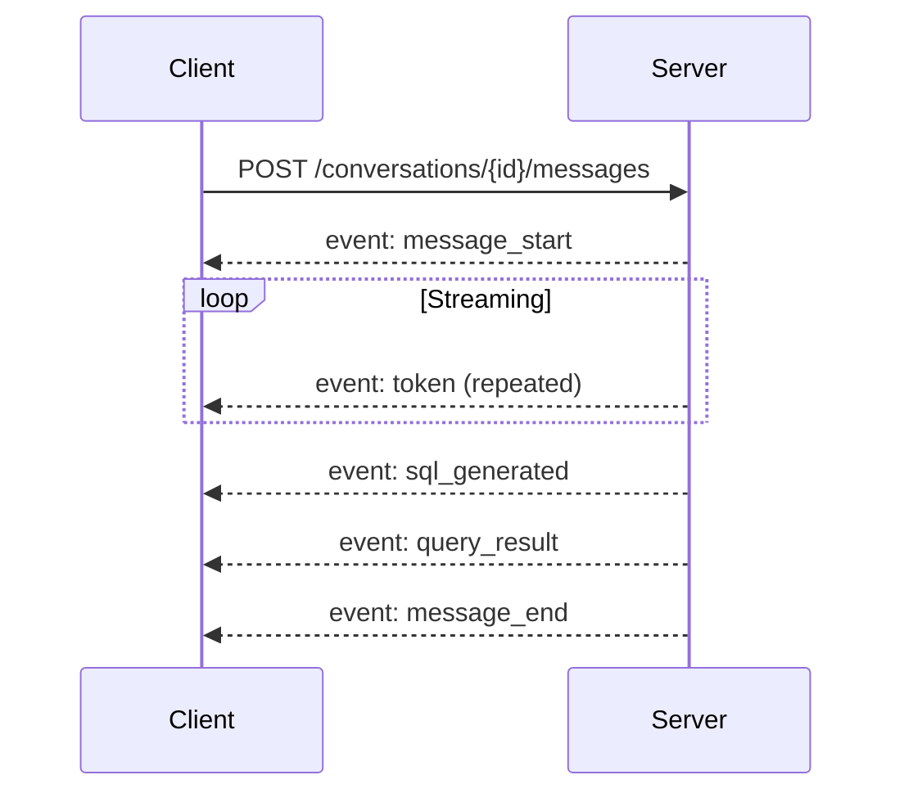

<!-- docs/api-reference.md -->
# API Reference

Complete reference for the DataX REST API. All versioned endpoints are prefixed with `/api/v1/`. Health probes are mounted at the application root for infrastructure compatibility.

**Base URL:** `http://localhost:8000`

---

## Health & Readiness

Infrastructure probes for liveness and readiness checks. These are mounted at the root level (not under `/api/v1/`) for Kubernetes compatibility, plus an API-level liveness probe.

### `GET /health`

Liveness probe — returns `200` if the FastAPI process is running. No dependency checks.

```json title="Response 200"
{
  "status": "ok"
}
```

### `GET /ready`

Readiness probe — checks PostgreSQL and DuckDB availability.

=== "Response 200"

    ```json
    {
      "status": "ready",
      "checks": {
        "postgresql": "ok",
        "duckdb": "ok"
      }
    }
    ```

=== "Response 503"

    ```json
    {
      "status": "unavailable",
      "checks": {
        "postgresql": "ok",
        "duckdb": "error: Connection failed"
      }
    }
    ```

### `GET /api/v1/health`

API-level liveness probe — confirms the v1 API router is mounted and responding.

```json title="Response 200"
{
  "status": "ok"
}
```

---

## Datasets

Upload files and manage datasets backed by DuckDB virtual tables. Supported formats: **CSV**, **Excel** (`.xlsx`, `.xls`), **Parquet**, and **JSON**.

### `POST /api/v1/datasets/upload`

Upload a data file for analysis via `multipart/form-data`. The file is streamed to disk in chunks. A dataset record is created immediately, and DuckDB registration runs as a **background task**.

**Request:** `multipart/form-data`

| Field  | Type     | Required | Description                                      |
|--------|----------|----------|--------------------------------------------------|
| `file` | file     | Yes      | The data file to upload                          |
| `name` | string   | No       | Display name (defaults to filename stem)         |

=== "Response 202"

    ```json
    {
      "id": "a1b2c3d4-e5f6-7890-abcd-ef1234567890",
      "name": "sales_data",
      "file_format": "csv",
      "file_size_bytes": 1048576,
      "status": "processing",
      "created_at": "2026-03-12T10:30:00"
    }
    ```

=== "Error 400 — Unsupported Format"

    ```json
    {
      "error": {
        "code": "UNSUPPORTED_FORMAT",
        "message": "File format '.docx' is not supported. Accepted: csv, xlsx, xls, parquet, json"
      }
    }
    ```

!!! info "Asynchronous Processing"
    The `202 Accepted` response means the file was saved and the dataset record created, but DuckDB registration is still running in the background. Poll `GET /api/v1/datasets/{id}` and check the `status` field — it transitions from `processing` to `ready` or `error`.

### `GET /api/v1/datasets`

List all datasets, sorted by `created_at` descending.

```json title="Response 200"
{
  "datasets": [
    {
      "id": "a1b2c3d4-e5f6-7890-abcd-ef1234567890",
      "name": "sales_data",
      "file_format": "csv",
      "file_size_bytes": 1048576,
      "row_count": 15000,
      "status": "ready",
      "created_at": "2026-03-12T10:30:00",
      "updated_at": "2026-03-12T10:30:05"
    }
  ]
}
```

### `GET /api/v1/datasets/{id}`

Get a single dataset with its schema columns.

```json title="Response 200"
{
  "id": "a1b2c3d4-e5f6-7890-abcd-ef1234567890",
  "name": "sales_data",
  "file_format": "csv",
  "file_size_bytes": 1048576,
  "row_count": 15000,
  "duckdb_table_name": "sales_data_abc123",
  "status": "ready",
  "created_at": "2026-03-12T10:30:00",
  "updated_at": "2026-03-12T10:30:05",
  "schema": [
    {
      "column_name": "revenue",
      "data_type": "DOUBLE",
      "is_nullable": true,
      "is_primary_key": false
    }
  ]
}
```

### `DELETE /api/v1/datasets/{id}`

Delete a dataset. Cascades cleanup: DuckDB table, file on disk, schema metadata, and database record.

**Response:** `204 No Content`

!!! warning "Cannot Delete While Processing"
    Attempting to delete a dataset with `status: "processing"` returns `409 Conflict` with error code `DATASET_PROCESSING`.

### `GET /api/v1/datasets/{id}/preview`

Preview dataset rows with pagination and sorting. Queries the DuckDB virtual table directly.

**Query Parameters:**

| Parameter    | Type    | Default | Description                          |
|-------------|---------|---------|--------------------------------------|
| `offset`    | integer | `0`     | Row offset (≥ 0)                     |
| `limit`     | integer | `100`   | Max rows to return (≥ 0)             |
| `sort_by`   | string  | `null`  | Column name to sort by               |
| `sort_order` | string | `asc`   | Sort direction: `asc` or `desc`      |

```json title="Response 200"
{
  "columns": ["id", "name", "revenue", "date"],
  "rows": [
    [1, "Product A", 99.99, "2026-01-15"],
    [2, "Product B", 149.50, "2026-01-16"]
  ],
  "total_rows": 15000,
  "offset": 0,
  "limit": 100
}
```

!!! note "Array Format"
    Rows are returned as arrays (not objects) for transfer efficiency. Column order matches the `columns` array.

---

## Connections

Manage external database connections with encrypted credential storage. Supported database types: **PostgreSQL** and **MySQL**.

!!! danger "Security"
    Passwords are **encrypted with Fernet** at rest and are **never returned** in any API response.

### `POST /api/v1/connections`

Create a new database connection. The server validates the `db_type`, encrypts the password, tests connectivity, and auto-introspects the schema on success.

**Request Body:**

```json title="ConnectionCreateRequest"
{
  "name": "Production DB",
  "db_type": "postgresql",
  "host": "db.example.com",
  "port": 5432,
  "database_name": "analytics",
  "username": "readonly_user",
  "password": "s3cret"
}
```

| Field           | Type    | Required | Constraints               |
|----------------|---------|----------|---------------------------|
| `name`         | string  | Yes      | 1–255 characters          |
| `db_type`      | string  | Yes      | `postgresql` or `mysql`   |
| `host`         | string  | Yes      | 1–255 characters          |
| `port`         | integer | Yes      | 1–65535                   |
| `database_name`| string  | Yes      | 1–255 characters          |
| `username`     | string  | Yes      | 1–255 characters          |
| `password`     | string  | Yes      | Min 1 character           |

=== "Response 201"

    ```json
    {
      "id": "b2c3d4e5-f6a7-8901-bcde-f12345678901",
      "name": "Production DB",
      "db_type": "postgresql",
      "host": "db.example.com",
      "port": 5432,
      "database_name": "analytics",
      "username": "readonly_user",
      "status": "connected",
      "last_tested_at": "2026-03-12T10:30:00+00:00",
      "created_at": "2026-03-12T10:30:00+00:00",
      "updated_at": "2026-03-12T10:30:00+00:00"
    }
    ```

=== "Error 408 — Timeout"

    ```json
    {
      "error": {
        "code": "HTTP_ERROR",
        "message": "Connection timed out after 10s. Troubleshooting tips: 1) Verify the host and port are correct. 2) Check that the database server is running. 3) Ensure firewall rules allow the connection."
      }
    }
    ```

### `GET /api/v1/connections`

List all connections. Passwords are never included.

```json title="Response 200"
{
  "connections": [
    {
      "id": "b2c3d4e5-f6a7-8901-bcde-f12345678901",
      "name": "Production DB",
      "db_type": "postgresql",
      "host": "db.example.com",
      "port": 5432,
      "database_name": "analytics",
      "username": "readonly_user",
      "status": "connected",
      "last_tested_at": "2026-03-12T10:30:00+00:00",
      "created_at": "2026-03-12T10:30:00+00:00",
      "updated_at": "2026-03-12T10:30:00+00:00"
    }
  ]
}
```

### `PUT /api/v1/connections/{id}`

Update an existing connection. All fields are optional. After update, the connection is re-tested and schema is re-introspected.

**Request Body:**

```json title="ConnectionUpdateRequest"
{
  "name": "Staging DB",
  "port": 5433
}
```

**Response:** Same shape as `ConnectionCreateRequest` response (status `200`).

### `DELETE /api/v1/connections/{id}`

Delete a connection, remove its schema metadata, and close the connection pool.

**Response:** `204 No Content`

### `POST /api/v1/connections/test-params`

Test connection parameters **without saving**. Validates connectivity, measures latency, and counts tables.

**Request Body:** Same fields as `ConnectionCreateRequest`.

=== "Response 200 — Success"

    ```json
    {
      "status": "connected",
      "latency_ms": 12.5,
      "tables_found": 42
    }
    ```

=== "Response 200 — Failure"

    ```json
    {
      "status": "error",
      "error": "Authentication failed: password authentication failed for user \"admin\""
    }
    ```

!!! note "Always Returns 200"
    This endpoint returns `200` even on connection failure — the `status` field indicates success or failure. This allows the UI to display the error message without HTTP-level error handling.

### `POST /api/v1/connections/{id}/test`

Test an existing saved connection. Decrypts stored credentials, connects, measures latency, and updates the connection's status.

**Response:** Same shape as `test-params` response.

### `POST /api/v1/connections/{id}/refresh-schema`

Re-introspect the database schema for an existing connection. If the database is unreachable, existing schema metadata is preserved.

```json title="Response 200"
{
  "source_id": "b2c3d4e5-f6a7-8901-bcde-f12345678901",
  "tables_found": 42,
  "columns_updated": 186,
  "refreshed_at": "2026-03-12T10:35:00+00:00"
}
```

---

## Conversations

Manage chat conversations. Messages are nested within conversations.

### `POST /api/v1/conversations`

Create a new conversation with the default title "New Conversation".

```json title="Response 201"
{
  "id": "c3d4e5f6-a7b8-9012-cdef-123456789012",
  "title": "New Conversation",
  "created_at": "2026-03-12T10:30:00"
}
```

### `GET /api/v1/conversations`

List conversations with **cursor-based pagination**, sorted by `updated_at` descending.

**Query Parameters:**

| Parameter | Type    | Default | Description                                 |
|-----------|---------|---------|---------------------------------------------|
| `cursor`  | string  | `null`  | UUID of the last conversation from previous page |
| `limit`   | integer | `20`    | Max results (1–100)                         |
| `search`  | string  | `null`  | Case-insensitive title filter               |

```json title="Response 200"
{
  "conversations": [
    {
      "id": "c3d4e5f6-a7b8-9012-cdef-123456789012",
      "title": "Revenue Analysis Q1",
      "created_at": "2026-03-12T10:30:00",
      "updated_at": "2026-03-12T11:15:00",
      "message_count": 8
    }
  ],
  "next_cursor": "d4e5f6a7-b890-1234-efab-234567890123"
}
```

!!! tip "Cursor Pagination"
    Pass the `next_cursor` value as the `cursor` parameter in your next request to fetch the next page. When `next_cursor` is `null`, there are no more results.

    The cursor is keyset-based on `(updated_at DESC, id DESC)`, which means it remains stable even if conversations are updated between page fetches.

### `GET /api/v1/conversations/{id}`

Get a conversation with its full message history in chronological order.

```json title="Response 200"
{
  "id": "c3d4e5f6-a7b8-9012-cdef-123456789012",
  "title": "Revenue Analysis Q1",
  "created_at": "2026-03-12T10:30:00",
  "messages": [
    {
      "id": "e5f6a7b8-9012-3456-abcd-ef1234567890",
      "role": "user",
      "content": "Show me total revenue by month",
      "metadata": null,
      "created_at": "2026-03-12T10:31:00"
    },
    {
      "id": "f6a7b890-1234-5678-bcde-f12345678901",
      "role": "assistant",
      "content": "Here's the monthly revenue breakdown...",
      "metadata": {
        "sql": "SELECT DATE_TRUNC('month', date) AS month, SUM(revenue) ...",
        "source_id": "a1b2c3d4-e5f6-7890-abcd-ef1234567890",
        "source_type": "dataset",
        "execution_time_ms": 45
      },
      "created_at": "2026-03-12T10:31:05"
    }
  ]
}
```

### `PATCH /api/v1/conversations/{id}`

Update a conversation's title.

**Request Body:**

```json
{
  "title": "Revenue Analysis Q1 2026"
}
```

```json title="Response 200"
{
  "id": "c3d4e5f6-a7b8-9012-cdef-123456789012",
  "title": "Revenue Analysis Q1 2026",
  "created_at": "2026-03-12T10:30:00",
  "updated_at": "2026-03-12T11:20:00"
}
```

### `DELETE /api/v1/conversations/{id}`

Delete a conversation and all its messages (cascade).

**Response:** `204 No Content`

---

## Messages (SSE Streaming)

The message endpoint is the core of the conversational AI experience. It accepts a user question, processes it through the AI agent pipeline, and streams the response via **Server-Sent Events (SSE)**.

### `POST /api/v1/conversations/{id}/messages`

Send a user message and receive an AI-generated response as an SSE stream.

**Request Body:**

```json title="SendMessageRequest"
{
  "content": "What are the top 10 products by revenue?"
}
```

| Field     | Type   | Required | Constraints        |
|-----------|--------|----------|--------------------|
| `content` | string | Yes      | Min 1 character    |

**Response:** `Content-Type: text/event-stream`

#### SSE Event Flow

The response is a stream of Server-Sent Events following this sequence:



#### SSE Event Types

Each event follows the standard SSE format:

```
event: {event_type}
data: {json_payload}

```

---

**`message_start`** — Emitted first. Signals the assistant response has begun.

```json
{
  "message_id": "f6a7b890-1234-5678-bcde-f12345678901",
  "role": "assistant"
}
```

---

**`token`** — Streamed text chunks of the AI response. Emitted multiple times.

```json
{
  "content": "Here's the monthly "
}
```

---

**`sql_generated`** — The SQL query generated by the AI agent.

```json
{
  "sql": "SELECT product_name, SUM(revenue) AS total FROM sales GROUP BY product_name ORDER BY total DESC LIMIT 10"
}
```

---

**`query_result`** — The executed query results.

```json
{
  "columns": ["product_name", "total"],
  "rows": [
    ["Widget Pro", 125000.50],
    ["Gadget X", 98750.00]
  ],
  "row_count": 10
}
```

---

**`message_end`** — Signals the response is complete.

```json
{
  "message_id": "f6a7b890-1234-5678-bcde-f12345678901"
}
```

---

**`error`** — Emitted when an error occurs during processing.

```json
{
  "code": "QUERY_ERROR",
  "message": "Column 'revnue' not found. Did you mean 'revenue'?"
}
```

!!! warning "chart_config Event"
    The `chart_config` event type is defined in the SSE protocol but is **not yet wired** in the current implementation. Chart configuration will be delivered via this event in a future release.

#### Error Codes in SSE

| Code           | Description                                    |
|----------------|------------------------------------------------|
| `NOT_FOUND`    | Conversation does not exist                    |
| `NO_PROVIDER`  | No AI provider is configured                   |
| `AI_ERROR`     | AI processing failed                           |
| `QUERY_ERROR`  | SQL query execution failed                     |
| `INTERNAL_ERROR` | Unexpected server error                      |

!!! tip "Client Implementation"
    Use an SSE client library (e.g., `EventSource` in browsers or `sse-starlette`-compatible clients) to consume the stream. Always handle the `error` event gracefully — it can arrive at any point in the stream, and `message_end` may still follow it.

---

## AI Providers

Configure AI model providers for the natural language query engine. Supports **OpenAI**, **Anthropic**, **Gemini**, and **OpenAI-compatible** endpoints.

Providers can come from two sources:

- **Environment variables** — auto-detected from `OPENAI_API_KEY`, `ANTHROPIC_API_KEY`, etc.
- **UI-configured** — created via this API with encrypted key storage

### `GET /api/v1/settings/providers`

List all configured providers. Merges environment-variable detected providers with UI-configured ones.

```json title="Response 200"
{
  "providers": [
    {
      "id": "d4e5f6a7-b890-1234-efab-234567890123",
      "provider_name": "openai",
      "model_name": "gpt-4o",
      "base_url": null,
      "is_default": true,
      "is_active": true,
      "has_api_key": true,
      "source": "env_var",
      "created_at": "2026-03-12T10:00:00"
    }
  ]
}
```

!!! danger "Security"
    API keys are **never returned**. The `has_api_key` boolean indicates whether a key is configured.

### `POST /api/v1/settings/providers`

Add a new AI provider configuration. The API key is encrypted with Fernet before storage.

**Request Body:**

```json title="ProviderCreateRequest"
{
  "provider_name": "anthropic",
  "model_name": "claude-sonnet-4-20250514",
  "api_key": "sk-ant-...",
  "base_url": null,
  "is_default": false
}
```

| Field           | Type    | Required | Description                                    |
|----------------|---------|----------|------------------------------------------------|
| `provider_name`| string  | Yes      | Provider identifier (e.g., `openai`, `anthropic`) |
| `model_name`   | string  | Yes      | Model identifier string                        |
| `api_key`      | string  | Yes      | API key for the provider                       |
| `base_url`     | string  | No       | Base URL (required for `openai_compatible`)    |
| `is_default`   | boolean | No       | Set as default provider (unsets others)         |

**Response:** `201` with `ProviderResponse` (same shape as list items).

### `DELETE /api/v1/settings/providers/{id}`

Remove a provider configuration.

**Response:** `204 No Content`

!!! warning "Environment Variable Providers"
    Providers detected from environment variables **cannot be deleted** via the API. Attempting to do so returns `409 Conflict` with error code `ENV_VAR_PROVIDER`. Remove the environment variable to disable these providers.

---

## Queries

Execute SQL queries, manage saved queries, and view execution history. All queries are enforced as **read-only** — write operations (`INSERT`, `UPDATE`, `DELETE`, `DROP`, etc.) are rejected.

### `POST /api/v1/queries/execute`

Execute a SQL query against a dataset (DuckDB) or connection (SQLAlchemy).

**Request Body:**

```json title="ExecuteRequest"
{
  "sql": "SELECT product_name, revenue FROM sales WHERE revenue > 1000",
  "source_id": "a1b2c3d4-e5f6-7890-abcd-ef1234567890",
  "source_type": "dataset"
}
```

| Field         | Type   | Required | Description                            |
|--------------|--------|----------|----------------------------------------|
| `sql`        | string | Yes      | SQL query (read-only enforced)         |
| `source_id`  | UUID   | Yes      | Dataset or connection UUID             |
| `source_type`| string | Yes      | `dataset` or `connection`              |

```json title="Response 200"
{
  "columns": ["product_name", "revenue"],
  "rows": [
    ["Widget Pro", 125000.50],
    ["Gadget X", 98750.00]
  ],
  "row_count": 2,
  "execution_time_ms": 23
}
```

### `POST /api/v1/queries/execute/cross-source`

Execute a cross-source query that joins data from multiple datasets and/or connections. Sub-queries run in parallel, results are loaded into DuckDB temp tables, and a final join query runs in DuckDB.

**Request Body:**

```json title="CrossSourceExecuteRequest"
{
  "sub_queries": [
    {
      "alias": "sales",
      "sql": "SELECT product_id, revenue FROM sales",
      "source_id": "a1b2c3d4-e5f6-7890-abcd-ef1234567890",
      "source_type": "dataset"
    },
    {
      "alias": "products",
      "sql": "SELECT id, name FROM products",
      "source_id": "b2c3d4e5-f6a7-8901-bcde-f12345678901",
      "source_type": "connection"
    }
  ],
  "join_sql": "SELECT p.name, s.revenue FROM sales s JOIN products p ON s.product_id = p.id"
}
```

```json title="Response 200"
{
  "columns": ["name", "revenue"],
  "rows": [["Widget Pro", 125000.50]],
  "row_count": 1,
  "execution_time_ms": 156,
  "sub_query_times_ms": {
    "sales": 12,
    "products": 89
  }
}
```

### `POST /api/v1/queries/explain`

Get the `EXPLAIN` plan for a SQL query without executing it.

**Request Body:** Same as `ExecuteRequest`.

```json title="Response 200"
{
  "plan": "┌─────────────────────────────────────┐\n│         SEQUENTIAL_SCAN             │\n│   ─ ─ ─ ─ ─ ─ ─ ─ ─ ─ ─ ─ ─ ─ ─  │\n│             sales                    │\n└─────────────────────────────────────┘"
}
```

### `POST /api/v1/queries/save`

Save a query for later use.

**Request Body:**

```json title="SaveQueryRequest"
{
  "name": "Top Revenue Products",
  "sql_content": "SELECT product_name, SUM(revenue) FROM sales GROUP BY 1 ORDER BY 2 DESC LIMIT 10",
  "source_id": "a1b2c3d4-e5f6-7890-abcd-ef1234567890",
  "source_type": "dataset"
}
```

| Field         | Type   | Required | Constraints           |
|--------------|--------|----------|-----------------------|
| `name`       | string | Yes      | 1–255 characters      |
| `sql_content`| string | Yes      | Min 1 character       |
| `source_id`  | UUID   | No       | Optional source UUID  |
| `source_type`| string | No       | Optional source type  |

```json title="Response 201"
{
  "id": "e5f6a7b8-9012-3456-abcd-ef1234567890",
  "name": "Top Revenue Products",
  "sql_content": "SELECT product_name, SUM(revenue) FROM sales GROUP BY 1 ORDER BY 2 DESC LIMIT 10",
  "source_id": "a1b2c3d4-e5f6-7890-abcd-ef1234567890",
  "source_type": "dataset",
  "created_at": "2026-03-12T10:30:00",
  "updated_at": "2026-03-12T10:30:00"
}
```

### `GET /api/v1/queries/saved`

List all saved queries, sorted by `updated_at` descending.

```json title="Response 200"
{
  "queries": [
    {
      "id": "e5f6a7b8-9012-3456-abcd-ef1234567890",
      "name": "Top Revenue Products",
      "sql_content": "SELECT ...",
      "source_id": "a1b2c3d4-e5f6-7890-abcd-ef1234567890",
      "source_type": "dataset",
      "created_at": "2026-03-12T10:30:00",
      "updated_at": "2026-03-12T10:30:00"
    }
  ]
}
```

### `PUT /api/v1/queries/saved/{id}`

Update a saved query. Request body is the same as `SaveQueryRequest`.

**Response:** `200` with updated `SavedQueryResponse`.

### `DELETE /api/v1/queries/saved/{id}`

Delete a saved query.

**Response:** `204 No Content`

### `GET /api/v1/queries/history`

Get in-memory query execution history with pagination.

**Query Parameters:**

| Parameter | Type    | Default | Description                  |
|-----------|---------|---------|------------------------------|
| `limit`   | integer | `50`    | Max entries (1–500)          |
| `offset`  | integer | `0`     | Offset for pagination (≥ 0)  |

```json title="Response 200"
{
  "history": [
    {
      "sql": "SELECT COUNT(*) FROM sales",
      "source_id": "a1b2c3d4-e5f6-7890-abcd-ef1234567890",
      "source_type": "dataset",
      "row_count": 1,
      "execution_time_ms": 5,
      "status": "success",
      "executed_at": "2026-03-12T10:35:00"
    }
  ],
  "total": 127,
  "offset": 0,
  "limit": 50
}
```

!!! warning "In-Memory Storage"
    Query history is stored in memory and is **lost on server restart**. It is not persisted to the database.

---

## Schema

Unified schema registry aggregating metadata from all datasets and connections.

### `GET /api/v1/schema`

Get the complete schema across all data sources, grouped by source → table → columns. Used by the AI agent for SQL generation context, the SQL autocomplete, and the schema browser UI.

```json title="Response 200"
{
  "sources": [
    {
      "source_id": "a1b2c3d4-e5f6-7890-abcd-ef1234567890",
      "source_type": "dataset",
      "source_name": "sales_data",
      "tables": [
        {
          "table_name": "sales_data_abc123",
          "columns": [
            {
              "name": "id",
              "type": "INTEGER",
              "nullable": false,
              "is_primary_key": true
            },
            {
              "name": "revenue",
              "type": "DOUBLE",
              "nullable": true,
              "is_primary_key": false
            }
          ]
        }
      ]
    },
    {
      "source_id": "b2c3d4e5-f6a7-8901-bcde-f12345678901",
      "source_type": "connection",
      "source_name": "Production DB",
      "tables": [
        {
          "table_name": "products",
          "columns": [
            {
              "name": "id",
              "type": "integer",
              "nullable": false,
              "is_primary_key": true
            },
            {
              "name": "name",
              "type": "varchar(255)",
              "nullable": false,
              "is_primary_key": false,
              "foreign_key_ref": null
            }
          ]
        }
      ]
    }
  ]
}
```

!!! note "Connection Columns"
    Connection schema columns may include a `foreign_key_ref` field (e.g., `"other_table.id"`) when foreign key relationships are detected during introspection. Dataset columns do not include this field.

---

## Error Handling

All endpoints return errors in a consistent JSON format:

```json title="Error Response"
{
  "error": {
    "code": "ERROR_CODE",
    "message": "Human-readable description of what went wrong."
  }
}
```

### Error Codes

| Code                  | HTTP Status | Description                                            |
|-----------------------|-------------|--------------------------------------------------------|
| `VALIDATION_ERROR`    | 422         | Request body failed Pydantic validation                |
| `NOT_FOUND`           | 404         | Requested resource does not exist                      |
| `ALREADY_EXISTS`      | 409         | Resource already exists (duplicate)                    |
| `INTERNAL_ERROR`      | 500         | Unhandled server error                                 |
| `HTTP_ERROR`          | varies      | Generic HTTP exception (from FastAPI/Starlette)        |
| `INVALID_UUID`        | 400         | Malformed UUID parameter                               |
| `UNSUPPORTED_FORMAT`  | 400         | File format not in CSV, XLSX, XLS, Parquet, JSON       |
| `EMPTY_FILE`          | 400         | Uploaded file contains no data                         |
| `DATASET_PROCESSING`  | 409         | Cannot delete a dataset while DuckDB registration runs |
| `STORAGE_ERROR`       | 500         | File storage directory is not writable                 |
| `UPLOAD_FAILED`       | 500         | Failed to write uploaded file to disk                  |
| `CONNECTION_ERROR`    | 503         | Database connection lost or unreachable                |
| `READ_ONLY_VIOLATION` | 400         | SQL contains write operations (INSERT, UPDATE, etc.)   |
| `INVALID_SOURCE_TYPE` | 400         | `source_type` must be `dataset` or `connection`        |
| `SOURCE_NOT_FOUND`    | 404         | Dataset or connection UUID does not exist              |
| `QUERY_TIMEOUT`       | 408         | Query exceeded the time limit                          |
| `INVALID_SQL`         | 400         | SQL syntax error or execution failure                  |
| `CROSS_SOURCE_ERROR`  | 400         | Cross-source query execution failed                    |
| `EXPLAIN_ERROR`       | 400         | EXPLAIN plan generation failed                         |
| `SAVED_QUERY_NOT_FOUND` | 404       | Saved query UUID does not exist                        |
| `INVALID_PROVIDER`    | 400         | Invalid provider name or configuration                 |
| `ENCRYPTION_ERROR`    | 500         | Failed to encrypt API key                              |
| `PROVIDER_NOT_FOUND`  | 404         | Provider UUID does not exist                           |
| `ENV_VAR_PROVIDER`    | 409         | Cannot delete an environment-variable provider         |
| `INVALID_CURSOR`      | 400         | Pagination cursor UUID does not exist                  |
| `NO_PROVIDER`         | —           | No AI provider configured (SSE error event only)       |
| `AI_ERROR`            | —           | AI processing failed (SSE error event only)            |
| `QUERY_ERROR`         | —           | Query failed during AI pipeline (SSE error event only) |
