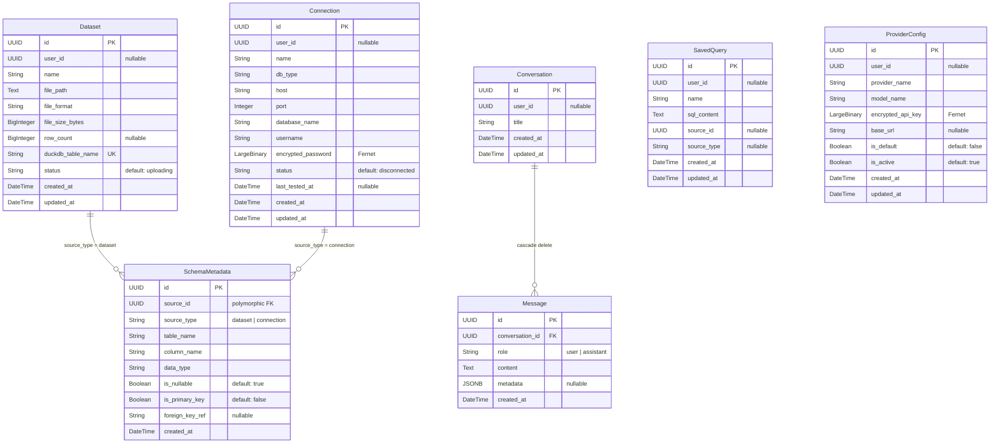
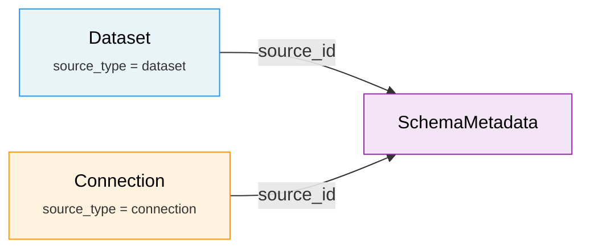
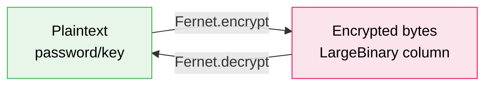

<!-- docs/data-models.md -->
# Data Models

DataX persists all application state in PostgreSQL using **SQLAlchemy 2.0** declarative ORM models. This page documents each model, its fields, relationships, and the design patterns shared across the schema.

## Entity-Relationship Diagram



## Shared Mixins

All models inherit from a shared `Base` class and one of two timestamp mixins defined in `backend/app/models/base.py`.

### TimestampMixin

Adds both `created_at` and `updated_at` columns. Used by entities that can be modified after creation.

| Column       | Type                     | Constraints                             |
| ------------ | ------------------------ | --------------------------------------- |
| `created_at` | `DateTime(timezone=True)` | `NOT NULL`, `server_default=func.now()` |
| `updated_at` | `DateTime(timezone=True)` | `NOT NULL`, `server_default=func.now()`, `onupdate=func.now()` |

**Used by:** Dataset, Connection, Conversation, SavedQuery, ProviderConfig

### CreatedAtMixin

Adds only `created_at`. Used by entities that are **immutable after creation** — once written, rows are never updated.

| Column       | Type                     | Constraints                             |
| ------------ | ------------------------ | --------------------------------------- |
| `created_at` | `DateTime(timezone=True)` | `NOT NULL`, `server_default=func.now()` |

**Used by:** Message, SchemaMetadata

!!! tip "Why two mixins?"
    Messages and schema metadata rows are append-only. Using `CreatedAtMixin` makes this intent explicit in the schema and avoids the overhead of tracking `updated_at` on rows that never change.

---

## Models

### Dataset

Tracks uploaded file metadata and the corresponding DuckDB virtual table used for analytical queries.

**Table:** `datasets` &nbsp;|&nbsp; **Mixin:** `TimestampMixin` &nbsp;|&nbsp; **Source:** `backend/app/models/orm.py`

| Column              | Type            | Constraints                     | Description |
| ------------------- | --------------- | ------------------------------- | ----------- |
| `id`                | `UUID`          | PK, default `uuid4()`          | Primary key |
| `user_id`           | `UUID`          | nullable                        | Reserved for multi-user support |
| `name`              | `String(255)`   | `NOT NULL`                      | User-facing dataset name |
| `file_path`         | `Text`          | `NOT NULL`                      | Path to the uploaded file on disk |
| `file_format`       | `String(50)`    | `NOT NULL`                      | File type: `csv`, `xlsx`, `xls`, `parquet`, `json` |
| `file_size_bytes`   | `BigInteger`    | `NOT NULL`                      | File size in bytes |
| `row_count`         | `BigInteger`    | nullable                        | Row count, populated after processing |
| `duckdb_table_name` | `String(255)`   | `NOT NULL`, `UNIQUE`            | Virtual table name registered in DuckDB |
| `status`            | `String(20)`    | `NOT NULL`, default `uploading` | Lifecycle state: `uploading` → `processing` → `ready` / `error` |

---

### Connection

Stores credentials for external database connections. Passwords are **encrypted at rest** using Fernet symmetric encryption.

**Table:** `connections` &nbsp;|&nbsp; **Mixin:** `TimestampMixin` &nbsp;|&nbsp; **Source:** `backend/app/models/orm.py`

| Column               | Type            | Constraints                        | Description |
| -------------------- | --------------- | ---------------------------------- | ----------- |
| `id`                 | `UUID`          | PK, default `uuid4()`             | Primary key |
| `user_id`            | `UUID`          | nullable                           | Reserved for multi-user support |
| `name`               | `String(255)`   | `NOT NULL`                         | User-facing connection name |
| `db_type`            | `String(50)`    | `NOT NULL`                         | Database engine: `postgresql`, `mysql` |
| `host`               | `String(255)`   | `NOT NULL`                         | Database host address |
| `port`               | `Integer`       | `NOT NULL`                         | Database port |
| `database_name`      | `String(255)`   | `NOT NULL`                         | Target database name |
| `username`           | `String(255)`   | `NOT NULL`                         | Database username |
| `encrypted_password` | `LargeBinary`   | `NOT NULL`                         | Fernet-encrypted database password |
| `status`             | `String(20)`    | `NOT NULL`, default `disconnected` | Connection state |
| `last_tested_at`     | `DateTime(tz)`  | nullable                           | Last successful connection test |

---

### SchemaMetadata

Column-level schema information for both datasets and connections, using a **polymorphic discriminator** pattern.

**Table:** `schema_metadata` &nbsp;|&nbsp; **Mixin:** `CreatedAtMixin` &nbsp;|&nbsp; **Source:** `backend/app/models/orm.py`

| Column           | Type           | Constraints                    | Description |
| ---------------- | -------------- | ------------------------------ | ----------- |
| `id`             | `UUID`         | PK, default `uuid4()`         | Primary key |
| `source_id`      | `UUID`         | `NOT NULL`                     | References `Dataset.id` or `Connection.id` |
| `source_type`    | `String(20)`   | `NOT NULL`                     | Discriminator: `dataset` or `connection` |
| `table_name`     | `String(255)`  | `NOT NULL`                     | Table name within the data source |
| `column_name`    | `String(255)`  | `NOT NULL`                     | Column name |
| `data_type`      | `String(100)`  | `NOT NULL`                     | Column data type (e.g., `VARCHAR`, `INTEGER`) |
| `is_nullable`    | `Boolean`      | `NOT NULL`, default `true`     | Whether the column allows NULL values |
| `is_primary_key` | `Boolean`      | `NOT NULL`, default `false`    | Whether the column is a primary key |
| `foreign_key_ref`| `String(255)`  | nullable                       | Foreign key reference (e.g., `other_table.id`) |

**Indexes:**

| Name                 | Columns                    | Purpose |
| -------------------- | -------------------------- | ------- |
| `idx_schema_source`  | `(source_id, source_type)` | Look up all columns for a given data source |
| `idx_schema_table`   | `(table_name)`             | Look up columns by table name |

#### Polymorphic Pattern



!!! info "Why polymorphic instead of separate tables?"
    A single `SchemaMetadata` table with a `source_type` discriminator avoids duplicating an identical schema across `dataset_schema` and `connection_schema` tables. The composite index on `(source_id, source_type)` ensures efficient lookups. The trade-off is that referential integrity cannot be enforced at the database level — it is enforced in application code instead.

---

### Conversation

Container for a chat conversation. Owns a collection of messages with cascade deletion.

**Table:** `conversations` &nbsp;|&nbsp; **Mixin:** `TimestampMixin` &nbsp;|&nbsp; **Source:** `backend/app/models/orm.py`

| Column    | Type          | Constraints            | Description |
| --------- | ------------- | ---------------------- | ----------- |
| `id`      | `UUID`        | PK, default `uuid4()`  | Primary key |
| `user_id` | `UUID`        | nullable               | Reserved for multi-user support |
| `title`   | `String(255)` | `NOT NULL`             | Conversation title |

**Relationships:**

| Relationship | Target    | Type     | Cascade              | Ordering |
| ------------ | --------- | -------- | -------------------- | -------- |
| `messages`   | `Message` | One-to-many | `all, delete-orphan` | `Message.created_at` ascending |

!!! warning "Cascade Delete"
    Deleting a `Conversation` will **cascade-delete all associated messages**. The foreign key uses `ondelete="CASCADE"` at the database level, and the ORM relationship uses `cascade="all, delete-orphan"` for in-session consistency.

---

### Message

An individual chat message within a conversation. Messages are **immutable** — they are created once and never updated.

**Table:** `messages` &nbsp;|&nbsp; **Mixin:** `CreatedAtMixin` &nbsp;|&nbsp; **Source:** `backend/app/models/orm.py`

| Column            | Type          | Constraints                                  | Description |
| ----------------- | ------------- | -------------------------------------------- | ----------- |
| `id`              | `UUID`        | PK, default `uuid4()`                        | Primary key |
| `conversation_id` | `UUID`        | FK → `conversations.id`, `ON DELETE CASCADE` | Parent conversation |
| `role`            | `String(20)`  | `NOT NULL`                                   | Message author: `user` or `assistant` |
| `content`         | `Text`        | `NOT NULL`                                   | Message text content |
| `metadata`        | `JSONB/JSON`  | nullable                                     | Structured metadata (see below) |

**Relationships:**

| Relationship   | Target         | Type      |
| -------------- | -------------- | --------- |
| `conversation` | `Conversation` | Many-to-one |

#### Message Metadata Structure

The `metadata` column stores a flexible JSON object with query-related details for assistant messages:

```json
{
  "sql": "SELECT region, SUM(revenue) FROM sales GROUP BY region",
  "source_id": "a1b2c3d4-...",
  "source_type": "dataset",
  "execution_time_ms": 42,
  "row_count": 15,
  "attempts": 1,
  "correction_history": []
}
```

| Key                  | Type     | Description |
| -------------------- | -------- | ----------- |
| `sql`                | `string` | The SQL query generated by the AI agent |
| `source_id`          | `string` | UUID of the dataset or connection queried |
| `source_type`        | `string` | `dataset` or `connection` |
| `execution_time_ms`  | `number` | Query execution time in milliseconds |
| `row_count`          | `number` | Number of rows returned |
| `attempts`           | `number` | Number of SQL generation attempts (max 3) |
| `correction_history` | `array`  | Previous failed SQL attempts and error messages |

!!! note "ORM Column Mapping"
    The Python attribute is named `metadata_` (with trailing underscore) to avoid shadowing SQLAlchemy's built-in `metadata`. It maps to the database column `metadata` via `mapped_column("metadata", JSONVariant, ...)`.

---

### SavedQuery

A user-saved SQL query, optionally linked to a specific data source.

**Table:** `saved_queries` &nbsp;|&nbsp; **Mixin:** `TimestampMixin` &nbsp;|&nbsp; **Source:** `backend/app/models/orm.py`

| Column        | Type          | Constraints            | Description |
| ------------- | ------------- | ---------------------- | ----------- |
| `id`          | `UUID`        | PK, default `uuid4()`  | Primary key |
| `user_id`     | `UUID`        | nullable               | Reserved for multi-user support |
| `name`        | `String(255)` | `NOT NULL`             | User-defined query name |
| `sql_content` | `Text`        | `NOT NULL`             | The saved SQL statement |
| `source_id`   | `UUID`        | nullable               | Optional dataset or connection reference |
| `source_type` | `String(20)`  | nullable               | `dataset` or `connection` (if `source_id` set) |

---

### ProviderConfig

AI provider configuration with encrypted API keys. Supports multiple providers with one marked as the default.

**Table:** `provider_configs` &nbsp;|&nbsp; **Mixin:** `TimestampMixin` &nbsp;|&nbsp; **Source:** `backend/app/models/orm.py`

| Column              | Type           | Constraints                   | Description |
| ------------------- | -------------- | ----------------------------- | ----------- |
| `id`                | `UUID`         | PK, default `uuid4()`         | Primary key |
| `user_id`           | `UUID`         | nullable                      | Reserved for multi-user support |
| `provider_name`     | `String(50)`   | `NOT NULL`                    | Provider: `openai`, `anthropic`, `gemini`, `openai_compatible` |
| `model_name`        | `String(100)`  | `NOT NULL`                    | Model identifier (e.g., `gpt-4o`, `claude-sonnet-4-20250514`) |
| `encrypted_api_key` | `LargeBinary`  | `NOT NULL`                    | Fernet-encrypted API key |
| `base_url`          | `String(500)`  | nullable                      | Custom endpoint for OpenAI-compatible providers |
| `is_default`        | `Boolean`      | `NOT NULL`, default `false`   | Whether this is the default provider |
| `is_active`         | `Boolean`      | `NOT NULL`, default `true`    | Whether this provider is enabled |

---

## Design Patterns

### Fernet Encryption at Rest

Two models store sensitive credentials — `Connection.encrypted_password` and `ProviderConfig.encrypted_api_key`. Both use **Fernet symmetric encryption** (from the `cryptography` library) to encrypt values before persisting to the database.



!!! danger "Security Boundaries"
    - Encrypted values are stored as `LargeBinary` — raw bytes, not base64 strings
    - The Fernet key is derived from the application's `SECRET_KEY` environment variable
    - Passwords and API keys are **never returned in API responses**

### JSONB with SQLite Test Compatibility

The `Message.metadata` column uses a type variant pattern to work across both PostgreSQL (production) and SQLite (tests):

```python title="backend/app/models/orm.py"
JSONVariant = JSON().with_variant(JSONB, "postgresql")
```

=== "PostgreSQL (production)"

    Uses native `JSONB` — supports indexing, containment queries (`@>`), and efficient JSON path operations.

=== "SQLite (tests)"

    Falls back to plain `JSON` — stores as a text column. JSON operations are limited but sufficient for test assertions.

### Nullable `user_id` Pattern

Every entity includes a `user_id: UUID | None` column that is currently always `NULL`. This is a forward-compatibility pattern for multi-user support:

- **Current behavior (single-user MVP):** All queries ignore `user_id`. Every record is visible to the single user.
- **Future behavior:** Queries will filter by `user_id` to enforce row-level isolation between users.

!!! tip "Migration path"
    When multi-user support is added, a data migration will set `user_id` on existing rows and an `ALTER TABLE` will make the column `NOT NULL`. No schema redesign is needed — only query filters change.

### Boolean Server Defaults

Boolean columns use SQLAlchemy's `sa_true()` and `sa_false()` helpers instead of Python literal `True`/`False`:

```python title="backend/app/models/orm.py"
from sqlalchemy import true as sa_true, false as sa_false

is_default: Mapped[bool] = mapped_column(
    Boolean, nullable=False, server_default=sa_false()
)
```

This generates the correct `server_default` SQL expression for both PostgreSQL (`DEFAULT true`) and SQLite (`DEFAULT 1`), ensuring test compatibility.

### UUID Primary Keys

All models use `UUID` primary keys with Python-side `uuid4()` generation:

```python title="backend/app/models/base.py"
def generate_uuid() -> uuid.UUID:
    return uuid.uuid4()
```

UUIDs are generated in Python (not via `gen_random_uuid()` in PostgreSQL) to maintain compatibility with SQLite test databases. The Alembic migration defines the column as `sa.Uuid()`, which maps to the native `UUID` type on PostgreSQL.

---

## Database Migrations

DataX uses **Alembic** for schema migrations. The migration configuration lives in `backend/alembic/`.

| Revision       | Description     | Tables Created |
| -------------- | --------------- | -------------- |
| `afded8db5834` | Initial schema  | All 7 tables   |

### Common Commands

```bash
# Apply all pending migrations
uv run alembic upgrade head

# Create a new auto-generated migration
uv run alembic revision --autogenerate -m "description"

# View current migration state
uv run alembic current

# Rollback one migration
uv run alembic downgrade -1
```

!!! note "Migration Order"
    The initial migration creates tables in dependency order — independent tables first (`datasets`, `connections`, `schema_metadata`, `conversations`), then dependent tables (`messages`, `saved_queries`, `provider_configs`). The downgrade drops them in reverse order.
