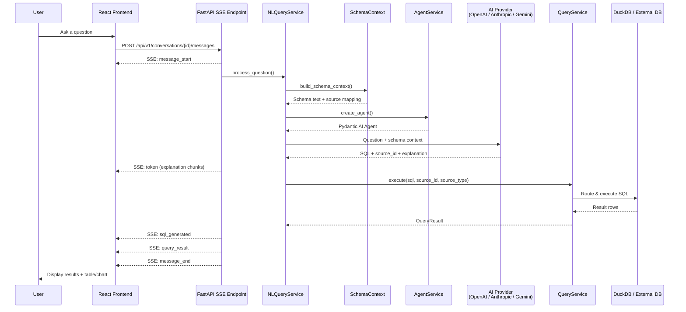
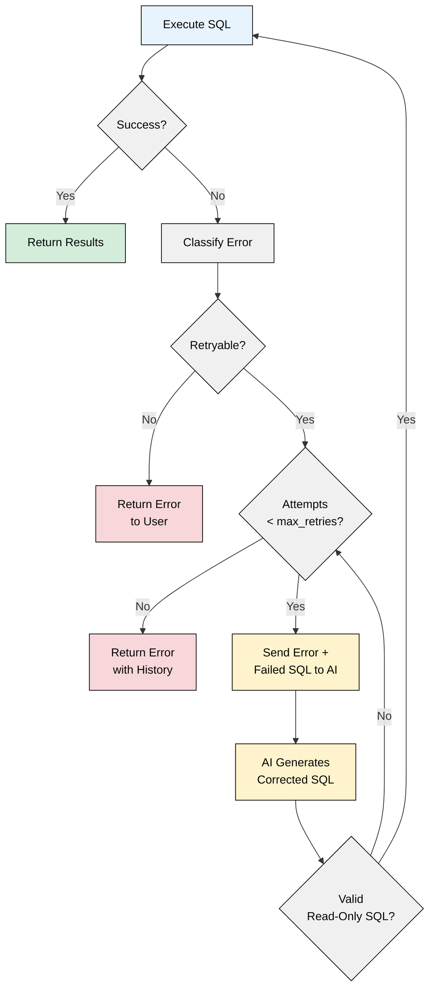

<!-- docs/ai-pipeline.md -->
# AI Pipeline

The AI pipeline is the core of DataX — it transforms natural language questions into SQL queries, executes them against the right data source, and streams results back with optional visualizations. This page walks through every stage of that pipeline, from question to answer.



## Pipeline Overview

Every user question flows through `NLQueryService.process_question()`, the orchestrator that coordinates six services:

| Service | File | Responsibility |
|---|---|---|
| **NLQueryService** | `services/nl_query_service.py` | Orchestrates the full pipeline |
| **SchemaContext** | `services/schema_context.py` | Builds schema metadata for the AI prompt |
| **AgentService** | `services/agent_service.py` | Creates the Pydantic AI agent with the right provider |
| **ProviderService** | `services/provider_service.py` | Manages AI provider configs and API keys |
| **QueryService** | `services/query_service.py` | Routes and executes SQL (DuckDB or external DB) |
| **ChartHeuristics + ChartConfig** | `services/chart_heuristics.py`, `services/chart_config.py` | Chart type selection and Plotly config generation |

## Step 1: Schema Context Building

**Service:** `SchemaContext` (`build_schema_context()`)

Before the AI can generate SQL, it needs to know what tables and columns exist. The schema context service queries all `SchemaMetadata` rows from PostgreSQL and formats them as structured text injected into the AI agent's system prompt.

``` python title="apps/backend/src/app/services/schema_context.py"
@dataclass
class SchemaContextResult:
    context_text: str       # Formatted text for the AI prompt
    table_count: int = 0
    total_columns: int = 0
    truncated: bool = False  # True if > MAX_SCHEMA_TABLES (100)
    error: str | None = None
```

The formatted output looks like:

```
## Available Data Sources

### Dataset: sales_data
Table: ds_sales_2024
  - id (integer, PK, NOT NULL)
  - "date" (date, NOT NULL)
  - amount (decimal, nullable)
  - customer_id (integer, NOT NULL, FK -> customers.id)

### Connection: production_db
Table: users
  - id (integer, PK, NOT NULL)
  - "name" (varchar, NOT NULL)
```

!!! note "Reserved Keyword Quoting"
    Column and table names that collide with SQL reserved keywords (like `date`, `name`, `user`) are automatically double-quoted in the schema output. This tells the AI to escape them in generated SQL, preventing syntax errors.

!!! info "Token Budget"
    When the schema exceeds **100 tables**, sources are prioritized by recency (most recently created first) and the list is truncated with a note about omitted tables.

Alongside the schema text, `_resolve_source_mapping()` builds a lookup table mapping table names to `{source_id, source_type}` pairs. This mapping is used later to resolve which data source the AI's SQL should run against.

## Step 2: Agent Creation

**Service:** `AgentService` (`create_agent()`)

The agent factory resolves the AI provider, builds the model instance, and creates a [Pydantic AI](https://ai.pydantic.dev/) `Agent` with the analytics system prompt.

``` python title="apps/backend/src/app/services/agent_service.py"
ANALYTICS_SYSTEM_PROMPT = """\
You are DataX, an AI data analytics assistant. \
Your role is to help users explore and understand their data \
through natural language conversation.
...
"""
```

The agent is configured with:

- **Model**: Resolved from the active provider (see [Multi-Provider Support](#multi-provider-support) below)
- **System prompt**: `ANALYTICS_SYSTEM_PROMPT` + injected schema context
- **Dependencies**: `AgentDeps` dataclass with schema context, conversation ID, and available table names
- **Retries**: Configurable (default 3) for transient model call failures

The `create_model()` function constructs the appropriate Pydantic AI model class for each provider. OpenAI uses `OpenAIResponsesModel` (the [Responses API](https://platform.openai.com/docs/api-reference/responses)), while Anthropic and Gemini use their respective native model classes. OpenAI-compatible providers use `OpenAIChatModel` (the Chat Completions API), since third-party endpoints typically do not support the Responses API.

``` python title="apps/backend/src/app/services/agent_service.py"
def create_model(provider_name, model_name, api_key, base_url=None, timeout=30.0):
    if provider_name == ProviderName.OPENAI:
        provider = OpenAIProvider(api_key=api_key)
        return OpenAIResponsesModel(model_name, provider=provider)

    # ... Anthropic, Gemini use their native model classes ...

    if provider_name == ProviderName.OPENAI_COMPATIBLE:
        provider = OpenAIProvider(api_key=api_key, base_url=base_url)
        return OpenAIChatModel(model_name, provider=provider)
```

## Step 3: SQL Generation

The NLQueryService sends the user's question to the AI agent along with the schema context and a structured prompt. The agent must respond in a specific format:

=== "Query Response"

    ```
    SQL: SELECT department, AVG(salary) FROM employees GROUP BY department
    SOURCE_ID: 550e8400-e29b-41d4-a716-446655440000
    SOURCE_TYPE: dataset
    EXPLANATION: Calculates the average salary per department.
    ```

=== "Clarification Response"

    ```
    CLARIFICATION: Which time period are you interested in? The dataset has data from 2020-2024.
    EXPLANATION: The question "show me sales trends" is ambiguous without a date range.
    ```

=== "No Source Response"

    ```
    NO_SOURCE: No dataset or connection contains employee salary data.
    EXPLANATION: You might need to upload an HR dataset or connect to your HR database.
    ```

The response is parsed by `_parse_ai_output()` using regex field extraction into a structured `SQLGenerationResult`:

``` python title="apps/backend/src/app/services/nl_query_service.py"
class SQLGenerationResult(BaseModel):
    sql: str | None = None
    source_id: str | None = None
    source_type: str | None = None       # "dataset" or "connection"
    explanation: str = ""
    needs_clarification: bool = False
    clarifying_question: str | None = None
    no_relevant_source: bool = False
    no_source_message: str | None = None
```

!!! tip "Source Resolution Fallback"
    If the AI doesn't include `SOURCE_ID` or `SOURCE_TYPE` in its response, the pipeline attempts to infer the source by extracting table names from `FROM` and `JOIN` clauses and matching them against the source mapping.

## Step 4: Query Execution

**Service:** `QueryService` (`execute()`)

Once SQL is generated and validated, `QueryService` routes it to the appropriate engine:

| Source Type | Engine | Dialect |
|---|---|---|
| `dataset` | DuckDB (in-process) | DuckDB SQL |
| `connection` | SQLAlchemy → external DB | PostgreSQL or MySQL |

### DuckDB View Rehydration

DuckDB runs in-memory, so all view definitions are lost when the backend process exits. To ensure uploaded datasets remain queryable after a server restart, the application re-registers DuckDB views during startup.

The `_rehydrate_duckdb_views()` function in the lifespan manager queries PostgreSQL for all datasets with `status = READY`, checks that each underlying file still exists on disk, and calls `duckdb_mgr.register_file()` to recreate the view. Datasets whose files are missing are marked as `ERROR`.

``` python title="apps/backend/src/app/main.py"
def _rehydrate_duckdb_views(session_factory, duckdb_mgr):
    """Re-create DuckDB views for all ready datasets after a restart."""
    with session_factory() as session:
        datasets = session.execute(
            select(Dataset).where(Dataset.status == DatasetStatus.READY)
        ).scalars().all()

        for ds in datasets:
            file_path = Path(ds.file_path)
            if not file_path.exists():
                ds.status = DatasetStatus.ERROR
                continue
            duckdb_mgr.register_file(file_path, ds.duckdb_table_name, ds.file_format)

        session.commit()
```

!!! info "No Re-Upload Required"
    Users do not need to re-upload files after a restart. The file data and PostgreSQL metadata survive across restarts — only the in-memory DuckDB views need to be recreated. This happens automatically before the server accepts requests.

### Safety Checks

Every query passes through two layers of read-only enforcement:

1. **API layer**: `is_read_only_sql()` regex-checks for write keywords (`INSERT`, `UPDATE`, `DELETE`, `DROP`, `ALTER`, `CREATE`, `TRUNCATE`, etc.)
2. **Service layer**: `QueryService.execute()` performs the same check before routing

### Execution Timeouts

For external database connections, per-statement timeouts are set before executing user SQL:

=== "PostgreSQL"

    ```sql
    SET LOCAL statement_timeout = '30000'  -- 30 seconds (transaction-scoped)
    ```

=== "MySQL"

    ```sql
    SET SESSION max_execution_time = 30000  -- 30 seconds (session-scoped)
    ```

The timeout is configurable via `DATAX_MAX_QUERY_TIMEOUT` (default: 30 seconds).

### Result Structure

``` python title="apps/backend/src/app/services/query_service.py"
@dataclass
class QueryResult:
    columns: list[str] = field(default_factory=list)
    rows: list[list] = field(default_factory=list)
    row_count: int = 0
    execution_time_ms: int = 0
    status: str = "success"           # "success", "error", or "timeout"
    error_message: str | None = None
```

## Step 5: Self-Correction Loop

When SQL execution fails with a retryable error, the pipeline enters an agentic self-correction loop — sending the error and failed SQL back to the AI for correction, up to 3 attempts.



### Error Classification

The `classify_error()` function categorizes SQL errors into 10 categories using regex pattern matching against the error message. This determines whether the error is retryable.

#### Retryable Errors

These errors indicate the SQL can potentially be fixed by regeneration:

| Category | Example Errors | Correction Hint |
|---|---|---|
| `syntax_error` | `syntax error`, `parse error`, `unexpected token` | Check keywords, parentheses, dialect-specific syntax |
| `column_not_found` | `column "foo" not found`, `no such column` | Verify exact column names from schema (case-sensitive) |
| `table_not_found` | `table "bar" not found`, `relation does not exist` | Check available sources, use exact table names |
| `type_mismatch` | `cannot cast`, `invalid input syntax for type` | Use `CAST()` or match comparison types to column types |
| `ambiguous_reference` | `ambiguous column reference` | Qualify with `table_name.column_name` |
| `unknown` | Anything not matching other patterns | General retry with full error context |

#### Non-Retryable Errors

These errors cannot be fixed by generating different SQL:

| Category | Example Errors | User Message |
|---|---|---|
| `timeout` | `statement_timeout`, `timed out` | "Query exceeded the time limit. Try narrowing your question." |
| `read_only_violation` | `READ_ONLY` | "Write operations are not allowed." |
| `connection_lost` | `connection lost`, `could not connect` | "Connection to the data source was lost." |
| `permission_denied` | `permission denied`, `access denied` | "Permission denied. Check database user access." |

### Correction Prompts

When retrying, the AI receives the full correction context:

- The **original question**
- The **failed SQL** and its **error message**
- The **error category** with category-specific correction hints
- The **full history** of all previous attempts (so it avoids repeating failed approaches)
- The **complete schema context** for reference

!!! warning "History Prevents Loops"
    The correction prompt explicitly includes all previous failed attempts with the instruction: *"Do NOT repeat any SQL from the previous failed attempts — try a fundamentally different approach if the same error keeps occurring."*

### Correction Tracking

Every attempt is recorded in the `correction_history` list and persisted in the assistant message's `metadata_` JSONB column:

```json
{
  "sql": "SELECT ...",
  "correction_history": [
    {
      "sql": "SELECT foo FROM bar",
      "error": "column \"foo\" not found",
      "category": "column_not_found"
    },
    {
      "sql": "SELECT name FROM bar",
      "error": "syntax error near ...",
      "category": "syntax_error"
    }
  ],
  "attempts": 3
}
```

## Step 6: SSE Streaming Protocol

**Endpoint:** `POST /api/v1/conversations/{conversation_id}/messages`

Results are streamed to the frontend via Server-Sent Events. The endpoint is implemented using [sse-starlette](https://github.com/sysid/sse-starlette) `EventSourceResponse`.

### Event Types

#### `message_start`

Emitted when the assistant message is created. Signals the start of a response.

```json
{
  "event": "message_start",
  "data": {
    "message_id": "550e8400-e29b-41d4-a716-446655440000",
    "role": "assistant"
  }
}
```

#### `token`

Streamed text chunks from the AI explanation. Multiple `token` events are emitted per response. Text is chunked in groups of 4 words for smooth streaming.

```json
{
  "event": "token",
  "data": {
    "content": "This query calculates the "
  }
}
```

#### `sql_generated`

Emitted when SQL has been generated (after successful execution).

```json
{
  "event": "sql_generated",
  "data": {
    "sql": "SELECT department, AVG(salary) as avg_salary FROM employees GROUP BY department ORDER BY avg_salary DESC"
  }
}
```

#### `query_result`

Emitted with the query execution results.

```json
{
  "event": "query_result",
  "data": {
    "columns": ["department", "avg_salary"],
    "rows": [
      ["Engineering", 125000],
      ["Marketing", 95000],
      ["Sales", 88000]
    ],
    "row_count": 3
  }
}
```

#### `chart_config`

Plotly chart configuration for visualization. See [Chart Generation](#step-7-chart-generation) below.

```json
{
  "event": "chart_config",
  "data": {
    "chart_type": "bar",
    "data": [{"type": "bar", "x": ["Engineering", "Marketing"], "y": [125000, 95000]}],
    "layout": {"title": {"text": "Average Salary by Department"}}
  }
}
```

#### `message_end`

Signals the response is complete. Always the last event (except in unrecoverable error cases).

```json
{
  "event": "message_end",
  "data": {
    "message_id": "550e8400-e29b-41d4-a716-446655440000"
  }
}
```

#### `error`

Emitted when an error occurs at any stage. The stream may continue after an error (e.g., with explanation tokens) or end immediately for fatal errors.

```json
{
  "event": "error",
  "data": {
    "code": "QUERY_ERROR",
    "message": "column \"revenue\" not found in table \"sales\""
  }
}
```

Error codes: `NOT_FOUND`, `NO_PROVIDER`, `AI_ERROR`, `QUERY_ERROR`, `INTERNAL_ERROR`

### Event Sequence

The typical successful flow emits events in this order:

```
message_start → token* → sql_generated → query_result → message_end
```

!!! note "Graceful Shutdown"
    Active SSE streams are tracked by `ShutdownManager`. During shutdown, new connections are rejected and existing streams are given a 30-second drain period to complete naturally before forced termination.

## Step 7: Chart Generation

!!! warning "Not Yet Wired"
    The chart generation services (`chart_heuristics.py` and `chart_config.py`) are **fully implemented and tested** but are **not yet connected** to the SSE streaming pipeline. The `chart_config` event type is defined in the protocol but is not currently emitted. The frontend's `ChartRenderer` component is ready to consume these events.

### Chart Heuristics

`recommend_chart_type()` in `chart_heuristics.py` analyzes the query result shape to recommend the best visualization. The heuristic priority:

| Priority | Condition | Chart Type |
|---|---|---|
| 1 | Single row, numeric column | KPI card |
| 2 | Single row, multiple columns | KPI card (multi-value) |
| 3 | All NULL data | Table (no chart) |
| 4 | No numeric columns | Table (no chart) |
| 5 | Date/time + numeric column | Line chart |
| 6 | Categorical + single numeric, ≤ 10 categories, all positive | Pie chart |
| 7 | Categorical + numeric | Bar chart |
| 8 | Two numeric columns | Scatter plot |
| 9 | Single numeric, many rows | Histogram |
| 10 | Fallback | Table |

### Plotly Config Generation

`generate_chart_config()` in `chart_config.py` transforms a `ChartRecommendation` and query results into a complete Plotly.js figure configuration (`{data: [...], layout: {...}}`). Features include:

- **Multi-trace support**: Multiple numeric columns create grouped bar charts or multi-line charts
- **NULL filtering**: Null values are filtered from data pairs before charting
- **Label truncation**: Long axis labels are truncated to 40 characters
- **Large dataset sampling**: Results exceeding 10,000 rows are systematically sampled
- **Consistent styling**: Shared color palette and layout defaults across all chart types

## Multi-Provider Support

DataX supports four AI providers through a pluggable model layer built on Pydantic AI:

| Provider | Model Class | Default Model | Env Variable |
|---|---|---|---|
| OpenAI | `OpenAIResponsesModel` (Responses API) | `gpt-4o` | `DATAX_OPENAI_API_KEY` |
| Anthropic | `AnthropicModel` | `claude-sonnet-4-20250514` | `DATAX_ANTHROPIC_API_KEY` |
| Gemini | `GoogleModel` | `gemini-2.0-flash` | `DATAX_GEMINI_API_KEY` |
| OpenAI-compatible | `OpenAIChatModel` (Chat Completions API) | `default` | — (requires UI config + base_url) |

!!! note "OpenAI Responses API"
    OpenAI requests use the [Responses API](https://platform.openai.com/docs/api-reference/responses) via `OpenAIResponsesModel`, not the older Chat Completions API. OpenAI-compatible providers (third-party endpoints) continue to use `OpenAIChatModel` with the Chat Completions API, since most third-party services do not support the Responses API.

### Provider Resolution Order

`resolve_provider_config()` determines which provider to use for each request:

1. **Explicit `provider_id`** — If the request specifies a provider UUID, use it
2. **Default provider** — The provider marked `is_default=True` and `is_active=True`
3. **First active provider** — Falls back to any active provider

### API Key Resolution

For each resolved provider, `_resolve_api_key()` determines the API key:

1. **Environment variable** — `DATAX_*_API_KEY` env vars take precedence over DB-stored keys
2. **Encrypted DB key** — Falls back to the Fernet-encrypted key stored in `ProviderConfig`

!!! tip "Environment variables override UI-configured keys"
    If both `DATAX_OPENAI_API_KEY` is set and an OpenAI provider is configured in the UI, the environment variable key is used. This makes deployment configuration predictable — env vars always win.

## Related Pages

- [Architecture](overview.md) — System-level overview of how the AI pipeline fits into the broader DataX architecture
- [API Reference](../reference/api-reference.md) — Endpoint details including the SSE streaming contract
