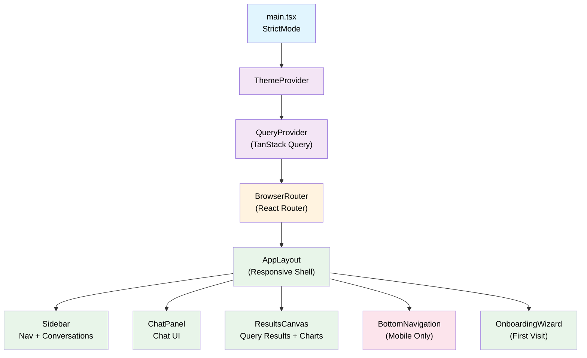
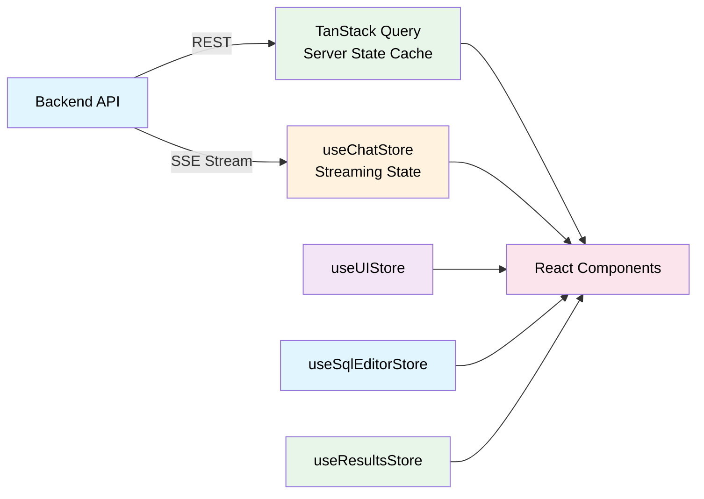
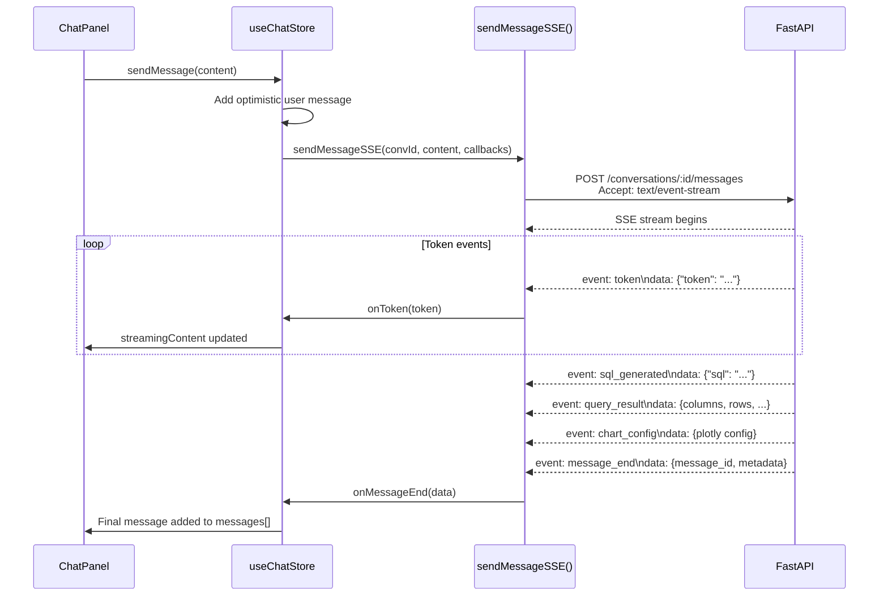
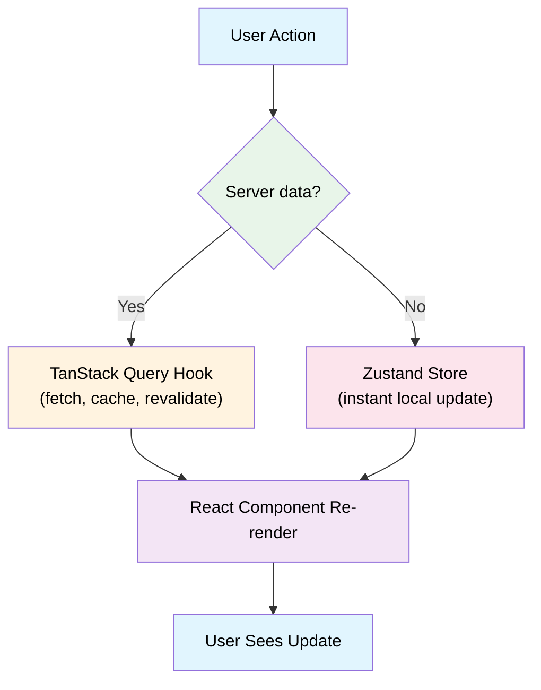

<!-- docs/frontend.md -->
# Frontend Architecture

DataX's frontend is a single-page application built with **React 19**, **TypeScript 5.9**, and **Vite 7**. It communicates with the FastAPI backend via REST endpoints and Server-Sent Events (SSE) for real-time AI chat streaming.

This page covers the component hierarchy, routing, responsive layout system, state management, and key implementation patterns.

## Technology Stack

| Layer | Technology | Purpose |
|---|---|---|
| Framework | React 19 | UI rendering with Suspense + lazy loading |
| Language | TypeScript 5.9 | Strict-mode type safety |
| Build | Vite 7 | Dev server + production bundler |
| Styling | Tailwind CSS 4 + shadcn/ui | Utility-first CSS + prebuilt components |
| Server State | TanStack Query v5 | Caching, revalidation, infinite scroll |
| Client State | Zustand 5 | Lightweight stores for UI and streaming |
| Routing | React Router v7 | Declarative client-side routing |
| Charts | react-plotly.js | Interactive AI-generated visualizations |
| SQL Editing | CodeMirror 6 | Schema-aware SQL editor |
| Markdown | Streamdown | Streaming markdown rendering in chat |

---

## Component Hierarchy



The application bootstraps through a strict provider chain: `StrictMode` → `ThemeProvider` → `QueryProvider` → `BrowserRouter` → `AppLayout`. Each provider wraps its children, ensuring theme context, query caching, and routing are available throughout the tree.

---

## Routing

All routes are nested under a single `AppLayout` element, which provides the responsive shell. Pages are **code-split** via `React.lazy()` with a shared `Suspense` fallback.

```typescript title="src/App.tsx"
<Routes>
  <Route element={<AppLayout />}>
    <Route index element={<DashboardPage />} />
    <Route path="chat" element={<ChatPage />} />
    <Route path="chat/:conversationId" element={<ChatPage />} />
    <Route path="sql" element={<SqlEditorPage />} />
    <Route path="settings" element={<SettingsPage />} />
    <Route path="datasets" element={<DatasetsPage />} />
    <Route path="datasets/upload" element={<DatasetUploadPage />} />
    <Route path="datasets/:id" element={<DatasetDetailPage />} />
    <Route path="connections" element={<ConnectionsPage />} />
    <Route path="connections/new" element={<ConnectionFormPage />} />
    <Route path="connections/:id/edit" element={<ConnectionFormPage />} />
    <Route path="connections/:id" element={<ConnectionDetailPage />} />
    <Route path="*" element={<NotFoundPage />} />
  </Route>
</Routes>
```

| Route | Page | Description |
|---|---|---|
| `/` | `DashboardPage` | Overview with data source summaries |
| `/chat` | `ChatPage` | New conversation |
| `/chat/:conversationId` | `ChatPage` | Resume existing conversation |
| `/sql` | `SqlEditorPage` | Multi-tab SQL editor |
| `/settings` | `SettingsPage` | AI provider configuration |
| `/datasets` | `DatasetsPage` | Uploaded file management |
| `/datasets/upload` | `DatasetUploadPage` | File upload form |
| `/datasets/:id` | `DatasetDetailPage` | Dataset preview + schema |
| `/connections` | `ConnectionsPage` | Database connection list |
| `/connections/new` | `ConnectionFormPage` | Create new connection |
| `/connections/:id` | `ConnectionDetailPage` | Connection details + schema |
| `/connections/:id/edit` | `ConnectionFormPage` | Edit existing connection |
| `*` | `NotFoundPage` | 404 fallback |

!!! tip "Lazy Loading"
    Every page is wrapped in `React.lazy()` with named export destructuring (e.g., `.then(m => ({ default: m.DashboardPage }))`). This keeps the initial bundle small — only `AppLayout` and the active page are loaded on first paint.

---

## Responsive Layout System

The layout adapts across three breakpoints, managed by the `useBreakpoint()` hook which listens to both `resize` and `orientationchange` events.

### Breakpoint Definitions

```typescript title="src/hooks/use-breakpoint.ts"
const MOBILE_MAX = 767;    // < 768px
const TABLET_MIN = 768;    // 768px – 1279px
const DESKTOP_MIN = 1280;  // ≥ 1280px
```

### Layout Modes

=== "Desktop (≥ 1280px)"

    Three side-by-side panels with a draggable resize handle between Chat and Results.

    ```
    ┌──────────┬──────────────┬─┬──────────────────┐
    │          │              │◂│                    │
    │ Sidebar  │  ChatPanel   │▸│  ResultsCanvas    │
    │          │              │ │                    │
    │  Nav +   │  Messages +  │R│  Query Results +  │
    │  Convos  │  Input       │e│  Charts            │
    │          │              │s│                    │
    │          │              │i│                    │
    │          │              │z│                    │
    │          │              │e│                    │
    └──────────┴──────────────┴─┴──────────────────┘
    ```

    - Sidebar is open by default
    - Chat panel width is resizable between **280px – 600px** (default: 380px)
    - `ResizeHandle` component supports drag-to-resize

=== "Tablet (768px – 1279px)"

    Collapsed sidebar with stacked Chat and Results panels.

    ```
    ┌────┬───────────────────────────┐
    │    │  ChatPanel (full width)   │
    │Side│───────────────────────────│
    │bar │  ResultsCanvas            │
    │    │                           │
    └────┴───────────────────────────┘
    ```

    - Sidebar auto-collapses on transition from desktop
    - Sidebar auto-restores when returning to desktop breakpoint
    - Chat and Results are stacked vertically

=== "Mobile (< 768px)"

    Single panel with bottom tab navigation. Only one panel visible at a time.

    ```
    ┌─────────────────────────────┐
    │                             │
    │     Active Panel            │
    │     (Chat / Dashboard /     │
    │      SQL / Settings)        │
    │                             │
    ├─────────────────────────────┤
    │ Chat │ Data │ SQL │ Settings│
    └─────────────────────────────┘
    ```

    - `BottomNavigation` provides 4 tabs
    - Panel switching via `useUIStore.activeMobilePanel`

!!! info "Automatic Sidebar Management"
    The `AppLayout` tracks breakpoint transitions using a ref. When moving from desktop to tablet, the sidebar is automatically collapsed. Returning to desktop restores it. This prevents the sidebar from obscuring content on smaller screens.

---

## State Management

DataX uses a **dual state architecture**: TanStack Query for server state and Zustand for client-only state. This separation ensures server data stays cached and synchronized while local UI state remains fast and lightweight.



### Zustand Stores

#### `useChatStore` — Conversation & Streaming

Manages the active conversation, message history, and SSE streaming lifecycle.

| Field | Type | Description |
|---|---|---|
| `conversationId` | `string \| null` | Active conversation (null = none selected) |
| `messages` | `Message[]` | Message history for current conversation |
| `status` | `"idle" \| "loading" \| "streaming" \| "error"` | Current chat state |
| `streamingContent` | `string` | Accumulated tokens during streaming |
| `abortController` | `AbortController \| null` | Cancellation handle for active stream |

**Key actions:**

| Action | Behavior |
|---|---|
| `newConversation()` | Creates a conversation via API, persists ID to localStorage |
| `switchConversation(id)` | Cancels active stream, loads messages from API |
| `sendMessage(content)` | Auto-creates conversation if needed, adds optimistic user message, starts SSE stream |
| `cancelStream()` | Aborts the SSE fetch, preserves partial content as a message |
| `restoreSession()` | Loads persisted conversation ID from localStorage on app boot |

!!! note "Session Persistence"
    The active conversation ID is stored in `localStorage` under `datax-active-conversation`. On app load, `restoreSession()` automatically resumes the last conversation — the user picks up right where they left off.

#### `useUIStore` — Layout & Panels

Controls sidebar visibility, panel widths, and the active mobile panel.

| Field | Type | Default | Description |
|---|---|---|---|
| `sidebarOpen` | `boolean` | `true` | Sidebar visibility |
| `chatPanelOpen` | `boolean` | `true` | Chat panel visibility |
| `chatPanelWidth` | `number` | `380` | Chat panel width in pixels |
| `activeMobilePanel` | `MobilePanel` | `"chat"` | Active panel on mobile |

Width is clamped between `MIN_CHAT_PANEL_WIDTH` (280px) and `MAX_CHAT_PANEL_WIDTH` (600px).

#### `useSqlEditorStore` — Multi-Tab SQL Editor

Manages the SQL editor's tab system, per-tab execution state, and query cancellation.

| Field | Type | Description |
|---|---|---|
| `tabs` | `SqlTab[]` | Array of editor tabs |
| `activeTabId` | `string` | Currently focused tab |
| `selectedSource` | `DataSource \| null` | Target dataset or connection |
| `abortControllers` | `Map<string, AbortController>` | Per-tab cancellation handles |

Each `SqlTab` contains:

```typescript
interface SqlTab {
  id: string;
  title: string;
  content: string;                            // SQL text
  cursorPosition: { line: number; col: number };
  isExecuting: boolean;
  error: string | null;
  results: QueryResult[];
  executionTimeMs: number | null;
}
```

!!! tip "Tab Lifecycle"
    Closing the last tab automatically creates a fresh replacement tab — the editor always has at least one tab open. Closing a tab also aborts any in-flight query for that tab.

#### `useResultsStore` — Global Results Canvas

A shared results list that receives output from both the chat stream and the SQL editor.

| Field | Type | Description |
|---|---|---|
| `results` | `QueryResult[]` | Ordered list of result cards |
| `sortNewestFirst` | `boolean` | Display order toggle |

Each `QueryResult` tracks its origin via a `source` field (`"chat"` or `"sql-editor"`), enabling the UI to distinguish how a result was produced.

#### `useOnboardingStore` — First-Run Wizard

A 3-step onboarding wizard with localStorage persistence.

| Field | Type | Description |
|---|---|---|
| `isOpen` | `boolean` | Whether the wizard is visible |
| `currentStep` | `number` | Current step index (0–2) |
| `completed` | `boolean` | Whether onboarding was finished |
| `dismissed` | `boolean` | Whether user skipped the wizard |

The wizard auto-opens on first visit (neither completed nor dismissed). Users can re-trigger it from settings via `reset()`.

---

## TanStack Query Hooks

All server data flows through TanStack Query hooks organized by domain. The global `QueryClient` is configured with:

- **`staleTime: 60s`** — data is considered fresh for one minute
- **`retry: 1`** — one retry on failure (individual hooks override this)

Most hooks use **exponential backoff** for retries: `Math.min(1000 * 2^attempt, 30000)` and skip retries for `404` responses.

### Hook Organization

=== "Datasets"

    ```typescript title="src/hooks/use-datasets.ts"
    useDatasetList()              // GET /datasets
    useDatasetDetail(id)          // GET /datasets/:id (disabled when id is undefined)
    useDatasetPreview(id, params) // GET /datasets/:id/preview
    useDeleteDataset()            // DELETE /datasets/:id → invalidates ["datasets"]
    useUploadDataset()            // POST /datasets/upload → invalidates ["datasets"]
    ```

=== "Connections"

    ```typescript title="src/hooks/use-connections.ts"
    useConnectionList()             // GET /connections
    useConnectionDetail(id)         // GET /connections/:id
    useCreateConnection()           // POST /connections → invalidates ["connections"]
    useUpdateConnection()           // PUT /connections/:id → invalidates ["connections"]
    useTestConnection()             // POST /connections/:id/test
    useTestConnectionParams()       // POST /connections/test-params
    useRefreshConnectionSchema()    // POST /connections/:id/refresh-schema
    useDeleteConnection()           // DELETE /connections/:id → invalidates ["connections"]
    ```

=== "Conversations"

    ```typescript title="src/hooks/use-conversations.ts"
    useConversationList(search)   // GET /conversations (infinite scroll with cursor)
    useDeleteConversation()       // DELETE /conversations/:id → invalidates ["conversations"]
    ```

    !!! info "Infinite Scroll"
        `useConversationList` uses TanStack Query's `useInfiniteQuery` with cursor-based pagination (page size: 20). The sidebar loads more conversations as the user scrolls, using an `IntersectionObserver`.

=== "SQL Queries"

    ```typescript title="src/hooks/use-queries.ts"
    useExecuteQuery()       // POST /queries/execute → invalidates ["queryHistory"]
    useExplainQuery()       // POST /queries/explain
    useSavedQueries()       // GET /queries/saved
    useSaveQuery()          // POST /queries/save → invalidates ["savedQueries"]
    useUpdateSavedQuery()   // PUT /queries/saved/:id → invalidates ["savedQueries"]
    useDeleteSavedQuery()   // DELETE /queries/saved/:id → invalidates ["savedQueries"]
    useQueryHistory(params) // GET /queries/history
    ```

=== "Providers & Schema"

    ```typescript title="src/hooks/use-providers.ts"
    useProviders()       // GET /settings/providers
    useCreateProvider()  // POST /settings/providers → invalidates ["providers"]
    useDeleteProvider()  // DELETE /settings/providers/:id → invalidates ["providers"]
    ```

    ```typescript title="src/hooks/use-schema.ts"
    useSchema()          // GET /schema (staleTime: 30s)
    ```

### Cache Invalidation Pattern

All mutation hooks follow a consistent pattern: on success, they invalidate the relevant query key to trigger a refetch.

```typescript
useMutation({
  mutationFn: deleteDataset,
  onSuccess: () => {
    void queryClient.invalidateQueries({ queryKey: ["datasets"] });
  },
});
```

---

## Key Component Groups

### Chat Components

| Component | File | Responsibility |
|---|---|---|
| `ChatPanel` | `components/layout/chat-panel.tsx` | Chat container with session restore |
| `ChatInput` | `components/chat/` | Textarea with send button |
| `MessageBubble` | `components/chat/` | Role-based message styling (user vs. assistant) |
| `StreamingText` | `components/chat/` | Live token rendering via Streamdown with block caret |
| `MarkdownContent` | `components/chat/` | Static rendered markdown for completed messages |

### Chart Components

| Component | File | Responsibility |
|---|---|---|
| `ChartRenderer` | `components/charts/` | Renders Plotly.js charts + KPI cards from AI-generated configs |
| `chart-export.ts` | `components/charts/` | PNG/SVG export via `Plotly.toImage()` |

### SQL Editor Components

| Component | File | Responsibility |
|---|---|---|
| `CodeEditor` | `components/sql-editor/` | CodeMirror 6 with PostgreSQL dialect + schema-aware autocomplete |
| `TabBar` | `components/sql-editor/` | Multi-tab management (add, close, rename) |
| `SqlResultsPanel` | `components/sql-editor/` | Sortable results table with pagination |
| `sql-completions.ts` | `components/sql-editor/` | Schema-aware SQL autocomplete using `useSchema` data |

### Schema Browser

| Component | Responsibility |
|---|---|
| `SchemaBrowser` | Three-level tree: data source → table → column |

Features a search filter and constraint badges for primary keys (PK), foreign keys (FK), and nullable columns.

### Results Components

| Component | Responsibility |
|---|---|
| `ResultCard` | SQL display + sortable table + pagination + CSV export + chart rendering |
| `ResultsPanel` | Scrollable container for `ResultCard` items |
| `ResultsCanvas` | Top-level results wrapper within the layout |

---

## SSE Streaming Implementation

!!! warning "Not Using EventSource"
    The chat streaming does **not** use the browser's built-in `EventSource` API. `EventSource` only supports `GET` requests, but the chat endpoint requires a `POST` with a JSON body. Instead, DataX uses `fetch()` with `ReadableStream` for manual SSE parsing.

### How It Works



### SSE Event Types

| Event | Payload | Purpose |
|---|---|---|
| `message_start` | `{}` | Resets streaming buffer |
| `token` | `{ token: string }` | Incremental text chunk |
| `sql_generated` | `{ sql: string }` | Generated SQL query |
| `query_result` | `{ columns, rows, ... }` | Query execution results |
| `chart_config` | `{ plotly config }` | AI-generated Plotly chart configuration |
| `message_end` | `{ message_id, metadata }` | Finalizes the assistant message |
| `error` | `{ message: string }` | Error during processing |

### Manual Line Parsing

The SSE parser handles cross-chunk boundaries by maintaining a buffer. Lines are split, and the last incomplete line is retained for the next chunk:

```typescript title="src/lib/api.ts"
const decoder = new TextDecoder();
let buffer = "";

while (true) {
  const { done, value } = await reader.read();
  if (done) break;

  buffer += decoder.decode(value, { stream: true });
  const lines = buffer.split("\n");
  buffer = lines.pop() ?? "";  // Keep incomplete line

  // Parse event:/data: pairs from complete lines
}
```

### Cancellation

Both chat streaming and SQL query execution support cancellation via `AbortController`:

- **Chat**: `useChatStore.cancelStream()` aborts the SSE fetch and preserves any partial content as a message
- **SQL Editor**: `useSqlEditorStore.cancelExecution(tabId)` aborts the per-tab query via its stored `AbortController`

---

## State Flow Pattern



**Server state** (TanStack Query) covers anything persisted on the backend:

- Datasets, connections, conversations
- Provider configurations, schema metadata
- Saved queries and query history

**Client state** (Zustand) covers ephemeral UI concerns:

- Sidebar/panel visibility and dimensions
- Active streaming content and chat status
- SQL editor tab state and cursor positions
- Results canvas display order
- Onboarding wizard progress

### Dual Result Writing

SQL query results flow to **two** destinations simultaneously:

1. **Per-tab results** in `useSqlEditorStore` — shown in the SQL editor's results panel
2. **Global results canvas** in `useResultsStore` — shown in the main results area

This allows users to see their query results both inline in the editor and in the shared results canvas alongside chat-generated results.

---

## File Organization

```
apps/frontend/src/
├── components/
│   ├── chat/           # Chat UI components
│   ├── charts/         # Plotly chart rendering + export
│   ├── layout/         # AppLayout, Sidebar, ChatPanel, ResultsCanvas, ResizeHandle
│   ├── onboarding/     # First-run wizard
│   ├── sql-editor/     # CodeMirror editor, tabs, results
│   └── ui/             # shadcn/ui primitives (Button, Dialog, etc.)
├── hooks/              # TanStack Query hooks by domain
├── lib/
│   └── api.ts          # REST + SSE API client (35+ functions)
├── pages/              # Route-level page components
├── providers/          # ThemeProvider, QueryProvider
├── stores/             # Zustand stores (chat, ui, sql-editor, results, onboarding)
├── types/              # TypeScript type definitions
├── App.tsx             # Router definition
└── main.tsx            # Application entry point
```

!!! tip "Path Aliases"
    The `@/` path alias maps to `src/` in both `tsconfig.json` and `vite.config.ts`, enabling clean imports like `import { Button } from "@/components/ui/button"`.

---

## Related Pages

- [API Reference](api-reference.md) — Backend REST + SSE endpoint documentation
