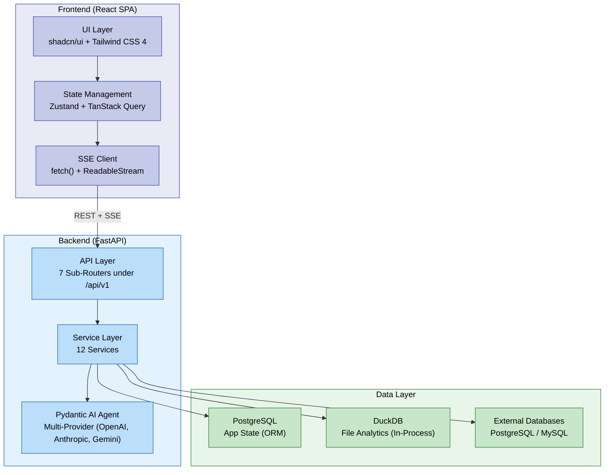
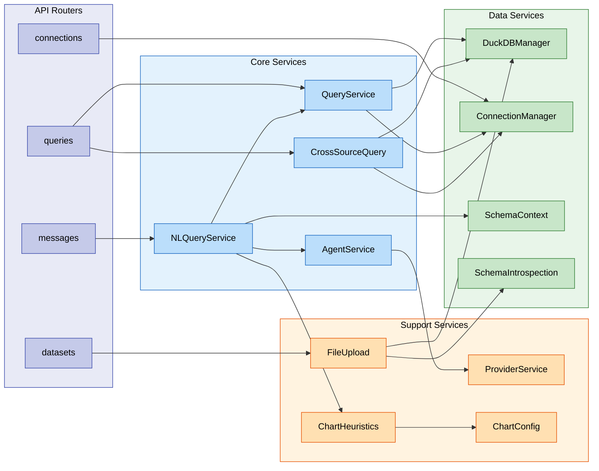
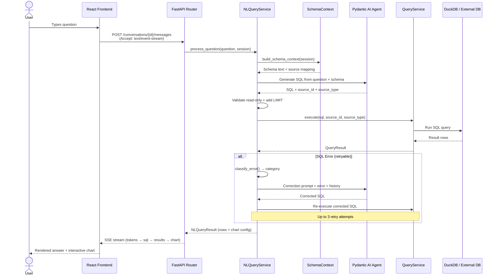
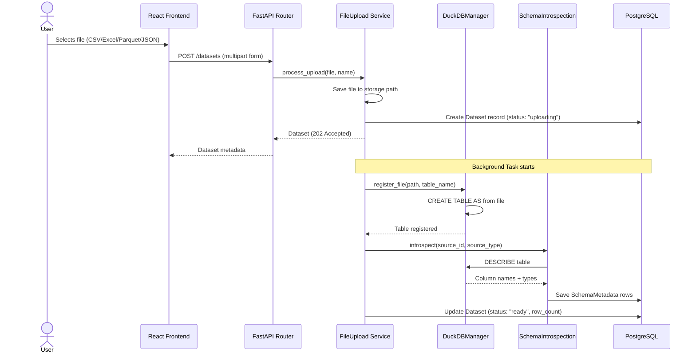
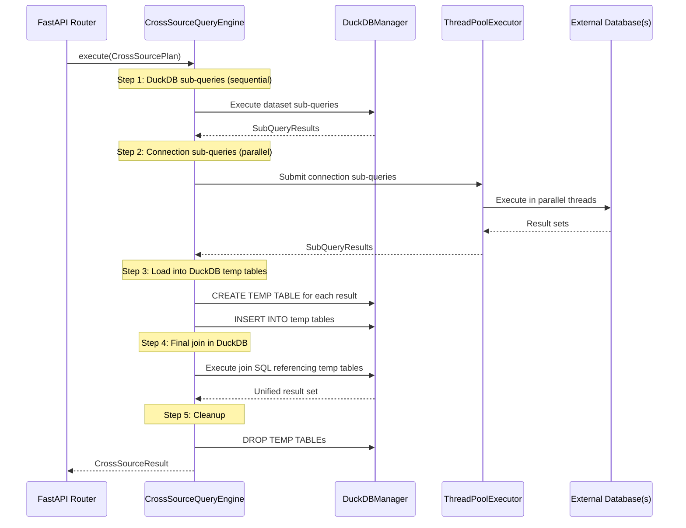

<!-- docs/architecture.md -->
# Architecture Overview

DataX is an AI-native data analytics platform — a "chat with your data" app built as a **two-language monorepo**: a Python/FastAPI backend and a TypeScript/React frontend connected via REST and Server-Sent Events (SSE).

## High-Level System Diagram



---

## Backend Architecture

The backend follows a **three-tier architecture** with clear separation between routing, business logic, and data access.

### Tier 1: API Layer (FastAPI Routers)

Seven sub-routers compose under a single `/api/v1` prefix:

| Router | Prefix | Responsibility |
|--------|--------|---------------|
| `datasets` | `/api/v1/datasets` | File upload, listing, metadata |
| `connections` | `/api/v1/connections` | External DB CRUD + test |
| `conversations` | `/api/v1/conversations` | Chat conversation management |
| `messages` | `/api/v1/messages` | Message creation + SSE streaming |
| `providers` | `/api/v1/providers` | AI provider config management |
| `queries` | `/api/v1/queries` | Direct SQL + cross-source execution |
| `schema` | `/api/v1/schema` | Schema introspection endpoints |

A root-level health router provides `/health` and `/ready` probes outside the versioned prefix.

### Tier 2: Service Layer

Twelve services encapsulate all business logic. The API layer delegates to services; services never import from routers.

| Service | Purpose |
|---------|---------|
| `DuckDBManager` | In-process DuckDB connection, virtual table registration, query execution |
| `ConnectionManager` | SQLAlchemy engine pool per external database, lifecycle management |
| `ProviderService` | AI provider CRUD, API key encryption/decryption via Fernet |
| `FileUpload` | Multipart file handling, storage, DuckDB registration trigger |
| `SchemaIntrospection` | Column-level schema extraction from DuckDB and live databases |
| `SchemaContext` | Builds natural-language schema descriptions for AI prompts |
| `AgentService` | Pydantic AI agent factory with multi-provider support (OpenAI providers use the Responses API via `OpenAIResponsesModel`) |
| `QueryService` | SQL execution router — dispatches to DuckDB or ConnectionManager |
| `NLQueryService` | NL-to-SQL pipeline: prompt → AI → execute → self-correct |
| `CrossSourceQuery` | Cross-source join orchestration with DuckDB temp tables |
| `ChartHeuristics` | Analyzes query result shape to recommend chart types |
| `ChartConfig` | Generates Plotly JSON chart configurations |

### Tier 3: Data Layer

Three distinct data stores serve different purposes:

- **PostgreSQL** — Persistent app state via SQLAlchemy ORM (7 models: Dataset, Connection, SchemaMetadata, Conversation, Message, SavedQuery, ProviderConfig)
- **DuckDB** — In-process analytical engine for file-based datasets (CSV, Excel, Parquet, JSON registered as virtual tables)
- **External Databases** — User-connected PostgreSQL and MySQL instances, accessed read-only through SQLAlchemy with statement timeouts

### App Factory & Dependency Injection

The backend uses an **app factory pattern** — `create_app(settings=None)` in `app/main.py` — with no module-level `app` instance. This enables clean test isolation by passing explicit `Settings`.

Singletons are attached to `app.state` during creation:

```python title="app/main.py (simplified)"
def create_app(settings: Settings | None = None) -> FastAPI:
    app = FastAPI(title="DataX", lifespan=lifespan)
    app.state.settings = settings or get_settings()
    app.state.db_engine = create_db_engine(settings.database_url)
    app.state.session_factory = create_session_factory(engine)
    app.state.duckdb_manager = DuckDBManager()
    app.state.connection_manager = ConnectionManager()
    app.state.shutdown_manager = ShutdownManager()
    return app
```

FastAPI dependencies in `dependencies.py` extract these from `request.app.state`:

- `get_db()` — yields a SQLAlchemy session with auto-commit/rollback
- `get_duckdb_manager()` — returns the DuckDB singleton
- `get_connection_manager()` — returns the connection pool manager
- `get_settings()` — returns application configuration
- `get_storage_path()` — returns the file upload directory
- `get_session_factory()` — returns the raw session factory (for background tasks)

---

## Frontend Architecture

The frontend is a **Vite 7 + React 19 SPA** with TypeScript 5.9 in strict mode.

### Component Tree

```
main.tsx → StrictMode → ThemeProvider → QueryProvider → BrowserRouter → AppLayout
```

### Routing

Eleven lazy-loaded pages via `React.lazy()` with a shared `<Suspense>` boundary:

| Route | Page | Purpose |
|-------|------|---------|
| `/` | Dashboard | Overview and quick actions |
| `/chat` | Chat | New conversation |
| `/chat/:conversationId` | Chat | Existing conversation |
| `/sql` | SQL Editor | Direct SQL execution |
| `/settings` | Settings | AI providers, preferences |
| `/datasets` | Datasets | List uploaded datasets |
| `/datasets/upload` | Dataset Upload | File upload form |
| `/datasets/:id` | Dataset Detail | Schema, preview, queries |
| `/connections` | Connections | List external databases |
| `/connections/new` | Connection Form | Add new connection |
| `/connections/:id` | Connection Detail | Schema, test, queries |

### State Management

A dual-store strategy separates server state from UI state:

- **TanStack Query v5** — Server state (datasets, connections, conversations, providers). Handles caching, background refetch, and optimistic updates.
- **Zustand** — Client-only UI state across 5 stores:

| Store | Purpose |
|-------|---------|
| `chat-store` | Active conversation, message draft, streaming state |
| `ui-store` | Sidebar collapsed, active panel, theme preferences |
| `sql-editor-store` | Editor content, selected source, execution history |
| `results-store` | Query results, chart config, active tab |
| `onboarding-store` | First-run wizard progress and completion flags |

### SSE Streaming

Chat uses **POST-based SSE** via `fetch()` + `ReadableStream` rather than the native `EventSource` API. This is because `EventSource` only supports GET requests — DataX needs to POST a JSON body containing the user's message and conversation context.

SSE event types: `message_start`, `token`, `sql_generated`, `query_result`, `chart_config`, `message_end`.

---

## Service Interaction Diagram



---

## Data Flow: Natural Language Query

The core flow — user asks a question in natural language, gets back data and a chart.



## Data Flow: File Upload

Uploading a file triggers async processing — the API returns immediately while DuckDB registration happens in the background.



## Data Flow: Cross-Source Query

Joining data across DuckDB datasets and live databases uses a temp-table strategy.



!!! info "Why sequential + parallel?"
    DuckDB connections are **not thread-safe**, so dataset sub-queries run sequentially. External database queries run in parallel via `ThreadPoolExecutor` since each uses its own SQLAlchemy engine. Results converge in DuckDB temp tables for the final join.

---

## Key Design Decisions

### DuckDB Per-Process

| | |
|---|---|
| **Context** | File-based datasets need fast analytical queries (aggregations, window functions, columnar scans). |
| **Decision** | DuckDB runs as an in-process library — one connection per application process. |
| **Rationale** | Eliminates network overhead and simplifies deployment. DuckDB's columnar engine handles analytical workloads orders of magnitude faster than PostgreSQL for file-based data. |
| **Trade-off** | Horizontal scaling requires session affinity or shared storage — each process has its own DuckDB state. |

### Agentic Self-Correction Loop

| | |
|---|---|
| **Context** | AI-generated SQL frequently contains errors (wrong column names, syntax issues, type mismatches). |
| **Decision** | `NLQueryService` implements a retry loop (up to 3 attempts) where the AI receives its failed SQL + error message + full correction history and generates corrected SQL. |
| **Rationale** | Dramatically improves first-question success rate. The AI learns from its own mistakes within a conversation turn. 9 error categories determine retryability — infrastructure errors (timeout, connection lost, permission denied) skip the loop since re-generating SQL won't help. |
| **Trade-off** | Each retry adds latency (one AI round-trip). SSE progress events keep the user informed. |

### Read-Only Enforcement

| | |
|---|---|
| **Context** | Users connect production databases. A rogue `DROP TABLE` would be catastrophic. |
| **Decision** | Write operations are blocked at two layers: the API validates SQL keywords, and `NLQueryService` calls `is_read_only_sql()` before execution. |
| **Rationale** | Defense in depth — even if the AI generates write SQL, it never reaches the database. Statement timeouts provide an additional safety net. |

### Polymorphic SchemaMetadata

| | |
|---|---|
| **Context** | Both uploaded datasets and live database connections have column-level schema metadata. |
| **Decision** | A single `schema_metadata` table with `source_id` (UUID) + `source_type` ("dataset" or "connection") instead of separate tables per source type. |
| **Rationale** | Simplifies schema context building — one query retrieves all schema regardless of source. The `SchemaContext` service builds AI prompts from this unified view. Indexed on `(source_id, source_type)` for efficient lookups. |

### POST-Based SSE

| | |
|---|---|
| **Context** | Chat streaming requires sending a JSON body (message content, conversation context) with the SSE request. |
| **Decision** | Use `fetch()` + `ReadableStream` instead of the native `EventSource` API. |
| **Rationale** | `EventSource` only supports GET requests with URL parameters. POST-based SSE via fetch allows sending structured JSON bodies while maintaining the streaming response pattern. |

### App Factory Pattern

| | |
|---|---|
| **Context** | Tests need isolated app instances with custom settings (e.g., SQLite instead of PostgreSQL). |
| **Decision** | `create_app(settings=None)` factory function — no module-level `FastAPI()` instance. |
| **Rationale** | Each test can create a fresh app with overridden settings. No global state leaks between tests. Production uses `uvicorn app.main:create_app --factory`. |

---

## Workspace Configuration

DataX is a two-language monorepo orchestrated by three tools:

| Tool | Scope | Config File |
|------|-------|------------|
| **uv workspaces** | Python packages | `pyproject.toml` (root) |
| **pnpm workspaces** | Node.js packages | `pnpm-workspace.yaml` |
| **Turbo** | Cross-language task runner | `turbo.json` |

### uv Workspaces (Python)

The root `pyproject.toml` defines a uv workspace with three Python members:

```toml title="pyproject.toml (root)"
[tool.uv.workspace]
members = ["apps/backend", "docs", "tools/dx"]
```

- **`apps/backend`** — The FastAPI application (main product backend)
- **`docs`** — MkDocs documentation site (has its own dependencies)
- **`tools/dx`** — Developer CLI built with Typer, provides the `dx` command for local dev workflows

The root project's dev dependency group references workspace members as editable installs, so `uv sync` in the repo root installs all Python packages in development mode.

### pnpm Workspaces (Node.js)

```yaml title="pnpm-workspace.yaml"
packages:
  - "apps/frontend"
```

A single Node.js workspace member — the React/Vite frontend.

### Turbo (Task Orchestration)

Turbo runs tasks across both Python and Node.js workspaces from a single command:

```json title="turbo.json"
{
  "tasks": {
    "dev": { "cache": false, "persistent": true },
    "build": { "dependsOn": ["^build"], "outputs": ["dist/**"] },
    "lint": {},
    "test": {}
  }
}
```

- **`dev`** — Starts all dev servers concurrently (non-cached, persistent processes)
- **`build`** — Builds all packages with topological dependency ordering
- **`lint`** and **`test`** — Runs linting and tests across all workspaces in parallel

---

## Directory Structure

```
datax/
├── .github/
│   └── workflows/
│       ├── ci.yml                    # CI pipeline (lint, test, build)
│       ├── deploy.yml                # Deployment workflow
│       └── docs.yml                  # Documentation site build/deploy
├── apps/
│   ├── backend/
│   │   ├── src/
│   │   │   └── app/
│   │   │       ├── api/
│   │   │       │   ├── health.py           # /health, /ready probes
│   │   │       │   └── v1/                 # Versioned API
│   │   │       │       ├── router.py       # Aggregates 7 sub-routers
│   │   │       │       ├── datasets.py
│   │   │       │       ├── connections.py
│   │   │       │       ├── conversations.py
│   │   │       │       ├── messages.py
│   │   │       │       ├── providers.py
│   │   │       │       ├── queries.py
│   │   │       │       └── schema.py
│   │   │       ├── services/               # Business logic (12 services)
│   │   │       │   ├── duckdb_manager.py
│   │   │       │   ├── connection_manager.py
│   │   │       │   ├── provider_service.py
│   │   │       │   ├── file_upload.py
│   │   │       │   ├── schema_introspection.py
│   │   │       │   ├── schema_context.py
│   │   │       │   ├── agent_service.py
│   │   │       │   ├── query_service.py
│   │   │       │   ├── nl_query_service.py
│   │   │       │   ├── cross_source_query.py
│   │   │       │   ├── chart_heuristics.py
│   │   │       │   └── chart_config.py
│   │   │       ├── models/                 # SQLAlchemy ORM
│   │   │       │   ├── base.py            # Base, mixins, UUID generator
│   │   │       │   ├── orm.py             # 7 entity models
│   │   │       │   ├── dataset.py         # Dataset-specific enums/types
│   │   │       │   └── connection.py      # Connection-specific enums/types
│   │   │       ├── main.py                # App factory + lifespan
│   │   │       ├── config.py              # Pydantic Settings
│   │   │       ├── database.py            # SQLAlchemy engine/session factory
│   │   │       ├── dependencies.py        # FastAPI DI (get_db, get_duckdb_manager, etc.)
│   │   │       ├── encryption.py          # Fernet key management
│   │   │       ├── errors.py              # Global exception handlers
│   │   │       ├── logging.py             # structlog configuration
│   │   │       └── shutdown.py            # Graceful shutdown manager
│   │   ├── alembic/                       # Database migration scripts
│   │   └── tests/                         # pytest test suite
│   └── frontend/
│       └── src/
│           ├── pages/                 # 11 lazy-loaded route pages
│           ├── components/            # UI components
│           │   ├── ui/                # shadcn/ui primitives
│           │   ├── layout/            # AppLayout, Sidebar, panels
│           │   ├── chat/              # Chat message list, input, streaming
│           │   ├── charts/            # Plotly chart renderer
│           │   └── sql-editor/        # CodeMirror SQL editor
│           ├── hooks/                 # TanStack Query + custom hooks
│           ├── stores/                # 5 Zustand stores
│           ├── lib/                   # API client, utilities
│           ├── types/                 # TypeScript API type definitions
│           ├── contexts/              # React contexts (theme, etc.)
│           └── providers/             # ThemeProvider, QueryProvider
├── docs/                          # MkDocs documentation site (uv workspace member)
├── tools/
│   └── dx/                        # Developer CLI (uv workspace member)
│       ├── src/
│       │   └── dx/
│       │       └── cli.py         # Typer CLI — `dx` command
│       └── pyproject.toml
├── scripts/                       # Shell scripts (dev, build, lint, docs-serve)
├── infra/                         # Infrastructure configs (docker, k8s, terraform)
├── docker-compose.yml             # Full-stack orchestration
├── pyproject.toml                 # Root uv workspace config
├── pnpm-workspace.yaml            # pnpm workspace config
├── turbo.json                     # Turbo task orchestration
├── mkdocs.yml                     # Documentation site config
└── CLAUDE.md                      # AI assistant project guide
```

---

## Further Reading

- **[AI Pipeline](ai-pipeline.md)** — Deep dive into the NL-to-SQL agent, self-correction loop, prompt engineering, and chart generation
- **[Frontend](frontend.md)** — Component architecture, state management patterns, SSE streaming implementation, and responsive layout system
- **[API Reference](../reference/api-reference.md)** — Complete endpoint documentation with request/response schemas
