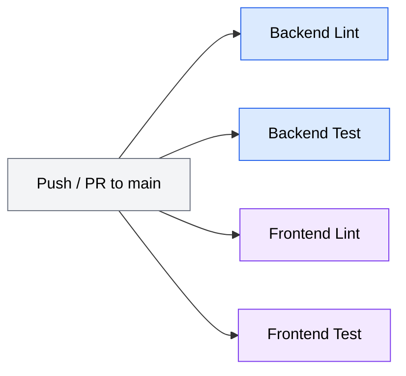

<!-- docs/development.md -->
# Development Guide

This guide covers everything you need to set up, build, test, and contribute to DataX — the AI-native data analytics platform. DataX is a two-language monorepo: a **Python/FastAPI** backend and a **TypeScript/React** frontend.

## Prerequisites

| Tool | Version | Purpose |
|------|---------|---------|
| Python | 3.12+ | Backend runtime |
| [uv](https://docs.astral.sh/uv/) | latest | Python package manager |
| Node.js | 22+ | Frontend runtime |
| [pnpm](https://pnpm.io/) | latest | Frontend package manager |
| Docker & Docker Compose | latest | Containerized development |
| PostgreSQL | 16+ | Application database (production) |

!!! tip "Quick check"
    Verify your toolchain is ready:
    ```bash
    python3 --version   # ≥ 3.12
    uv --version
    node --version      # ≥ 22
    pnpm --version
    docker --version
    ```

---

## Getting Started

=== "Local Development"

    ### 1. Clone the repository

    ```bash
    git clone <repo-url> datax
    cd datax
    ```

    ### 2. Configure environment variables

    ```bash
    cp .env.example .env.local
    ```

    Edit `.env.local` with your settings. See [Configuration](../getting-started/configuration.md) for the full variable reference. The minimum required variables are:

    | Variable | Description |
    |----------|-------------|
    | `DATABASE_URL` | PostgreSQL connection string |
    | `DATAX_ENCRYPTION_KEY` | Fernet key for encrypting secrets at rest |
    | One of: `DATAX_OPENAI_API_KEY`, `DATAX_ANTHROPIC_API_KEY`, `DATAX_GEMINI_API_KEY` | AI provider API key |

    !!! note "Generating an encryption key"
        ```bash
        python3 -c "from cryptography.fernet import Fernet; print(Fernet.generate_key().decode())"
        ```
        The `.env.example` ships a dev-only key — **never** use it in production.

    ### 3. Set up the backend

    ```bash
    cd apps/backend
    uv sync                      # Install all dependencies (including dev)
    uv run alembic upgrade head  # Run database migrations
    uv run fastapi dev           # Start dev server (port 8000, hot reload)
    ```

    ### 4. Set up the frontend

    Open a second terminal:

    ```bash
    cd apps/frontend
    pnpm install    # Install dependencies
    pnpm dev        # Start Vite dev server (port 5173)
    ```

    The app is now available at **http://localhost:5173**.

=== "Docker Development"

    Docker Compose runs the full stack with hot-reload via source-code bind mounts.

    ### With an external PostgreSQL (e.g., Neon)

    Set `DATABASE_URL` in `.env.local` pointing to your hosted database, then:

    ```bash
    docker compose up
    ```

    ### With a local PostgreSQL container

    ```bash
    docker compose --profile local-db up
    ```

    This starts three services:

    | Service | Port | Description |
    |---------|------|-------------|
    | `postgres` | 5432 | PostgreSQL 16 (only with `local-db` profile) |
    | `backend` | 8000 | FastAPI server |
    | `frontend` | 5173 | Vite dev server |

    !!! tip "Volumes"
        Docker Compose uses named volumes (`postgres_data`, `backend_venv`, `frontend_node_modules`) so dependency installs persist across restarts. To force a clean install, remove the relevant volume:
        ```bash
        docker compose down -v  # Removes all volumes
        ```

---

## Project Structure

```
datax/
├── apps/
│   ├── backend/
│   │   ├── src/
│   │   │   └── app/
│   │   │       ├── api/v1/          # Route handlers (one file per resource)
│   │   │       ├── models/          # SQLAlchemy ORM models
│   │   │       ├── services/        # Business logic layer
│   │   │       ├── config.py        # Pydantic Settings (env vars)
│   │   │       ├── database.py      # Engine & session factory
│   │   │       ├── dependencies.py  # FastAPI dependency injection
│   │   │       ├── errors.py        # Error types & handlers
│   │   │       └── main.py          # App factory (create_app)
│   │   ├── alembic/                 # Database migrations
│   │   ├── tests/                   # pytest test suite
│   │   └── pyproject.toml           # Python project config
│   └── frontend/
│       ├── src/
│       │   ├── components/ui/   # shadcn/ui primitives
│       │   ├── contexts/        # React context providers
│       │   ├── hooks/           # Custom hooks
│       │   ├── lib/             # API client, utilities
│       │   ├── pages/           # Route page components
│       │   ├── stores/          # Zustand state stores
│       │   ├── test/            # Test setup & mocks
│       │   └── types/           # TypeScript type definitions
│       ├── vitest.config.ts     # Test configuration
│       └── package.json         # Node project config
├── docs/                        # MkDocs documentation site
├── tools/
│   └── dx/                      # Dev server CLI (see below)
├── scripts/                     # Shell scripts for monorepo tasks
├── docker-compose.yml
├── .env.example
└── CLAUDE.md
```

### Monorepo Workspace Setup

DataX uses **two workspace systems** to manage its monorepo — one for Python and one for Node.js.

#### Python Workspaces (uv)

The root `pyproject.toml` defines a [uv workspace](https://docs.astral.sh/uv/concepts/workspaces/) with three members:

| Member | Path | Description |
|--------|------|-------------|
| `datax-backend` | `apps/backend` | FastAPI backend application |
| `datax-docs` | `docs` | MkDocs documentation site |
| `dx` | `tools/dx` | Dev server CLI tool |

Running `uv sync` from the project root resolves all Python workspace members and installs them in a shared virtual environment. The root dev dependency group pulls in `datax-backend` and `dx` as editable installs, so both packages are available on `PATH` after a single `uv sync`.

#### Node.js Workspaces (pnpm)

The `pnpm-workspace.yaml` declares `apps/frontend` as the sole pnpm workspace member. **Turborepo** (`turbo.json`) orchestrates frontend tasks (`dev`, `build`, `lint`, `test`) with caching and dependency ordering.

#### Root Scripts

The root `package.json` exposes convenience scripts that delegate to shell scripts in `scripts/`:

| Command | Script | What it does |
|---------|--------|--------------|
| `pnpm dev` | `scripts/dev.sh` | Starts both backend (`uv run fastapi dev`) and frontend (`pnpm dev`) concurrently, with process cleanup on exit |
| `pnpm build` | `scripts/build.sh` | Builds the backend (`uv build`) and frontend (`pnpm build`) sequentially |
| `pnpm lint` | `scripts/lint.sh` | Runs Ruff check + format check on the backend and ESLint on the frontend |

!!! tip "Quick full-stack start"
    From the project root, `pnpm dev` is the fastest way to start both servers in a single terminal. Press `Ctrl+C` to stop both.

### `dx` — Dev Server CLI

The `tools/dx/` directory contains **dx**, a Typer-based CLI for managing the backend and frontend dev servers. It provides PID tracking, health checking, log tailing, and clean process group shutdown. Runtime artifacts are stored in `.datax/` at the project root (gitignored).

After running `uv sync` at the project root, the `dx` command is available:

```bash
dx start               # Start both backend and frontend
dx start backend       # Start only the backend
dx stop                # Stop all running servers
dx restart             # Restart all servers
dx status              # Show running services, PIDs, and ports
dx logs backend -n 100 # Tail backend logs (last 100 lines)
dx health              # Check backend /health and /ready endpoints
```

---

## Backend Development

### Running the Dev Server

The backend uses the **app factory pattern** — there is no module-level `app` instance. FastAPI's dev mode handles this automatically:

```bash
cd apps/backend
uv run fastapi dev    # Starts on http://localhost:8000 with hot reload
```

To run directly with uvicorn (e.g., for custom flags):

```bash
uv run uvicorn app.main:create_app --factory --reload --host 0.0.0.0 --port 8000
```

!!! info "App factory pattern"
    `create_app()` in `app/main.py` builds the FastAPI instance, attaches shared resources (DuckDB, session factory, connection manager) to `app.state`, and wires up middleware and routers. Dependencies in `app/dependencies.py` pull these from `request.app.state`, enabling clean dependency injection and testability.

### Database Migrations

DataX uses **Alembic** for schema migrations against PostgreSQL:

```bash
cd apps/backend

# Apply all pending migrations
uv run alembic upgrade head

# Create a new auto-generated migration
uv run alembic revision --autogenerate -m "add user preferences table"

# Downgrade one step
uv run alembic downgrade -1

# View migration history
uv run alembic history
```

!!! warning "Always review auto-generated migrations"
    Alembic's `--autogenerate` compares your ORM models against the database schema. It may miss certain changes (e.g., data migrations, custom indexes) or generate incorrect operations. Always review the generated file in `apps/backend/alembic/versions/` before applying.

### Adding a New API Endpoint

Follow this pattern when adding a new resource or endpoint:

**1. Define the ORM model** in `apps/backend/src/app/models/orm.py`:

```python title="apps/backend/src/app/models/orm.py"
class Widget(TimestampMixin, Base):
    __tablename__ = "widgets"

    id: Mapped[uuid.UUID] = mapped_column(Uuid, primary_key=True, default=generate_uuid)
    user_id: Mapped[uuid.UUID | None] = mapped_column(Uuid, nullable=True)
    name: Mapped[str] = mapped_column(String(255), nullable=False)
```

**2. Create a migration:**

```bash
uv run alembic revision --autogenerate -m "add widgets table"
uv run alembic upgrade head
```

**3. Create the route handler** in `apps/backend/src/app/api/v1/widgets.py`:

```python title="apps/backend/src/app/api/v1/widgets.py"
from fastapi import APIRouter, Depends
from sqlalchemy.orm import Session

from app.dependencies import get_db
from app.models.orm import Widget

router = APIRouter(prefix="/widgets", tags=["widgets"])

@router.get("")
def list_widgets(db: Session = Depends(get_db)) -> dict:
    widgets = list(db.execute(select(Widget)).scalars().all())
    return {"widgets": [{"id": str(w.id), "name": w.name} for w in widgets]}
```

**4. Register the router** in `apps/backend/src/app/api/v1/router.py`:

```python title="apps/backend/src/app/api/v1/router.py"
from app.api.v1.widgets import router as widgets_router

router.include_router(widgets_router)
```

All endpoints are automatically prefixed with `/api/v1/` by the parent router.

---

## Frontend Development

### Running the Dev Server

```bash
cd apps/frontend
pnpm dev    # Starts on http://localhost:5173 with HMR
```

The Vite dev server proxies API calls to `http://localhost:8000` (or `VITE_API_URL` when running in Docker).

### Key Conventions

| Concern | Convention |
|---------|-----------|
| **Components** | `src/components/ui/` for shadcn primitives, feature components alongside pages |
| **State** | Zustand stores in `src/stores/`, TanStack Query for server state |
| **Styling** | Tailwind CSS 4 via `@tailwindcss/vite` plugin — no PostCSS config needed |
| **Path aliases** | `@/` maps to `src/` in both `tsconfig.json` and `vite.config.ts` |
| **Pages** | Lazy-loaded route components in `src/pages/` |
| **API client** | Centralized in `src/lib/api.ts` |

### Adding a New Page

**1. Create the page component** in `src/pages/`:

```tsx title="apps/frontend/src/pages/widgets.tsx"
export default function WidgetsPage() {
  return (
    <div className="p-6">
      <h1 className="text-2xl font-bold">Widgets</h1>
    </div>
  );
}
```

**2. Add the route** in your router configuration with lazy loading:

```tsx
const WidgetsPage = lazy(() => import("@/pages/widgets"));
```

**3. Add API functions** in `src/lib/api.ts` and create a TanStack Query hook in `src/hooks/`.

---

## Code Style & Linting

### Backend (Python)

DataX uses **Ruff** for both linting and formatting:

```bash
cd apps/backend

# Check for lint errors
uv run ruff check .

# Auto-fix lint errors
uv run ruff check . --fix

# Format code
uv run ruff format .

# Check formatting without modifying files
uv run ruff format . --check
```

Ruff configuration (from `pyproject.toml`):

| Setting | Value |
|---------|-------|
| Target | Python 3.12 |
| Line length | 100 |
| Rules | `E` (pycodestyle errors), `F` (pyflakes), `I` (isort), `N` (pep8-naming), `W` (warnings), `UP` (pyupgrade) |

### Frontend (TypeScript)

DataX uses **ESLint** for linting and **Prettier** for formatting:

```bash
cd apps/frontend

# Lint
pnpm lint

# Format all source files
pnpm format

# Check formatting without modifying files
pnpm format:check
```

---

## Testing

### Backend Tests

Tests use **pytest** with `pytest-asyncio` and run against an **SQLite in-memory** database (not PostgreSQL). This keeps tests fast and dependency-free.

```bash
cd apps/backend

# Run all tests
uv run pytest

# Run a specific test file
uv run pytest tests/test_datasets.py

# Run a specific test by name
uv run pytest -k "test_upload_csv"

# Run with verbose output
uv run pytest -v
```

Key testing patterns:

- **Async tests** are auto-detected — no `@pytest.mark.asyncio` decorator needed (`asyncio_mode = "auto"`)
- **HTTP tests** use `httpx.AsyncClient` with `ASGITransport` to call the app directly (no running server)
- **Database** uses `sqlite://` with the same ORM models (the `JSONVariant` type adapts JSONB → JSON for SQLite)
- **Boolean defaults** use `sa_true()` / `sa_false()` for cross-database compatibility

!!! warning "SQLite vs PostgreSQL differences"
    Some PostgreSQL-specific features (array columns, advanced JSONB queries, `RETURNING` clauses) may behave differently in SQLite tests. If you encounter test failures for PostgreSQL-specific code, consider adding a focused integration test with a real PostgreSQL instance.

### Frontend Tests

Tests use **Vitest** with **jsdom** and **Testing Library**:

```bash
cd apps/frontend

# Run all tests once
pnpm test

# Watch mode (re-runs on file changes)
pnpm test:watch
```

Key testing patterns:

- Test files live alongside source files in `__tests__/` directories (e.g., `src/pages/__tests__/dashboard.test.tsx`)
- A separate `vitest.config.ts` is used (avoids loading the Tailwind Vite plugin in the test environment)
- `src/test/setup.ts` provides browser API mocks required by jsdom:
    - `window.matchMedia` — not natively supported in jsdom
    - `window.innerWidth` — defaults to 1280px (desktop breakpoint)
    - `Element.scrollIntoView` — stub for scroll behavior

For detailed testing strategies, see the [Testing Guide](testing.md).

---

## Git Conventions

### Commit Messages

DataX follows the **Conventional Commits** specification:

```
type(scope): description
```

| Type | When to use |
|------|-------------|
| `feat` | New feature or capability |
| `fix` | Bug fix |
| `docs` | Documentation changes only |
| `style` | Formatting, whitespace (no logic changes) |
| `refactor` | Code restructuring without behavior change |
| `test` | Adding or updating tests |
| `chore` | Build scripts, CI, dependency updates |

**Examples:**

```
feat(datasets): add CSV preview with pagination
fix(auth): handle expired encryption keys gracefully
docs: update API endpoint reference
refactor(agent): extract SQL retry logic into service
test(connections): add integration tests for MySQL proxy
chore: upgrade FastAPI to 0.115
```

!!! tip "Scope is optional but encouraged"
    Use the module or feature area as the scope (e.g., `datasets`, `agent`, `chat`, `connections`). Omit it for changes that span the entire project.

### Branch Naming

Use descriptive branch names with a type prefix:

```
feat/dataset-upload-preview
fix/connection-timeout-handling
docs/api-reference-update
```

---

## CI/CD

DataX uses **GitHub Actions** for continuous integration, deployment, and documentation publishing. Workflow files live in `.github/workflows/`.

### CI Pipeline

**File:** `.github/workflows/ci.yml`
**Triggers:** Push to `main`, pull requests targeting `main`

The CI workflow runs four parallel jobs covering both the backend and frontend:



| Job | Runner | What it does |
|-----|--------|--------------|
| **Backend Lint** | `ubuntu-latest` | Installs Python deps with `uv sync --frozen`, then runs `ruff check` and `ruff format --check` |
| **Backend Test** | `ubuntu-latest` | Installs Python deps with `uv sync --frozen`, then runs `pytest` |
| **Frontend Lint** | `ubuntu-latest` | Installs Node 22 + pnpm deps with `--frozen-lockfile`, then runs `pnpm lint` |
| **Frontend Test** | `ubuntu-latest` | Installs Node 22 + pnpm deps with `--frozen-lockfile`, then runs `pnpm test` |

!!! info "Lockfile enforcement"
    All CI jobs use frozen/locked installs (`uv sync --frozen`, `pnpm install --frozen-lockfile`) to ensure reproducible builds. If you add or update dependencies locally, commit the updated lockfiles or CI will fail.

### Docs Deployment

**File:** `.github/workflows/docs.yml`
**Triggers:** Push to `main` that changes files under `docs/`

This workflow builds the MkDocs site and deploys it to **GitHub Pages**:

1. **Build** — Installs docs dependencies with `uv sync --frozen` in the `docs/` workspace, then runs `uv run mkdocs build` to generate the static site into `docs/site/`
2. **Deploy** — Uploads the built site as a Pages artifact and deploys via `actions/deploy-pages@v4`

The workflow requires `pages: write` and `id-token: write` permissions for GitHub Pages deployment.

### Application Deployment

**File:** `.github/workflows/deploy.yml`
**Triggers:** Manual dispatch only (`workflow_dispatch`)

!!! warning "Placeholder workflow"
    The deploy workflow is currently a placeholder. It accepts a target environment (`staging` or `production`) via manual dispatch but does not perform any actual deployment steps. Configure this workflow when a deployment target is ready.

---

## Common Tasks

### Generating an Encryption Key

```bash
python3 -c "from cryptography.fernet import Fernet; print(Fernet.generate_key().decode())"
```

### Resetting the Local Database

```bash
cd apps/backend

# Drop and recreate all tables
uv run alembic downgrade base
uv run alembic upgrade head
```

### Adding a Python Dependency

```bash
cd apps/backend

# Add a runtime dependency
uv add <package>

# Add a dev-only dependency
uv add --group dev <package>
```

### Adding a Frontend Dependency

```bash
cd apps/frontend

# Runtime dependency
pnpm add <package>

# Dev dependency
pnpm add -D <package>
```

### Checking API Health

```bash
# Root health endpoint
curl http://localhost:8000/health

# API v1 health endpoint
curl http://localhost:8000/api/v1/health
```

### Viewing API Documentation

FastAPI auto-generates interactive API docs:

- **Swagger UI**: http://localhost:8000/docs
- **ReDoc**: http://localhost:8000/redoc

---

## Troubleshooting

!!! danger "Port already in use"
    If port 8000 or 5173 is occupied:
    ```bash
    # Find and kill the process
    lsof -ti:8000 | xargs kill -9
    ```

!!! warning "`DATABASE_URL` not set"
    The backend requires `DATABASE_URL` to start. If running locally without Docker, ensure your `.env.local` file exists at the project root and contains a valid PostgreSQL connection string. The settings loader checks multiple paths: `../.env`, `../.env.local`, `.env`, `.env.local` (relative to the backend directory).

!!! note "DuckDB lock errors"
    DuckDB is single-process — only one backend instance can access the DuckDB database at a time. If you see lock errors, ensure no other backend process is running.

!!! note "Frontend `matchMedia` test failures"
    If tests fail with `matchMedia is not a function`, ensure `src/test/setup.ts` is loaded. The setup file is configured in `vitest.config.ts` under `test.setupFiles`.
