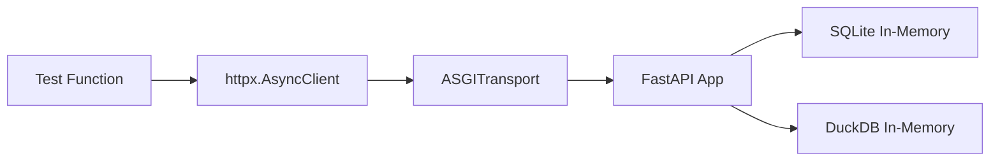

<!-- docs/testing.md -->
# Testing Guide

DataX uses a dual testing strategy: **pytest** for the Python backend and **vitest** for the TypeScript frontend. Both test suites use in-memory databases (SQLite and jsdom respectively) instead of production dependencies, enabling fast, isolated test execution without Docker.

## Running Tests

=== "Backend (pytest)"

    ```bash
    cd apps/backend

    uv run pytest                        # Run all tests
    uv run pytest tests/test_datasets.py # Run a single test file
    uv run pytest -k "test_list_empty"   # Run tests matching a pattern
    uv run pytest -x                     # Stop on first failure
    uv run pytest -v                     # Verbose output with test names
    ```

=== "Frontend (vitest)"

    ```bash
    cd apps/frontend

    pnpm test              # Run all tests (vitest run)
    pnpm test:watch        # Watch mode for development (vitest)
    ```

!!! tip "Running a single frontend test file"
    Vitest accepts a file filter argument directly:

    ```bash
    pnpm test -- src/pages/__tests__/datasets.test.tsx
    ```

---

## Backend Testing

### Architecture

Backend tests use an **app-factory pattern** — each test file creates its own FastAPI application via `create_app(settings)` with a SQLite database, bypassing PostgreSQL entirely. HTTP requests are sent through `httpx.AsyncClient` with `ASGITransport`, which invokes the ASGI app directly in-process (no HTTP server needed).



### Key Dependencies

| Package | Role |
|---------|------|
| `pytest` >= 8 | Test runner and fixture framework |
| `pytest-asyncio` >= 0.24 | Async test support with `asyncio_mode = "auto"` |
| `httpx` >= 0.28 | Async HTTP client with ASGI transport |

### Configuration

```toml title="apps/backend/pyproject.toml"
[tool.pytest.ini_options]
asyncio_mode = "auto"
testpaths = ["tests"]
```

The `asyncio_mode = "auto"` setting means **all async test functions are automatically treated as async** — you don't strictly need `@pytest.mark.asyncio` on every test, though the existing tests include it for explicitness.

### Test Infrastructure Pattern

Every test file follows the same structure: create settings, build the app, wire up SQLite, and provide an async client.

```python title="Standard test fixture pattern"
import os
import tempfile
from pathlib import Path
from unittest.mock import patch

import pytest
from httpx import ASGITransport, AsyncClient
from sqlalchemy import create_engine, event
from sqlalchemy.orm import sessionmaker

from app.config import Settings
from app.main import create_app
from app.models.base import Base


def _test_settings(db_path: Path) -> Settings:
    """Create test settings pointing at a temp SQLite file."""
    env = {
        "DATABASE_URL": f"sqlite:///{db_path}",
        "DATAX_ENCRYPTION_KEY": "test-encryption-key",
    }
    with patch.dict(os.environ, env, clear=True):
        return Settings()


@pytest.fixture
def db_engine(db_path):
    """SQLite engine with foreign key support enabled."""
    url = f"sqlite:///{db_path}"
    engine = create_engine(url, connect_args={"check_same_thread": False})

    @event.listens_for(engine, "connect")
    def set_sqlite_pragma(dbapi_connection, connection_record):
        cursor = dbapi_connection.cursor()
        cursor.execute("PRAGMA foreign_keys=ON")
        cursor.close()

    Base.metadata.create_all(engine)
    yield engine
    engine.dispose()


@pytest.fixture
def app(db_path, db_engine, session_factory):
    """FastAPI app wired to the test database."""
    application = create_app(settings=_test_settings(db_path))
    application.state.db_engine = db_engine
    application.state.session_factory = session_factory
    return application


@pytest.fixture
async def client(app):
    """Async HTTP client that talks directly to the ASGI app."""
    transport = ASGITransport(app=app)
    async with AsyncClient(transport=transport, base_url="http://testserver") as c:
        yield c
```

!!! warning "SQLite requires foreign key pragma"
    SQLite does **not** enforce foreign keys by default. The `PRAGMA foreign_keys=ON` listener is essential for testing cascade deletes and referential integrity. Without it, orphaned rows will silently persist.

!!! note "No shared conftest.py"
    Each test file defines its own fixtures rather than sharing a `conftest.py`. This keeps tests fully independent — you can run any single file without side effects from fixture imports.

### Example: API Endpoint Test

API tests create records directly in the database, then hit endpoints via the async client:

```python title="Testing a CRUD endpoint"
class TestListDatasets:
    """Test GET /api/v1/datasets."""

    @pytest.mark.asyncio
    async def test_list_empty_returns_empty_array(self, client) -> None:
        response = await client.get("/api/v1/datasets")
        assert response.status_code == 200
        assert response.json()["datasets"] == []

    @pytest.mark.asyncio
    async def test_list_returns_datasets(self, client, db, tmp_dir, duckdb_mgr) -> None:
        _create_dataset(db, tmp_dir, duckdb_mgr, name="data1.csv")
        _create_dataset(db, tmp_dir, duckdb_mgr, name="data2.csv")

        response = await client.get("/api/v1/datasets")
        assert len(response.json()["datasets"]) == 2
```

### Example: Service Unit Test

Pure service/utility tests don't need the HTTP client — import the function directly:

```python title="Testing chart heuristics"
from app.services.chart_heuristics import ChartType, recommend_chart_type


class TestTimeSeriesLineChart:
    def test_date_column_with_numeric(self) -> None:
        columns = ["date", "revenue"]
        rows = [
            ["2024-01-01", 100],
            ["2024-01-02", 200],
            ["2024-01-03", 300],
        ]
        result = recommend_chart_type(columns, rows, ["DATE", "FLOAT"])
        assert result.chart_type == ChartType.LINE
        assert result.x_column == "date"
        assert result.y_column == "revenue"
```

### Example: Model Test

Model tests use in-memory SQLite to verify table creation, relationships, and constraints:

```python title="Testing ORM relationships"
class TestDatabaseCRUD:
    def test_conversation_message_relationship(self, session) -> None:
        conv = Conversation(title="Test conversation")
        session.add(conv)
        session.flush()

        msg = Message(conversation_id=conv.id, role="user", content="Hello")
        session.add(msg)
        session.commit()

        result = session.get(Conversation, conv.id)
        assert len(result.messages) == 1
        assert result.messages[0].role == "user"
```

### Cross-Database Compatibility

The codebase uses two patterns to ensure models work identically on SQLite (tests) and PostgreSQL (production):

#### JSONB Variant

```python title="apps/backend/src/app/models/orm.py"
from sqlalchemy import JSON
from sqlalchemy.dialects.postgresql import JSONB

# Uses plain JSON on SQLite, JSONB on PostgreSQL
JSONVariant = JSON().with_variant(JSONB, "postgresql")
```

This is used for the `metadata` column on `Message` — it stores arbitrary JSON (SQL queries, chart configs) and needs JSONB indexing in production but works fine as plain JSON in SQLite tests.

#### Boolean Server Defaults

```python title="apps/backend/src/app/models/orm.py"
from sqlalchemy import true as sa_true, false as sa_false

# Cross-database boolean defaults
is_active = mapped_column(Boolean, nullable=False, server_default=sa_true())
is_default = mapped_column(Boolean, nullable=False, server_default=sa_false())
```

!!! info "Why not `default=True`?"
    `server_default` pushes the default to the database level (SQL `DEFAULT` clause), ensuring consistency even for raw SQL inserts. `sa_true()`/`sa_false()` generate the correct SQL for both SQLite (`1`/`0`) and PostgreSQL (`true`/`false`).

---

## Frontend Testing

### Architecture

Frontend tests run in a **jsdom** environment via vitest, with `@testing-library/react` for component rendering and `@testing-library/user-event` for interaction simulation. A separate `vitest.config.ts` is used instead of extending `vite.config.ts` to avoid loading the Tailwind CSS plugin in the test environment.

### Key Dependencies

| Package | Role |
|---------|------|
| `vitest` v4 | Test runner (Vite-native) |
| `jsdom` 28+ | Browser environment simulation |
| `@testing-library/react` | Component rendering and queries |
| `@testing-library/user-event` | Realistic user interaction simulation |
| `@testing-library/jest-dom` | Custom DOM matchers (`toBeInTheDocument`, etc.) |

### Configuration

```typescript title="apps/frontend/vitest.config.ts"
import { defineConfig } from "vitest/config";
import react from "@vitejs/plugin-react";
import path from "path";

export default defineConfig({
  plugins: [react()],
  resolve: {
    alias: {
      "@": path.resolve(__dirname, "./src"),
    },
  },
  test: {
    environment: "jsdom",
    globals: true,
    setupFiles: ["./src/test/setup.ts"],
  },
});
```

!!! warning "Separate vitest config is required"
    The main `vite.config.ts` uses `@tailwindcss/vite` which causes errors in the test environment. The separate `vitest.config.ts` includes only `@vitejs/plugin-react` and the `@/` path alias.

### Browser API Mocks

jsdom 28+ does not implement several browser APIs that React components commonly use. The setup file provides global mocks:

```typescript title="apps/frontend/src/test/setup.ts"
import "@testing-library/jest-dom/vitest";

// matchMedia — used by theme detection and responsive hooks
Object.defineProperty(window, "matchMedia", {
  writable: true,
  value: (query: string) => ({
    matches: false,
    media: query,
    onchange: null,
    addListener: () => {},
    removeListener: () => {},
    addEventListener: () => {},
    removeEventListener: () => {},
    dispatchEvent: () => false,
  }),
});

// Default window.innerWidth to desktop (1280px)
Object.defineProperty(window, "innerWidth", {
  writable: true,
  configurable: true,
  value: 1280,
});

// scrollIntoView — called by focus management and scroll-to behaviors
Element.prototype.scrollIntoView = () => {};
```

!!! tip "Overriding mocks per-test"
    The `writable: true` / `configurable: true` properties allow individual tests to override these values. For example, to test mobile layout:

    ```typescript
    Object.defineProperty(window, "innerWidth", { value: 375 });
    ```

### Example: Component Test

Component tests mock hooks and render with necessary providers:

```typescript title="Testing a page component"
import { render, screen } from "@testing-library/react";
import userEvent from "@testing-library/user-event";
import { MemoryRouter } from "react-router-dom";
import { describe, it, expect, vi, beforeEach } from "vitest";

const mockUseDatasetList = vi.fn();

vi.mock("@/hooks/use-datasets", () => ({
  useDatasetList: () => mockUseDatasetList(),
}));

function renderPage() {
  return render(
    <MemoryRouter initialEntries={["/datasets"]}>
      <DatasetsPage />
    </MemoryRouter>,
  );
}

describe("DatasetsPage", () => {
  beforeEach(() => {
    vi.clearAllMocks();
    mockUseDatasetList.mockReturnValue({
      data: mockDatasets,
      isLoading: false,
      isError: false,
    });
  });

  it("renders all dataset rows", () => {
    renderPage();
    expect(screen.getAllByTestId("dataset-row")).toHaveLength(3);
  });

  it("filters datasets by search query", async () => {
    renderPage();
    await userEvent.type(screen.getByTestId("search-input"), "sales");
    expect(screen.getAllByTestId("dataset-row")).toHaveLength(1);
  });
});
```

### Example: Component with User Interaction

Tests that simulate clicks, typing, or other interactions use `@testing-library/user-event`:

```typescript title="Testing theme toggle behavior"
import userEvent from "@testing-library/user-event";

it("switches theme when toggled", async () => {
  render(
    <ThemeProvider>
      <ThemeToggle showLabel />
    </ThemeProvider>,
  );

  const user = userEvent.setup();
  const toggle = screen.getByTestId("theme-toggle");

  // Starts as light (mocked system default)
  expect(document.documentElement.classList.contains("light")).toBe(true);

  // Click to switch to dark
  await user.click(toggle);
  expect(document.documentElement.classList.contains("dark")).toBe(true);
});
```

### Common Patterns

#### Mocking TanStack Query Hooks

Pages fetch data through custom hooks wrapping TanStack Query. Tests mock these hooks at the module level:

```typescript
vi.mock("@/hooks/use-datasets", () => ({
  useDatasetList: () => mockUseDatasetList(),
  useDeleteDataset: () => ({ mutate: mockDeleteMutate, isPending: false }),
}));
```

#### Testing Loading/Error States

Create helper functions to simulate different async states:

```typescript
function loadingState() {
  return { data: undefined, isLoading: true, isError: false, refetch: vi.fn() };
}

function errorState() {
  return { data: undefined, isLoading: false, isError: true, refetch: vi.fn() };
}

it("shows loading skeletons", () => {
  mockUseDatasetList.mockReturnValue(loadingState());
  const { container } = renderPage();
  expect(container.querySelectorAll(".animate-pulse").length).toBeGreaterThan(0);
});
```

#### Wrapping with Providers

Components that use React Router, themes, or other context providers need wrapping:

```typescript
function renderWithProviders(ui: React.ReactElement) {
  return render(
    <MemoryRouter>
      <ThemeProvider>
        {ui}
      </ThemeProvider>
    </MemoryRouter>,
  );
}
```

---

## Test File Reference

### Backend Tests

| File | Coverage Area |
|------|--------------|
| `test_app.py` | App creation, lifespan events, middleware |
| `test_config.py` | Settings loading, environment variable parsing |
| `test_encryption.py` | Fernet encrypt/decrypt roundtrip |
| `test_health.py` | Liveness (`/health`) and readiness (`/ready`) probes |
| `test_models.py` | ORM model instantiation, relationships, constraints |
| `test_duckdb_manager.py` | File registration, query execution, table cleanup |
| `test_datasets.py` | Dataset CRUD API endpoints |
| `test_dataset_preview.py` | Data preview with pagination and sorting |
| `test_upload.py` | File upload flow (multipart, validation) |
| `test_connections.py` | Connection CRUD, test connectivity, password encryption |
| `test_providers.py` | Provider CRUD, env-var detection, API key masking |
| `test_conversations.py` | Conversation CRUD, cursor-based pagination |
| `test_messages.py` | SSE streaming, message creation |
| `test_queries.py` | SQL execution, read-only enforcement, saved queries |
| `test_cross_source_query.py` | Cross-source query orchestration |
| `test_schema_introspection.py` | SQLAlchemy Inspector usage, type normalization |
| `test_schema_registry.py` | Unified schema aggregation across sources |
| `test_schema_context.py` | Schema-to-prompt-text conversion for AI context |
| `test_agent_service.py` | AI agent creation, provider resolution |
| `test_nl_query_service.py` | NL-to-SQL pipeline, self-correction retry loop |
| `test_chart_heuristics.py` | Chart type recommendation logic |
| `test_chart_config.py` | Plotly JSON config generation |

### Frontend Tests

| Location | Coverage Area |
|----------|--------------|
| `pages/__tests__/dashboard.test.tsx` | Dashboard page |
| `pages/__tests__/chat.test.tsx` | Chat page |
| `pages/__tests__/datasets.test.tsx` | Datasets list page |
| `pages/__tests__/dataset-detail.test.tsx` | Dataset detail page |
| `pages/__tests__/connections.test.tsx` | Connections list page |
| `pages/__tests__/connection-detail.test.tsx` | Connection detail page |
| `pages/__tests__/connection-form.test.tsx` | Connection form page |
| `pages/__tests__/settings.test.tsx` | Settings page |
| `pages/__tests__/sql-editor.test.tsx` | SQL editor page |
| `pages/__tests__/not-found.test.tsx` | 404 page |
| `components/__tests__/theme-toggle.test.tsx` | Theme toggle component |
| `components/onboarding/__tests__/onboarding-wizard.test.tsx` | Onboarding wizard |
| `components/chat/__tests__/chat-components.test.tsx` | Chat UI components |
| `components/chat/__tests__/chat-panel.test.tsx` | Chat panel |
| `components/results/__tests__/result-card.test.tsx` | Result card |
| `components/results/__tests__/results-panel.test.tsx` | Results panel |
| `components/layout/__tests__/responsive-layout.test.tsx` | Responsive layout |
| `components/layout/__tests__/app-layout.test.tsx` | App layout shell |
| `components/charts/__tests__/chart-renderer.test.tsx` | Plotly chart renderer |
| `components/charts/__tests__/chart-export.test.ts` | Chart export functionality |
| `components/schema-browser/__tests__/schema-browser.test.tsx` | Schema browser |
| `components/sql-editor/__tests__/tab-bar.test.tsx` | SQL editor tab bar |
| `components/sql-editor/__tests__/sql-results-panel.test.tsx` | SQL results panel |
| `lib/__tests__/sql-completions.test.ts` | SQL autocomplete logic |

---

## Writing New Tests

### Backend Checklist

1. **Create a `_test_settings()` helper** with `DATABASE_URL` pointing at SQLite
2. **Build the app** via `create_app(settings=_test_settings(db_path))`
3. **Wire up `app.state`** with `db_engine`, `session_factory`, and any required managers
4. **Use `ASGITransport`** with `httpx.AsyncClient` for API tests
5. **Enable SQLite foreign keys** via the `PRAGMA foreign_keys=ON` event listener
6. **Test the error format** — verify `{ "error": { "code": "...", "message": "..." } }` responses

### Frontend Checklist

1. **Mock data-fetching hooks** at the module level with `vi.mock()`
2. **Wrap with required providers** (`MemoryRouter`, `ThemeProvider`, etc.)
3. **Use `userEvent.setup()`** for interaction tests (preferred over `fireEvent`)
4. **Test all async states**: loading, success, error, and empty
5. **Use `getByTestId`** for structural queries, `getByRole`/`getByText` for semantic queries
6. **Clean up mocks** in `beforeEach` with `vi.clearAllMocks()`

!!! tip "Prefer `userEvent` over `fireEvent`"
    `@testing-library/user-event` simulates real browser behavior (focus, blur, keyboard events) while `fireEvent` dispatches synthetic events. This catches bugs that `fireEvent` would miss, like components that rely on focus state or keyboard navigation.
