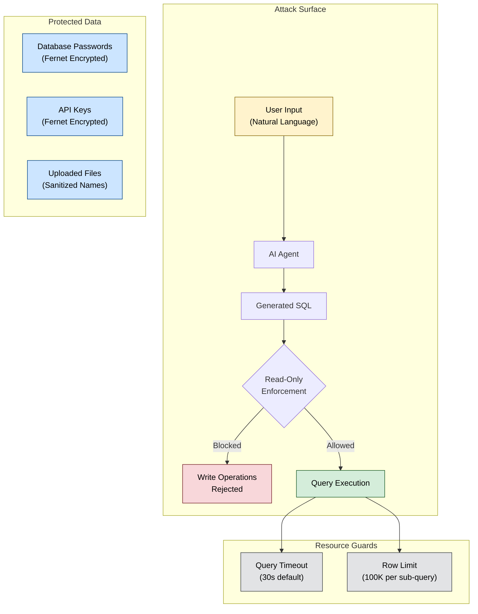
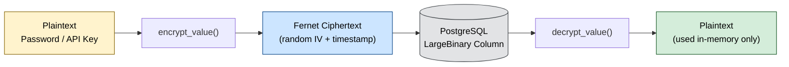
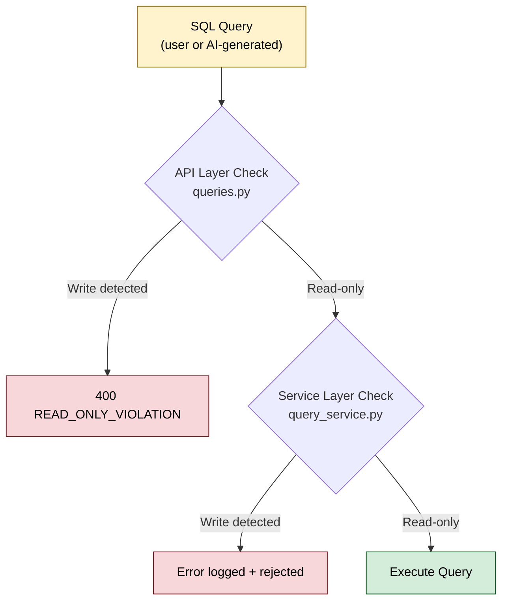

<!-- docs/security.md -->
# Security

DataX handles sensitive data — database credentials, AI provider API keys, and user-uploaded datasets. This page documents the security controls built into the platform, their implementation details, and current limitations to be aware of when deploying.

## Threat Model Overview

DataX operates as a single-user analytics platform that accepts natural language input, generates SQL, and executes it against user data. The primary threat vectors are:

| Threat | Risk | Mitigation |
|---|---|---|
| **SQL injection via AI** | AI-generated SQL could modify or destroy data | Double-layer read-only enforcement |
| **Credential exposure** | Database passwords and API keys leaked in responses | Fernet encryption at rest, excluded from API responses |
| **Malicious file uploads** | Path traversal, oversized files, or dangerous formats | Filename sanitization, format allowlist |
| **Cross-source memory exhaustion** | Joining large datasets crashes the process | Row limits per sub-query |
| **Long-running queries** | Resource exhaustion via expensive queries | Configurable query timeouts |
| **Cross-origin attacks** | Unauthorized browser-based API access | CORS origin allowlist |



---

## Encryption at Rest

DataX uses **Fernet symmetric encryption** (from the Python `cryptography` library) to protect sensitive values stored in PostgreSQL. Fernet provides authenticated encryption — it uses AES-128-CBC with HMAC-SHA256, ensuring both confidentiality and integrity.

### What's Encrypted

| Entity | Field | Column Type | Purpose |
|---|---|---|---|
| `Connection` | `encrypted_password` | `LargeBinary` | Database connection passwords |
| `ProviderConfig` | `encrypted_api_key` | `LargeBinary` | AI provider API keys (OpenAI, Anthropic, etc.) |

### How It Works



Each call to `encrypt_value()` produces **unique ciphertext** because Fernet includes a random IV and timestamp in every encryption operation. This means the same plaintext encrypted twice will produce different ciphertext, preventing pattern analysis.

### Encryption Key Management

The master key is loaded from the `DATAX_ENCRYPTION_KEY` environment variable:

```python title="apps/backend/src/app/encryption.py"
def _load_key() -> bytes:
    raw_key = os.environ.get("DATAX_ENCRYPTION_KEY")
    if not raw_key:
        raise InvalidEncryptionKeyError(
            "DATAX_ENCRYPTION_KEY environment variable is not set."
        )
    # Validates key format by constructing a Fernet instance
    Fernet(key_bytes)
    return key_bytes
```

At application startup, `validate_encryption_key()` is available to **fail fast** if the key is misconfigured.

!!! danger "Key Loss = Data Loss"
    If the `DATAX_ENCRYPTION_KEY` is lost, all encrypted passwords and API keys become **permanently unrecoverable**. There is no key escrow or recovery mechanism. Back up the key securely.

### Generating a Key

```bash
python -c "from cryptography.fernet import Fernet; print(Fernet.generate_key().decode())"
```

This produces a 32-byte URL-safe base64-encoded key suitable for the `DATAX_ENCRYPTION_KEY` variable.

!!! warning "No Key Rotation"
    DataX does not currently support encryption key rotation. Changing the key requires manually re-encrypting all existing ciphertext with the new key. See [Current Limitations](#current-limitations) for details.

---

## Read-Only SQL Enforcement

DataX enforces **read-only SQL execution** through a double-layer defense — SQL is validated at both the API layer and the service layer before any query reaches a database.

### Defense Layers



### Blocked Operations

The `is_read_only_sql()` function checks for write keywords at the start of any SQL statement (case-insensitive, multiline-aware):

| Blocked Keyword | Operation Type |
|---|---|
| `INSERT` | Data insertion |
| `UPDATE` | Data modification |
| `DELETE` | Data deletion |
| `DROP` | Schema destruction |
| `ALTER` | Schema modification |
| `CREATE` | Schema creation |
| `TRUNCATE` | Table truncation |
| `REPLACE` | Insert-or-update |
| `MERGE` | Upsert operations |
| `GRANT` | Privilege escalation |
| `REVOKE` | Privilege removal |
| `RENAME` | Object renaming |

```python title="apps/backend/src/app/services/query_service.py"
_WRITE_KEYWORDS = re.compile(
    r"^\s*(INSERT|UPDATE|DELETE|DROP|ALTER|CREATE|TRUNCATE|REPLACE|MERGE|GRANT|REVOKE|RENAME)\b",
    re.IGNORECASE | re.MULTILINE,
)

def is_read_only_sql(sql: str) -> bool:
    stripped = sql.strip()
    if not stripped:
        return False
    return _WRITE_KEYWORDS.search(stripped) is None
```

**Allowed statement types:** `SELECT`, `WITH` (CTEs), `EXPLAIN`, `SHOW`, `DESCRIBE`, `PRAGMA`.

!!! note "Why Two Layers?"
    The API layer catches violations early and returns a clean `400` error to the client. The service layer acts as a **safety net** — if a code path bypasses the API validation (e.g., the AI agent calling the service directly), the write is still blocked. Defense in depth.

!!! info "DuckDB Is Also Read-Only"
    For uploaded file datasets, DuckDB creates **views** over the data files — not mutable tables. This provides an additional structural guarantee that file-based data cannot be modified through SQL.

---

## Secret Masking in API Responses

Sensitive values are **never returned** in API responses. This is enforced structurally through Pydantic response models that exclude secret fields entirely.

### Connection Passwords

The `ConnectionResponse` model omits the password field completely — it is not present in the schema, not redacted, not masked. It simply does not exist in the response:

```python title="apps/backend/src/app/api/v1/connections.py"
class ConnectionResponse(BaseModel):
    """Response schema for a single connection (password never included)."""
    id: str
    name: str
    db_type: str
    host: str
    port: int
    database_name: str
    username: str
    status: str
    last_tested_at: str | None
    created_at: str
    updated_at: str
    # No password field — not masked, not redacted, simply absent
```

### Provider API Keys

The `ProviderResponse` model replaces the actual API key with a boolean indicator:

```python title="apps/backend/src/app/api/v1/providers.py"
class ProviderResponse(BaseModel):
    """Single provider in API responses. Never includes the actual API key."""
    id: UUID
    provider_name: str
    model_name: str
    base_url: str | None
    is_default: bool
    is_active: bool
    has_api_key: bool  # Boolean indicator only — actual key never exposed
    source: str
    created_at: datetime
```

!!! tip "Structural vs. Procedural Masking"
    DataX uses **structural masking** — the response model itself doesn't have the field, so there's no way to accidentally include it. This is more robust than procedural masking (e.g., setting a field to `"***"` after the fact), which can fail if the masking step is skipped.

---

## CORS Configuration

Cross-Origin Resource Sharing (CORS) is configured via the `CORS_ORIGINS` environment variable and enforced by FastAPI's `CORSMiddleware`.

```python title="apps/backend/src/app/main.py"
app.add_middleware(
    CORSMiddleware,
    allow_origins=settings.cors_origins,
    allow_credentials=True,
    allow_methods=["*"],
    allow_headers=["*"],
)
```

| Setting | Default | Description |
|---|---|---|
| `CORS_ORIGINS` | `http://localhost:5173` | Comma-separated list of allowed origins |
| `allow_credentials` | `True` | Allows cookies and auth headers |
| `allow_methods` | `*` | All HTTP methods permitted |
| `allow_headers` | `*` | All request headers permitted |

The default restricts access to the Vite dev server. For production, set `CORS_ORIGINS` to your frontend's deployed URL.

!!! warning "Production CORS"
    Never use `*` as a CORS origin in production. Always specify the exact frontend origin(s) to prevent unauthorized cross-origin API access. See [Configuration](configuration.md) for environment variable details.

---

## Query Timeouts

All SQL queries — whether against DuckDB (uploaded files) or live database connections — are subject to a configurable execution timeout.

| Setting | Default | Description |
|---|---|---|
| `DATAX_MAX_QUERY_TIMEOUT` | `30` seconds | Maximum execution time per query |

Queries that exceed the timeout return a `QUERY_TIMEOUT` error:

```json
{
  "error": {
    "code": "QUERY_TIMEOUT",
    "message": "Query exceeded the time limit."
  }
}
```

This prevents expensive queries (e.g., unfiltered joins across large tables) from monopolizing resources.

---

## Cross-Source Memory Guard

When DataX executes cross-source queries (joining data across DuckDB datasets and live database connections), intermediate results are loaded into memory. A row limit prevents memory exhaustion.

| Setting | Default | Description |
|---|---|---|
| `DATAX_MAX_CROSS_SOURCE_ROWS` | `100,000` | Maximum rows per sub-query |

When a sub-query exceeds the limit, results are **truncated** (not rejected) and a warning is logged:

```python title="apps/backend/src/app/services/cross_source_query.py"
truncated = len(all_rows) > max_rows
if truncated:
    all_rows = all_rows[:max_rows]
    logger.warning("subquery_result_truncated", alias=sub_query.alias, ...)
```

!!! note "Truncation, Not Failure"
    Cross-source queries that exceed the row limit will still return results, but they may be incomplete. The truncation is logged server-side. Consider this when analyzing results from large cross-source joins.

---

## Input Validation

### API Request Validation

All API input is validated by **Pydantic models** with strict type checking and constraints:

```python title="apps/backend/src/app/api/v1/connections.py"
class ConnectionCreateRequest(BaseModel):
    name: str = Field(..., min_length=1, max_length=255)
    db_type: str = Field(...)
    host: str = Field(..., min_length=1, max_length=255)
    port: int = Field(..., gt=0, le=65535)
    database_name: str = Field(..., min_length=1, max_length=255)
    username: str = Field(..., min_length=1, max_length=255)
    password: str = Field(..., min_length=1)
```

Invalid requests receive a `422 VALIDATION_ERROR` response without exposing validation internals:

```json
{
  "error": {
    "code": "VALIDATION_ERROR",
    "message": "Request validation failed. Check your input."
  }
}
```

### File Upload Sanitization

Uploaded filenames are sanitized to prevent path traversal and filesystem issues:

1. **Strip directory components** — prevents `../../etc/passwd` style attacks
2. **Replace unsafe characters** — only `a-z`, `A-Z`, `0-9`, `.`, `-`, `_` are kept
3. **Collapse consecutive underscores** and trim leading/trailing dots
4. **Append a UUID suffix** — prevents filename collisions
5. **Allowlist file extensions** — only `.csv`, `.xlsx`, `.xls`, `.parquet`, `.json`

```python title="apps/backend/src/app/services/file_upload.py"
def sanitize_filename(filename: str) -> str:
    name = Path(filename).name                          # Strip directories
    stem = re.sub(r"[^a-zA-Z0-9._-]", "_", stem)      # Safe chars only
    stem = re.sub(r"_+", "_", stem).strip("_.")        # Clean up
    return f"{stem}{ext}"
```

### UUID Validation

All entity identifiers (datasets, connections, conversations, etc.) use **UUIDs**, which are validated by Pydantic's type system. This prevents ID enumeration attacks and ensures referential integrity.

---

## Error Handling

DataX uses a global exception handler system that ensures internal details are never leaked to clients.

| Exception Type | HTTP Status | Error Code | Details Exposed? |
|---|---|---|---|
| `AppError` | Varies (400-499) | Custom code | Controlled message only |
| `HTTPException` | Varies | `HTTP_ERROR` | Starlette detail string |
| `RequestValidationError` | 422 | `VALIDATION_ERROR` | Generic message |
| **Unhandled exceptions** | 500 | `INTERNAL_ERROR` | `"An unexpected error occurred."` |

!!! info "Stack Traces Are Logged, Not Returned"
    All exceptions — including unhandled ones — are logged with full context (exception type, message, request path) via structured logging. But the API response for 500 errors contains only the generic message `"An unexpected error occurred."`, never a stack trace.

---

## Current Limitations

!!! danger "MVP Security Boundaries"
    DataX is currently a **single-user MVP**. The following limitations are known and should be addressed before any multi-user or public-facing deployment.

### Critical

| Limitation | Impact | Mitigation |
|---|---|---|
| **No authentication** | Anyone with network access to the API can perform all operations | Deploy behind a reverse proxy with authentication (e.g., OAuth2 proxy, Cloudflare Access) |
| **No authorization** | No role-based access control; all data accessible to any user | All entities have a `user_id` field prepared for future RBAC implementation |
| **No encryption key rotation** | Changing `DATAX_ENCRYPTION_KEY` breaks all existing encrypted data | Manually re-encrypt all passwords and API keys if key rotation is needed |

### High

| Limitation | Impact | Mitigation |
|---|---|---|
| **No rate limiting** | API is vulnerable to abuse and resource exhaustion | Deploy behind an API gateway or reverse proxy with rate limiting |
| **No audit logging** | No record of who did what, when | Monitor application logs for security-relevant events |
| **DuckDB file access not sandboxed** | DuckDB can potentially read files outside the uploads directory | Restrict filesystem permissions on the process and the uploads directory |

### Medium

| Limitation | Impact | Mitigation |
|---|---|---|
| **No CSP headers** | Frontend may be vulnerable to XSS in certain scenarios | Configure Content-Security-Policy headers at the reverse proxy |
| **`allow_methods=*` / `allow_headers=*`** in CORS | Broader than necessary | Restrict to the specific methods and headers actually used |

---

## Deployment Security Checklist

!!! tip "Production Readiness"
    Follow this checklist before deploying DataX to any environment beyond local development.

### Encryption & Secrets

- [ ] Generate a unique `DATAX_ENCRYPTION_KEY` — never reuse across environments
- [ ] Store the encryption key in a secrets manager (e.g., AWS Secrets Manager, HashiCorp Vault)
- [ ] Back up the encryption key securely — loss means unrecoverable data
- [ ] Set `DATABASE_URL` with SSL mode enabled (`?sslmode=require`)
- [ ] Avoid passing API keys in environment variables if a secrets manager is available

### Network & Access

- [ ] Deploy behind a reverse proxy with TLS termination (HTTPS)
- [ ] Add authentication middleware (OAuth2 proxy, Cloudflare Access, or similar)
- [ ] Set `CORS_ORIGINS` to the exact frontend URL — never use `*`
- [ ] Enable rate limiting at the reverse proxy or API gateway
- [ ] Restrict network access to PostgreSQL (private subnet or firewall rules)

### Runtime

- [ ] Run the backend process as a non-root user
- [ ] Set restrictive filesystem permissions on the uploads directory
- [ ] Configure `DATAX_MAX_QUERY_TIMEOUT` appropriately for your workload
- [ ] Monitor structured logs for `READ_ONLY_VIOLATION`, `QUERY_TIMEOUT`, and `unhandled_exception` events
- [ ] Set `DATAX_MAX_CROSS_SOURCE_ROWS` based on available memory

### Database Connections

- [ ] Use read-only database users when configuring external connections
- [ ] Verify that connected databases enforce their own access controls
- [ ] Test connection credentials with minimal required privileges
