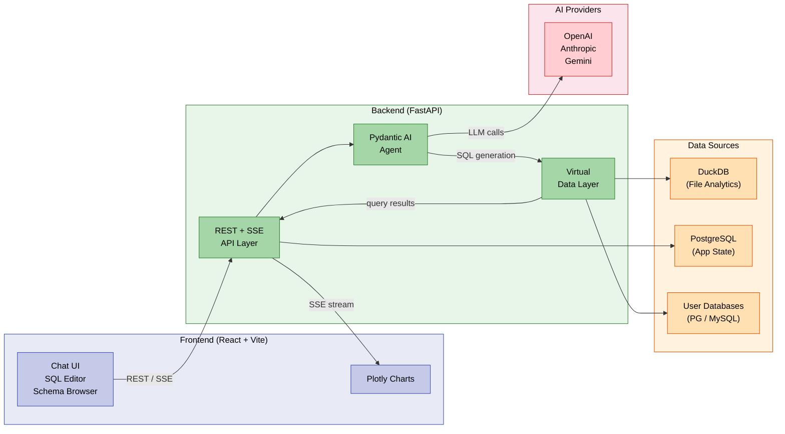

<!-- docs/index.md -->
# DataX

**AI-native data analytics platform — chat with your data.**

DataX lets you ask questions in plain English and get answers as SQL queries, tabular results, and interactive visualizations. Upload files or connect live databases — an agentic AI handles the rest.

<div class="grid cards" markdown>

-   :material-chat-processing-outline:{ .lg .middle } **Natural Language Queries**

    ---

    Ask questions in plain English. The AI agent generates SQL, executes it, and streams results back in real time via SSE.

-   :material-chart-bar:{ .lg .middle } **Interactive Visualizations**

    ---

    AI-selected Plotly charts are generated automatically based on your query results — bar, line, scatter, pie, and more.

-   :material-database-search:{ .lg .middle } **Virtual Data Layer**

    ---

    Query uploaded files and live databases through a unified layer. DuckDB handles file analytics; SQLAlchemy proxies to PostgreSQL and MySQL.

-   :material-shield-lock-outline:{ .lg .middle } **Secure by Default**

    ---

    API keys and database passwords are Fernet-encrypted at rest. Connected databases are queried in read-only mode with execution time limits.

</div>

---

## Key Features

| Feature | Description |
|---|---|
| **Natural language to SQL** | Pydantic AI agent with multi-provider support (OpenAI, Anthropic, Gemini) |
| **Self-correcting SQL** | Failed queries are retried up to 3 times with error classification and automatic fixes |
| **File upload & analytics** | CSV, Excel, Parquet, and JSON files registered as DuckDB virtual tables |
| **Live database connections** | Connect to PostgreSQL and MySQL with encrypted credentials |
| **Cross-source queries** | Join data across uploaded files and live databases in a single query |
| **Interactive charts** | AI picks the chart type and generates Plotly JSON configs from result shape |
| **SQL editor** | CodeMirror 6 with schema-aware autocomplete and syntax highlighting |
| **Schema browser** | Searchable tree view of all tables, columns, and types across data sources |
| **Streaming responses** | SSE-powered real-time token streaming with markdown rendering via Streamdown |
| **Responsive layout** | Three-panel design adapts across mobile, tablet, and desktop breakpoints |

---

## Architecture Overview

DataX is a two-language monorepo — a Python/FastAPI backend and a TypeScript/React frontend connected via REST and Server-Sent Events.



!!! info "How it works"
    1. A user types a question in the chat interface
    2. The FastAPI backend forwards it to the Pydantic AI agent
    3. The agent calls the configured LLM to generate SQL
    4. The Virtual Data Layer routes the query to DuckDB (files) or SQLAlchemy (live databases)
    5. Results stream back via SSE — along with an AI-generated Plotly chart configuration
    6. If the SQL fails, the agent self-corrects (up to 3 retries) before asking the user to refine

---

## Technology Stack

=== "Backend"

    | Component | Technology |
    |---|---|
    | Runtime | Python 3.12+ |
    | Web framework | FastAPI with async endpoints |
    | AI agent | Pydantic AI (multi-provider) |
    | ORM | SQLAlchemy 2 with Alembic migrations |
    | Analytics engine | DuckDB (in-process) |
    | App database | PostgreSQL via psycopg 3 |
    | Logging | structlog |
    | Encryption | Fernet (cryptography) |

=== "Frontend"

    | Component | Technology |
    |---|---|
    | Framework | React 19 with TypeScript 5.9 |
    | Build tool | Vite 7 |
    | Styling | Tailwind CSS 4 + shadcn/ui v4 |
    | State management | Zustand (UI) + TanStack Query v5 (server) |
    | SQL editor | CodeMirror 6 |
    | Charts | react-plotly.js |
    | Streaming | Streamdown |
    | Routing | React Router v7 |

=== "Infrastructure"

    | Component | Technology |
    |---|---|
    | Containerization | Docker Compose |
    | App database | PostgreSQL |
    | Package management | uv (Python), pnpm (Node) |
    | Linting | Ruff (Python), ESLint (TypeScript) |

---

## Documentation Guide

| Section | What you'll find |
|---|---|
| [Getting Started](getting-started.md) | Installation, setup, and running DataX locally |
| **Architecture** | |
| &nbsp;&nbsp;&nbsp;&nbsp;[Overview](architecture.md) | System design, component relationships, and data flow |
| &nbsp;&nbsp;&nbsp;&nbsp;[AI Pipeline](ai-pipeline.md) | Agent architecture, prompt design, SQL generation, and self-correction |
| &nbsp;&nbsp;&nbsp;&nbsp;[Frontend](frontend.md) | React component tree, state management, and UI patterns |
| **Reference** | |
| &nbsp;&nbsp;&nbsp;&nbsp;[API Reference](api-reference.md) | All 33 REST endpoints with request/response schemas |
| &nbsp;&nbsp;&nbsp;&nbsp;[Data Models](data-models.md) | ORM models, relationships, and database schema |
| &nbsp;&nbsp;&nbsp;&nbsp;[Configuration](configuration.md) | Environment variables, settings, and provider setup |
| &nbsp;&nbsp;&nbsp;&nbsp;[Security](security.md) | Encryption, read-only queries, and credential handling |
| **Guides** | |
| &nbsp;&nbsp;&nbsp;&nbsp;[Development](development.md) | Local development workflow, code standards, and tooling |
| &nbsp;&nbsp;&nbsp;&nbsp;[Deployment](deployment.md) | Docker Compose deployment and production configuration |
| &nbsp;&nbsp;&nbsp;&nbsp;[Testing](testing.md) | Test strategy, running tests, and writing new tests |

---

## Quick Start

!!! tip "Get running in under 5 minutes"

    ```bash
    # Clone the repository
    git clone https://github.com/sequenzia/datax.git
    cd datax

    # Start the full stack with Docker
    docker compose up

    # Or run backend and frontend separately:
    cd backend && uv sync && uv run fastapi dev    # API on :8000
    cd frontend && pnpm install && pnpm dev         # UI on :5173
    ```

    See the [Getting Started](getting-started.md) guide for detailed setup instructions, including AI provider configuration.

---

## Project Stats

| Metric | Count |
|---|---|
| API endpoints | 33 |
| Backend services | 12 |
| ORM models | 7 |
| Route modules | 9 |
| Supported AI providers | 3+ (OpenAI, Anthropic, Gemini, OpenAI-compatible) |
| Supported file formats | 4 (CSV, Excel, Parquet, JSON) |
| Supported databases | 2 (PostgreSQL, MySQL) |
