# DataX PRD

**Version**: 1.0
**Author**: Stephen Sequenzia
**Date**: 2026-03-11
**Status**: Draft
**Spec Type**: New Product
**Spec Depth**: Full Technical Documentation
**Description**: An agentic AI data analytics app that enables users to analyze and understand their data through natural language queries, with support for multiple data sources, AI-generated visualizations, and a virtual data layer for seamless cross-source querying.

---

## 1. Executive Summary

DataX is an AI-native data analytics platform that enables users to explore and understand their data through natural language conversation. Unlike traditional BI tools that bolt AI on as an afterthought, DataX is built around an agentic AI core that interprets questions, generates SQL, produces visualizations, and iteratively refines results — making data analytics accessible to both technical and non-technical users.

## 2. Problem Statement

### 2.1 The Problem

Data-driven decision making is bottlenecked by tool complexity. Non-technical users depend on data teams to answer questions about their own data. Technical users spend excessive time context-switching between query editors, visualization tools, and documentation. No existing tool provides a unified, AI-native experience that bridges the gap between asking a question and getting an actionable answer.

### 2.2 Current State

Users currently address this problem through a patchwork of approaches:
- **Traditional BI tools** (Tableau, Looker, Power BI): Powerful but require training, dashboard setup, and ongoing maintenance. AI features are add-ons, not core to the experience.
- **SQL editors** (DataGrip, DBeaver): Require SQL expertise, produce raw tabular output without visualization or explanation.
- **ChatGPT + file upload**: Limited to single-file analysis, no persistent connections, no virtual data layer, and no iterative refinement against live databases.
- **Metabase / Redash**: Open-source alternatives that still require dashboard configuration and don't offer conversational interfaces.

### 2.3 Impact Analysis

- **Time cost**: Non-technical users wait hours or days for data team responses to ad-hoc questions.
- **Context loss**: By the time an answer arrives, the business context that prompted the question has often shifted.
- **Underutilization**: Organizations collect vast amounts of data but only a fraction is analyzed because the tooling barrier is too high.

### 2.4 Business Value

DataX addresses a growing market need for AI-native analytics tools. By making data exploration conversational and self-service, it:
- Eliminates the dependency on data teams for ad-hoc queries
- Reduces time-to-insight from hours to seconds
- Enables organizations to extract more value from existing data assets
- Serves as a flexible, self-hosted alternative to expensive SaaS BI platforms

## 3. Goals & Success Metrics

### 3.1 Primary Goals

1. **AI-native analytics**: Build a platform where AI is the primary interface, not an add-on
2. **Self-service data exploration**: Enable non-technical users to get answers without writing SQL
3. **Unified data access**: Provide a single interface to query across uploaded files and live database connections

### 3.2 Success Metrics

| Metric | Target | Measurement Method |
|--------|--------|-------------------|
| Query Accuracy | AI-generated SQL returns correct results >= 85% of the time | Manual evaluation against test question set |
| Time to Insight | User gets a visualized answer within 30 seconds of asking | Measure end-to-end latency from query submission to chart render |
| Self-Correction Rate | Agentic retry loop resolves >= 70% of initial query failures without user intervention | Track retry success rate in telemetry |
| Data Source Coverage | Successfully query across all supported formats (CSV, Excel, Parquet, JSON, PostgreSQL, MySQL) | Integration test suite |

### 3.3 Non-Goals

- **Real-time data streaming**: DataX queries data at rest or via point-in-time database queries; it does not process streaming data (e.g., Kafka topics)
- **ETL / data pipeline management**: DataX is an analytics tool, not a data engineering platform
- **Multi-user collaboration**: MVP is single-user; collaborative features are deferred
- **Data transformation / cleaning**: DataX queries data as-is; data prep tools are out of scope
- **Embedded analytics**: No embeddable widgets or iframe support for MVP

## 4. User Research

### 4.1 Target Users

#### Primary Persona: Alex — The Data Analyst

- **Role/Description**: Mid-level data analyst at a growing company, comfortable with SQL and basic Python
- **Goals**: Quickly answer ad-hoc business questions, build visualizations for stakeholders, explore unfamiliar datasets
- **Pain Points**: Too many tools (query editor + BI tool + spreadsheet), context-switching overhead, building dashboards for one-off questions is overkill
- **Context**: Works at a desk, queries multiple databases daily, often asked "quick questions" by business stakeholders
- **Technical Proficiency**: High — writes SQL daily, familiar with database concepts

#### Secondary Persona: Jordan — The Business Manager

- **Role/Description**: Department manager who needs data insights but doesn't write SQL
- **Goals**: Get answers to business questions without filing tickets to the data team, understand trends in their department's metrics
- **Pain Points**: Depends on data team for every query, doesn't understand SQL or BI tool configuration, feels disconnected from company data
- **Context**: Needs quick answers during meetings or while making decisions, prefers natural language interaction

### 4.2 User Journey Map


### 4.3 User Workflows

#### Workflow 1: Natural Language Query

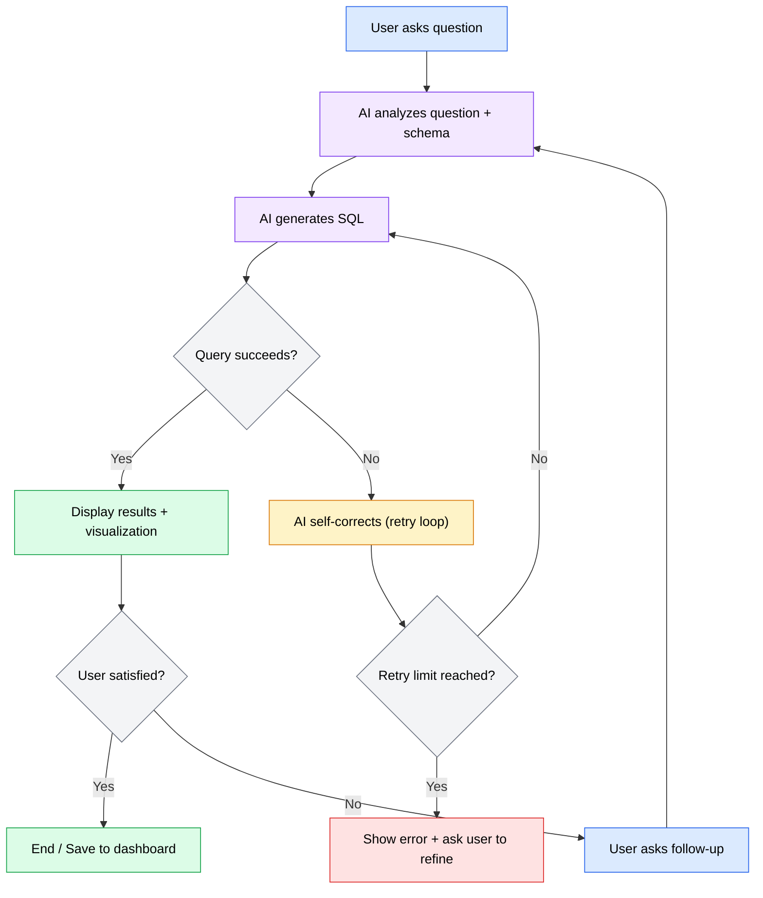

#### Workflow 2: Data Upload + Explore

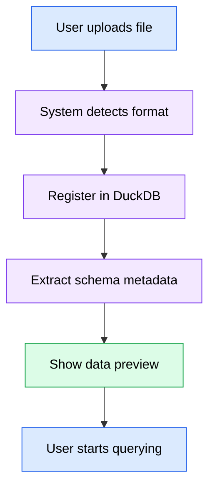

#### Workflow 3: Database Connection

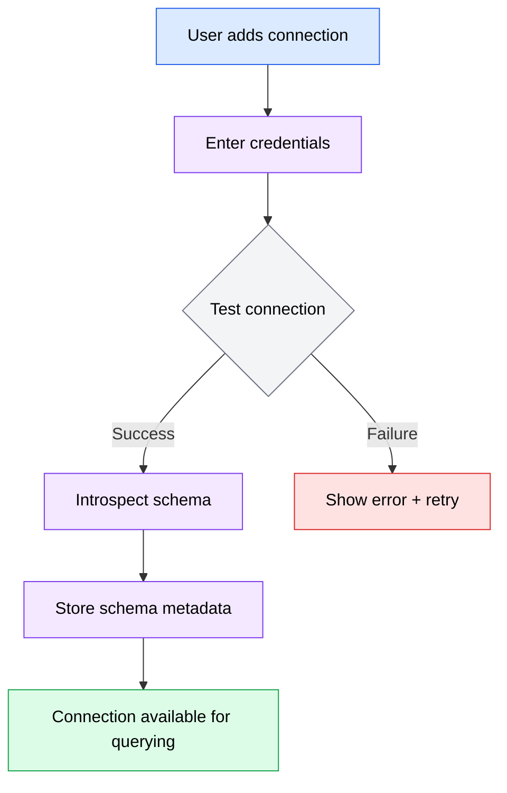

## 5. Functional Requirements

### 5.1 Feature: Data Upload

**Priority**: P0 (Critical)
**Complexity**: High

#### User Stories

**US-001**: As a user, I want to upload data files (CSV, Excel, Parquet, JSON) so that I can query them with natural language.

**Acceptance Criteria**:
- [ ] User can upload files via drag-and-drop or file picker
- [ ] System accepts CSV, Excel (.xlsx, .xls), Parquet, and JSON files
- [ ] No hard file size limit — large files use chunked upload with progress indicator
- [ ] Uploaded files are registered in DuckDB for querying
- [ ] Schema (column names, types) is automatically detected and stored
- [ ] User sees a spreadsheet-style preview of the uploaded data after upload
- [ ] Upload progress is shown with percentage and estimated time remaining

**Technical Notes**:
- Implement chunked/streaming upload pipeline to handle arbitrarily large files
- Stream directly into DuckDB registration without loading entirely into memory
- Use async background processing for large files with status notifications
- Store file metadata in PostgreSQL, raw files on local filesystem (configurable storage path)

**Edge Cases**:
| Scenario | Input | Expected Behavior |
|----------|-------|-------------------|
| Malformed CSV | CSV with inconsistent column counts | Detect and warn user, attempt best-effort parse |
| Empty file | 0-byte file | Reject with clear error message |
| Duplicate upload | Same filename uploaded twice | Prompt user to replace or rename |
| Unsupported format | .doc, .pdf, etc. | Reject with list of supported formats |
| Extremely wide table | CSV with 500+ columns | Accept and warn about potential query performance |

**Error Handling**:
| Error Condition | User Message | System Action |
|-----------------|--------------|---------------|
| Upload interrupted | "Upload interrupted. Resume?" | Offer chunked resume from last completed chunk |
| Invalid file format | "This file format is not supported. Supported: CSV, Excel, Parquet, JSON" | Reject upload |
| Schema detection failure | "Could not detect column types. Please verify the file format." | Fallback to string types |

---

### 5.2 Feature: Database Connections

**Priority**: P0 (Critical)
**Complexity**: Medium

#### User Stories

**US-002**: As a user, I want to connect to my PostgreSQL or MySQL databases so that I can query live data through DataX.

**Acceptance Criteria**:
- [ ] User can add connections via a settings form (host, port, database, username, password)
- [ ] Connection credentials are encrypted at rest in PostgreSQL
- [ ] User can test a connection before saving
- [ ] System introspects the database schema on successful connection
- [ ] Schema metadata (tables, columns, types, relationships) is stored for AI context
- [ ] User can edit or delete existing connections
- [ ] Connection status (connected/disconnected/error) is visible in the sidebar

**Technical Notes**:
- Use SQLAlchemy for database connectivity (supports PostgreSQL and MySQL via dialects)
- Proxy SQL queries to live databases — do not copy data into DuckDB
- Store connection metadata in PostgreSQL; credentials encrypted with Fernet
- Implement connection pooling per data source

**Edge Cases**:
| Scenario | Input | Expected Behavior |
|----------|-------|-------------------|
| Connection timeout | Unreachable host | Timeout after 10s, show error with troubleshooting tips |
| Invalid credentials | Wrong password | Show authentication error, do not store credentials |
| Schema changes | Database schema modified externally | Provide "refresh schema" action |
| Network interruption | Connection drops mid-query | Detect and surface error, suggest retry |

---

### 5.3 Feature: Natural Language Querying

**Priority**: P0 (Critical)
**Complexity**: High

#### User Stories

**US-003**: As a user, I want to ask questions about my data in natural language so that I can get insights without writing SQL.

**Acceptance Criteria**:
- [ ] User types a natural language question in the chat panel
- [ ] AI determines which data sources are relevant based on schema metadata
- [ ] AI generates appropriate SQL for the identified data source(s)
- [ ] Query is executed with read-only permissions and time limits
- [ ] EXPLAIN plan is reviewed before execution of potentially expensive queries
- [ ] Results are displayed in the results panel as a stacked card
- [ ] AI provides a natural language explanation of the results
- [ ] AI automatically suggests and renders the best visualization for the data
- [ ] User can ask follow-up questions to refine the query conversationally
- [ ] AI responses stream token-by-token with typing animation via SSE

**Technical Notes**:
- Use Pydantic AI for the agentic layer with multi-provider support
- AI agent receives schema metadata as context for query generation
- Implement agentic self-correcting loop: on query failure, AI analyzes the error, modifies the SQL, and retries (configurable max retries, default 3)
- For cross-source queries: DuckDB handles file-based sources, SQL is proxied to live databases, results are joined at the application layer
- Stream AI responses via Server-Sent Events (SSE)

**Edge Cases**:
| Scenario | Input | Expected Behavior |
|----------|-------|-------------------|
| Ambiguous question | "Show me the data" (no specific table/metric) | AI asks clarifying question |
| No relevant data source | Question about data that doesn't exist | AI responds that no matching data was found |
| Cross-source query | "Join uploaded CSV with PostgreSQL table" | Execute via hybrid virtual data layer |
| Query timeout | Query exceeds time limit | Cancel query, inform user, suggest optimization |
| Rate limit on AI provider | Provider returns 429 | Queue request, retry with backoff, inform user of delay |

**Error Handling**:
| Error Condition | User Message | System Action |
|-----------------|--------------|---------------|
| SQL generation failure | "I couldn't generate a query for that. Could you rephrase?" | Log the failure for analysis |
| Query execution error | "The query encountered an error. Let me try a different approach." | Enter self-correction loop |
| Max retries exceeded | "I wasn't able to get the right results after several attempts. Here's what I tried: [details]" | Show attempted queries and errors |

---

### 5.4 Feature: AI-Generated Visualizations

**Priority**: P0 (Critical)
**Complexity**: Medium

#### User Stories

**US-004**: As a user, I want the AI to automatically create the best visualization for my query results so that I can understand patterns at a glance.

**Acceptance Criteria**:
- [ ] AI determines the best chart type based on the data shape (categorical, time series, distribution, etc.)
- [ ] Charts render using Plotly in the results panel
- [ ] Charts are interactive (zoom, pan, hover tooltips, data point selection)
- [ ] User can request a different chart type via follow-up conversation
- [ ] Chart configurations are generated as structured data by the AI agent
- [ ] Charts support export (PNG, SVG)

**Technical Notes**:
- AI generates Plotly chart specifications as JSON, which the frontend renders
- Use Plotly.js React wrapper (`react-plotly.js`)
- Chart type selection heuristics: single numeric → KPI card, time series → line, categories → bar, proportions → pie, two numerics → scatter
- Smooth chart transitions when data updates

**Edge Cases**:
| Scenario | Input | Expected Behavior |
|----------|-------|-------------------|
| Single row result | One data point | Display as KPI/stat card, not a chart |
| Very large result set | 100k+ rows | Sample or aggregate for visualization, show full data in table |
| All NULL values | Column with no data | Show "No data available" message |
| Mixed types | Column with mixed numeric/string | Treat as categorical |

---

### 5.5 Feature: Virtual Data Layer

**Priority**: P0 (Critical)
**Complexity**: High

#### User Stories

**US-005**: As a user, I want to query across my uploaded files and database connections seamlessly so that I don't have to manually combine data.

**Acceptance Criteria**:
- [ ] File-based data sources (CSV, Excel, Parquet, JSON) are queryable through DuckDB
- [ ] Live database connections are queryable through SQLAlchemy proxy
- [ ] Cross-source queries are supported: DuckDB results + live DB results joined at the application layer
- [ ] Schema metadata from all sources is unified and available to the AI agent
- [ ] The user does not need to know which data source a table belongs to — the AI resolves it

**Technical Notes**:
- DuckDB serves as the engine for file-based data: files are registered as virtual tables
- Live database queries are proxied through SQLAlchemy and executed on the source database
- For cross-source joins: both queries execute independently, results are loaded into DuckDB temporary tables, and the join is executed in DuckDB
- Schema registry maintains a unified view of all tables, columns, and types across all sources

---

### 5.6 Feature: SQL Editor

**Priority**: P1 (High)
**Complexity**: High

#### User Stories

**US-006**: As a technical user, I want a full-featured SQL editor so that I can write and execute my own queries directly.

**Acceptance Criteria**:
- [ ] Syntax highlighting for SQL
- [ ] Smart autocomplete for table names, column names, and SQL keywords (context-aware from schema metadata)
- [ ] Multiple editor tabs for working on several queries simultaneously
- [ ] Query history with search
- [ ] Saved queries with naming and organization
- [ ] EXPLAIN plan viewer for query optimization
- [ ] Result formatting (table view with sorting, filtering, export)
- [ ] Keyboard shortcuts (Cmd/Ctrl+Enter to run, Cmd/Ctrl+S to save, etc.)
- [ ] Query results appear in the results panel as stacked cards
- [ ] Queries run through the same safety layer (read-only by default, time limits, EXPLAIN review)

**Technical Notes**:
- Use a code editor component (e.g., CodeMirror 6 or Monaco Editor) with SQL language support
- Autocomplete pulls from the schema registry for context-aware suggestions
- Query history stored in PostgreSQL

---

### 5.7 Feature: Dashboard

**Priority**: P1 (High)
**Complexity**: Medium

#### User Stories

**US-007**: As a user, I want a dashboard to view and manage my datasets, connections, conversations, and saved visualizations in one place.

**Acceptance Criteria**:
- [ ] Dashboard shows overview of: uploaded datasets, active connections, recent conversations, saved visualizations
- [ ] Users can view dataset details (schema, row count, file size, upload date)
- [ ] Users can manage connections (add, edit, delete, test, refresh schema)
- [ ] Conversation history is browsable and searchable
- [ ] Saved visualizations can be viewed, re-run, or deleted
- [ ] Dashboard is accessible from the sidebar navigation

---

### 5.8 Feature: Multi-Model Provider Support

**Priority**: P1 (High)
**Complexity**: Medium

#### User Stories

**US-008**: As a user, I want to choose which AI model provider to use (OpenAI, Anthropic, Google Gemini, or OpenAI-compatible endpoints) so that I can use my preferred provider.

**Acceptance Criteria**:
- [ ] Settings page for configuring AI model providers
- [ ] Support for: OpenAI, Anthropic, Google Gemini, and any OpenAI-compatible API
- [ ] API keys configurable via both UI settings and environment variables (env vars take precedence)
- [ ] API keys stored encrypted at rest using Fernet symmetric encryption
- [ ] User can select which provider/model to use for queries
- [ ] Unified provider interface via Pydantic AI — adding a new provider requires configuration only, no code changes
- [ ] Provider status indicator (connected/error) in settings

**Technical Notes**:
- Pydantic AI provides the provider abstraction natively — leverage its multi-model support
- Store provider configurations in PostgreSQL with encrypted API key fields
- Environment variable format: `DATAX_OPENAI_API_KEY`, `DATAX_ANTHROPIC_API_KEY`, etc.
- Server-side master encryption key sourced from environment variable `DATAX_ENCRYPTION_KEY`

---

### 5.9 Feature: Chat Interface

**Priority**: P0 (Critical)
**Complexity**: Medium

#### User Stories

**US-009**: As a user, I want a conversational chat interface where I can ask questions, see results, and refine my analysis iteratively.

**Acceptance Criteria**:
- [ ] Chat panel on the left side of the IDE-style layout (collapsible)
- [ ] Conversations are threaded with full message history
- [ ] AI responses stream token-by-token with typing animation
- [ ] Query results, charts, and tables appear as stacked cards in the results panel (right side)
- [ ] Each result card shows: the query used, the data table, the visualization, and the AI explanation
- [ ] Users can start new conversations or continue existing ones
- [ ] Conversation history is persisted in PostgreSQL

**Technical Notes**:
- Frontend uses Vercel ai-sdk for streaming integration
- Streamdown for rendering streaming markdown in AI responses
- Tambo AI for conversational UI components
- SSE (Server-Sent Events) transport from FastAPI backend

---

### 5.10 Feature: Onboarding

**Priority**: P2 (Medium)
**Complexity**: Low

#### User Stories

**US-010**: As a first-time user, I want a guided quick-start wizard so that I can get productive with DataX quickly.

**Acceptance Criteria**:
- [ ] Quick-start wizard appears on first launch
- [ ] Steps: (1) Upload data or connect a database → (2) Ask your first question → (3) View the results
- [ ] Wizard can be dismissed and re-accessed from settings
- [ ] Each step has contextual guidance and examples

---

### 5.11 Feature: Settings

**Priority**: P1 (High)
**Complexity**: Low

#### User Stories

**US-011**: As a user, I want a settings page to configure my AI providers, manage connections, and customize preferences.

**Acceptance Criteria**:
- [ ] AI Provider configuration (API keys, model selection)
- [ ] Database connection management
- [ ] Theme toggle (dark/light)
- [ ] Default model selection
- [ ] Data storage path configuration (for self-hosted)
- [ ] Re-trigger onboarding wizard

## 6. Non-Functional Requirements

### 6.1 Performance Requirements

| Metric | Requirement | Measurement Method |
|--------|-------------|-------------------|
| AI Response Start | < 2s from query submission to first token | End-to-end latency measurement |
| Query Execution (simple) | < 5s for queries against datasets < 1M rows | Query execution timing |
| Query Execution (complex) | Configurable timeout, default 30s | Query execution timing |
| File Upload (< 100MB) | < 10s including schema detection | Upload pipeline timing |
| Chart Render | < 1s from data availability to chart display | Frontend performance profiling |
| Page Load | < 3s initial load, < 500ms navigation | Lighthouse / Web Vitals |

### 6.2 Security Requirements

#### Authentication
- MVP is single-user mode — no authentication required
- Design data models with a `user_id` field to support multi-user in the future without migration

#### Data Protection
- **Encryption at rest**: API keys encrypted using Fernet symmetric encryption with server-side master key
- **Encryption in transit**: All API communication over HTTPS (TLS 1.2+)
- **Database credentials**: Stored encrypted, never logged or exposed in API responses
- **Query safety**: Read-only mode by default for connected databases; execution time limits enforced; EXPLAIN plan review for potentially expensive queries

### 6.3 Scalability Requirements
- MVP targets single-user workloads
- Architecture should support horizontal scaling of the FastAPI backend via container orchestration
- DuckDB instances are per-process; scaling requires session affinity or shared storage
- PostgreSQL handles all persistent state and can be scaled independently

### 6.4 Reliability Requirements
- **Self-hosted**: Reliability depends on user infrastructure; provide clear deployment documentation
- **Graceful shutdown**: Drain in-flight SSE connections and finish active queries before stopping
- **Data durability**: Uploaded files persisted on disk; metadata in PostgreSQL with standard backup strategies

### 6.5 Accessibility Requirements
- WCAG 2.1 AA compliance target
- Keyboard navigation for all primary workflows (chat, SQL editor, sidebar navigation)
- Screen reader support for chat messages, query results, and navigation
- Sufficient color contrast in both dark and light themes
- Focus management for modal dialogs and panel transitions

### 6.6 Responsive Design
- **Desktop** (1280px+): Full IDE-style layout with sidebar, chat panel, and results canvas
- **Tablet** (768px - 1279px): Collapsed sidebar, chat and results toggle or stack vertically
- **Mobile** (< 768px): Single-panel view with bottom navigation, chat-focused experience

## 7. Technical Architecture

### 7.1 System Overview

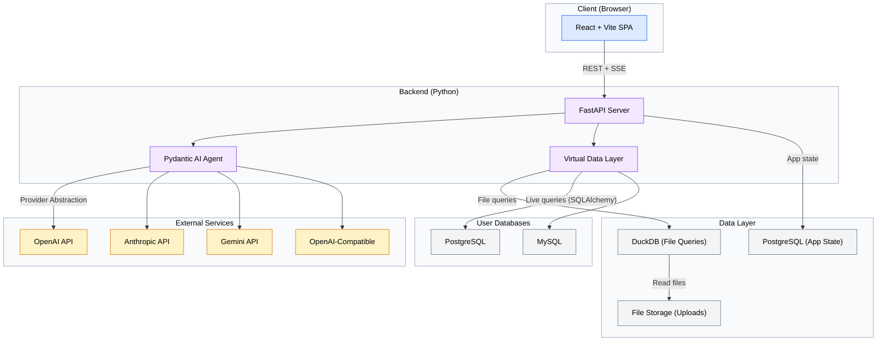

### 7.2 Tech Stack

| Layer | Technology | Justification |
|-------|------------|---------------|
| Frontend Framework | Vite + React | SPA-focused, fast HMR, no SSR overhead — backend is FastAPI |
| UI Components | shadcn/ui + Tailwind CSS | Accessible, customizable components with utility-first styling |
| State Management | TanStack Query + Zustand | TanStack for server state caching; Zustand for lightweight UI state |
| Streaming UI | Vercel ai-sdk + Streamdown | SDK for AI streaming integration; Streamdown for markdown rendering |
| Chat UI | Tambo AI | Conversational interface components |
| Visualization | Plotly (react-plotly.js) | Interactive charts, AI-friendly JSON config, wide chart type coverage |
| Backend Framework | FastAPI | Async Python web framework, OpenAPI docs, SSE support |
| AI Agent | Pydantic AI | Multi-provider agent framework with structured outputs |
| Data Validation | Pydantic | Input/output validation, settings management |
| Configuration | Pydantic Settings | Env-var-based configuration with validation |
| Data Engine | DuckDB | Analytical SQL engine for file-based data querying |
| Database ORM | SQLAlchemy | Database abstraction for app state and user database proxying |
| App Database | PostgreSQL | Full-featured RDBMS for persistent application state |
| Package Mgmt (Python) | UV | Fast Python package manager |
| Package Mgmt (JS) | npm or pnpm | Standard JS package management |
| Containerization | Docker + Kubernetes | Docker images with k8s manifests for flexible deployment |

### 7.3 Data Models

#### Entity: Dataset

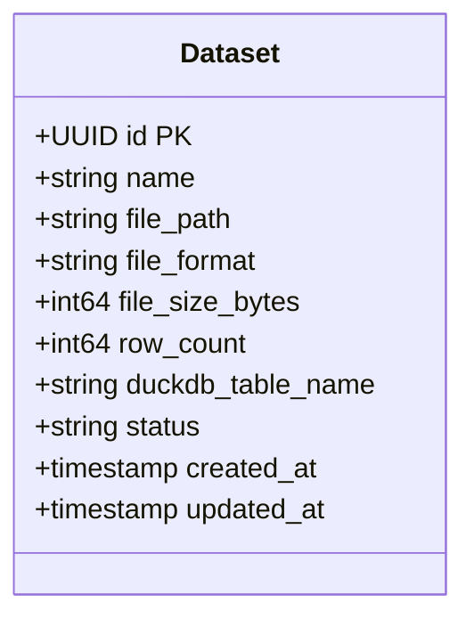

**Field Definitions**:
| Field | Type | Constraints | Description |
|-------|------|-------------|-------------|
| id | UUID | PK, NOT NULL | Unique identifier |
| name | VARCHAR(255) | NOT NULL | User-facing dataset name |
| file_path | TEXT | NOT NULL | Path to stored file on disk |
| file_format | VARCHAR(50) | NOT NULL | File format (csv, xlsx, parquet, json) |
| file_size_bytes | BIGINT | NOT NULL | File size in bytes |
| row_count | BIGINT | NULLABLE | Number of rows (populated after processing) |
| duckdb_table_name | VARCHAR(255) | UNIQUE, NOT NULL | Virtual table name in DuckDB |
| status | VARCHAR(20) | NOT NULL, DEFAULT 'uploading' | Processing status: uploading, processing, ready, error |
| created_at | TIMESTAMP | NOT NULL, DEFAULT NOW() | Creation timestamp |
| updated_at | TIMESTAMP | NOT NULL, DEFAULT NOW() | Last update timestamp |

#### Entity: Connection

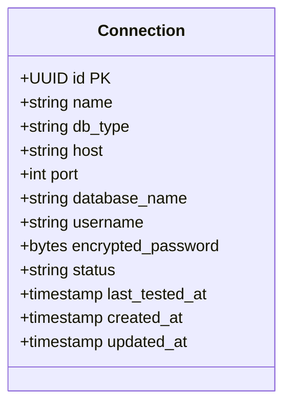

**Field Definitions**:
| Field | Type | Constraints | Description |
|-------|------|-------------|-------------|
| id | UUID | PK, NOT NULL | Unique identifier |
| name | VARCHAR(255) | NOT NULL | User-facing connection name |
| db_type | VARCHAR(50) | NOT NULL | Database type: postgresql, mysql |
| host | VARCHAR(255) | NOT NULL | Database host |
| port | INTEGER | NOT NULL | Database port |
| database_name | VARCHAR(255) | NOT NULL | Database name |
| username | VARCHAR(255) | NOT NULL | Database username |
| encrypted_password | BYTEA | NOT NULL | Fernet-encrypted password |
| status | VARCHAR(20) | NOT NULL, DEFAULT 'disconnected' | Connection status: connected, disconnected, error |
| last_tested_at | TIMESTAMP | NULLABLE | Last successful connection test |
| created_at | TIMESTAMP | NOT NULL, DEFAULT NOW() | Creation timestamp |
| updated_at | TIMESTAMP | NOT NULL, DEFAULT NOW() | Last update timestamp |

#### Entity: SchemaMetadata

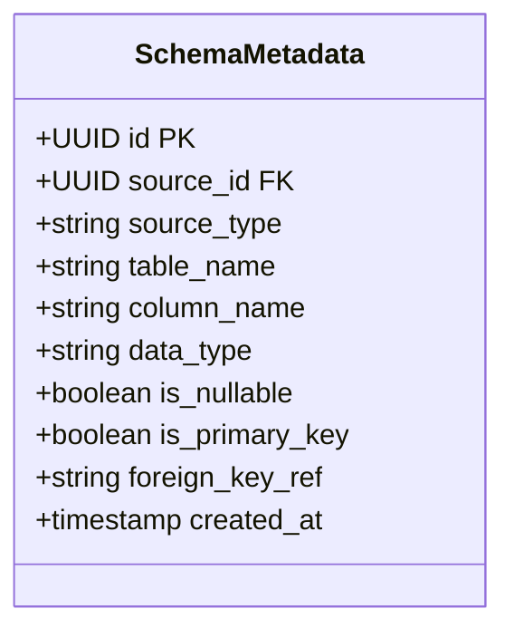

**Field Definitions**:
| Field | Type | Constraints | Description |
|-------|------|-------------|-------------|
| id | UUID | PK, NOT NULL | Unique identifier |
| source_id | UUID | FK, NOT NULL | References Dataset.id or Connection.id |
| source_type | VARCHAR(20) | NOT NULL | Source type: dataset, connection |
| table_name | VARCHAR(255) | NOT NULL | Table name in the source |
| column_name | VARCHAR(255) | NOT NULL | Column name |
| data_type | VARCHAR(100) | NOT NULL | Column data type |
| is_nullable | BOOLEAN | NOT NULL, DEFAULT true | Whether column allows NULL |
| is_primary_key | BOOLEAN | NOT NULL, DEFAULT false | Whether column is a primary key |
| foreign_key_ref | VARCHAR(255) | NULLABLE | Foreign key reference (table.column) |
| created_at | TIMESTAMP | NOT NULL, DEFAULT NOW() | Creation timestamp |

**Indexes**: `idx_schema_source (source_id, source_type)`, `idx_schema_table (table_name)`

#### Entity: Conversation

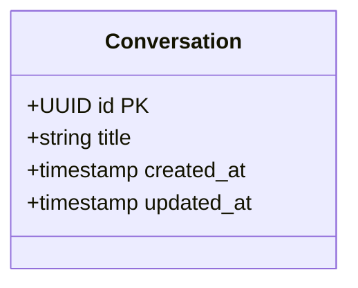

#### Entity: Message

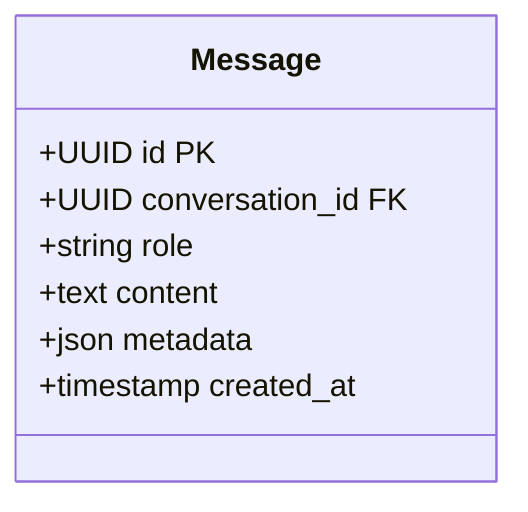

**Field Definitions**:
| Field | Type | Constraints | Description |
|-------|------|-------------|-------------|
| id | UUID | PK, NOT NULL | Unique identifier |
| conversation_id | UUID | FK → Conversation.id, NOT NULL | Parent conversation |
| role | VARCHAR(20) | NOT NULL | Message role: user, assistant, system |
| content | TEXT | NOT NULL | Message content (markdown) |
| metadata | JSONB | NULLABLE | Structured metadata: generated SQL, chart config, error details |
| created_at | TIMESTAMP | NOT NULL, DEFAULT NOW() | Creation timestamp |

#### Entity: SavedQuery

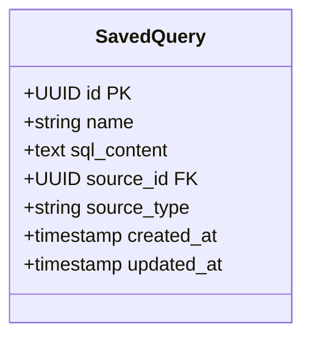

#### Entity: ProviderConfig

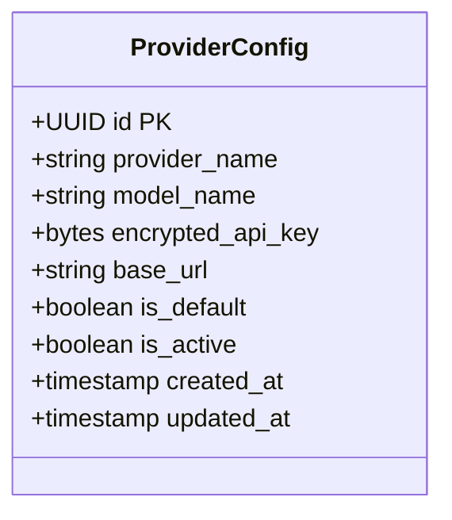

#### Entity Relationships

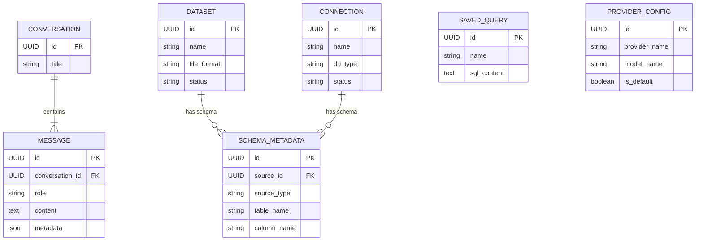

### 7.4 API Specifications

#### Datasets

##### Endpoint: `POST /api/v1/datasets/upload`

**Purpose**: Upload a data file for analysis

**Request**:
```http
POST /api/v1/datasets/upload
Content-Type: multipart/form-data

file: <binary>
name: "Sales Data Q4" (optional, defaults to filename)
```

**Response**:

`202 Accepted` (processing starts asynchronously for large files)
```json
{
  "id": "uuid",
  "name": "Sales Data Q4",
  "file_format": "csv",
  "file_size_bytes": 52428800,
  "status": "processing",
  "created_at": "2026-03-11T00:00:00Z"
}
```

`400 Bad Request`
```json
{
  "error": {
    "code": "UNSUPPORTED_FORMAT",
    "message": "File format .doc is not supported. Supported formats: csv, xlsx, xls, parquet, json"
  }
}
```

##### Endpoint: `GET /api/v1/datasets`

**Purpose**: List all uploaded datasets

**Response**:

`200 OK`
```json
{
  "datasets": [
    {
      "id": "uuid",
      "name": "Sales Data Q4",
      "file_format": "csv",
      "file_size_bytes": 52428800,
      "row_count": 150000,
      "status": "ready",
      "created_at": "2026-03-11T00:00:00Z"
    }
  ]
}
```

##### Endpoint: `GET /api/v1/datasets/{id}`

**Purpose**: Get dataset details including schema

**Response**:

`200 OK`
```json
{
  "id": "uuid",
  "name": "Sales Data Q4",
  "file_format": "csv",
  "file_size_bytes": 52428800,
  "row_count": 150000,
  "status": "ready",
  "schema": [
    { "column_name": "date", "data_type": "DATE", "is_nullable": false },
    { "column_name": "revenue", "data_type": "DOUBLE", "is_nullable": true }
  ],
  "created_at": "2026-03-11T00:00:00Z"
}
```

##### Endpoint: `GET /api/v1/datasets/{id}/preview`

**Purpose**: Get a paginated data preview (spreadsheet-style)

**Request**:
```http
GET /api/v1/datasets/{id}/preview?offset=0&limit=100&sort_by=date&sort_order=desc
```

**Response**:

`200 OK`
```json
{
  "columns": ["date", "product", "revenue", "quantity"],
  "rows": [
    ["2026-01-15", "Widget A", 1250.00, 50],
    ["2026-01-14", "Widget B", 890.50, 35]
  ],
  "total_rows": 150000,
  "offset": 0,
  "limit": 100
}
```

##### Endpoint: `DELETE /api/v1/datasets/{id}`

**Purpose**: Delete an uploaded dataset

**Response**: `204 No Content`

---

#### Connections

##### Endpoint: `POST /api/v1/connections`

**Purpose**: Add a new database connection

**Request**:
```http
POST /api/v1/connections
Content-Type: application/json

{
  "name": "Production DB",
  "db_type": "postgresql",
  "host": "db.example.com",
  "port": 5432,
  "database_name": "analytics",
  "username": "readonly_user",
  "password": "secret"
}
```

**Response**:

`201 Created`
```json
{
  "id": "uuid",
  "name": "Production DB",
  "db_type": "postgresql",
  "host": "db.example.com",
  "port": 5432,
  "database_name": "analytics",
  "status": "connected",
  "created_at": "2026-03-11T00:00:00Z"
}
```

##### Endpoint: `POST /api/v1/connections/{id}/test`

**Purpose**: Test an existing connection

**Response**:

`200 OK`
```json
{
  "status": "connected",
  "latency_ms": 45,
  "tables_found": 23
}
```

##### Endpoint: `POST /api/v1/connections/{id}/refresh-schema`

**Purpose**: Re-introspect database schema

**Response**: `200 OK` with updated schema metadata

##### Endpoint: `GET /api/v1/connections`

**Purpose**: List all connections

##### Endpoint: `PUT /api/v1/connections/{id}`

**Purpose**: Update connection details

##### Endpoint: `DELETE /api/v1/connections/{id}`

**Purpose**: Delete a connection

---

#### Conversations & Chat

##### Endpoint: `POST /api/v1/conversations`

**Purpose**: Start a new conversation

**Response**:

`201 Created`
```json
{
  "id": "uuid",
  "title": "New Conversation",
  "created_at": "2026-03-11T00:00:00Z"
}
```

##### Endpoint: `POST /api/v1/conversations/{id}/messages`

**Purpose**: Send a message and receive AI response via SSE stream

**Request**:
```http
POST /api/v1/conversations/{id}/messages
Content-Type: application/json
Accept: text/event-stream

{
  "content": "What were the top 5 products by revenue last quarter?"
}
```

**Response**: SSE stream

```
event: message_start
data: {"message_id": "uuid", "role": "assistant"}

event: token
data: {"content": "Let me"}

event: token
data: {"content": " analyze"}

event: sql_generated
data: {"sql": "SELECT product, SUM(revenue) as total_revenue FROM sales WHERE date >= '2025-10-01' GROUP BY product ORDER BY total_revenue DESC LIMIT 5"}

event: query_result
data: {"columns": ["product", "total_revenue"], "rows": [...], "row_count": 5}

event: chart_config
data: {"type": "bar", "config": {...plotly_config...}}

event: token
data: {"content": "The top 5 products by revenue..."}

event: message_end
data: {"message_id": "uuid"}
```

##### Endpoint: `GET /api/v1/conversations`

**Purpose**: List conversations with pagination

##### Endpoint: `GET /api/v1/conversations/{id}`

**Purpose**: Get conversation with full message history

##### Endpoint: `DELETE /api/v1/conversations/{id}`

**Purpose**: Delete a conversation

---

#### Queries (SQL Editor)

##### Endpoint: `POST /api/v1/queries/execute`

**Purpose**: Execute a raw SQL query

**Request**:
```http
POST /api/v1/queries/execute
Content-Type: application/json

{
  "sql": "SELECT * FROM sales LIMIT 100",
  "source_id": "uuid",
  "source_type": "dataset"
}
```

**Response**:

`200 OK`
```json
{
  "columns": ["date", "product", "revenue"],
  "rows": [...],
  "row_count": 100,
  "execution_time_ms": 45
}
```

##### Endpoint: `POST /api/v1/queries/explain`

**Purpose**: Get EXPLAIN plan for a query

##### Endpoint: `POST /api/v1/queries/save`

**Purpose**: Save a query for later use

##### Endpoint: `GET /api/v1/queries/saved`

**Purpose**: List saved queries

##### Endpoint: `GET /api/v1/queries/history`

**Purpose**: Get query execution history

---

#### Schema

##### Endpoint: `GET /api/v1/schema`

**Purpose**: Get unified schema across all data sources

**Response**:

`200 OK`
```json
{
  "sources": [
    {
      "source_id": "uuid",
      "source_type": "dataset",
      "source_name": "Sales Data Q4",
      "tables": [
        {
          "table_name": "sales_data_q4",
          "columns": [
            { "name": "date", "type": "DATE", "nullable": false },
            { "name": "revenue", "type": "DOUBLE", "nullable": true }
          ]
        }
      ]
    }
  ]
}
```

---

#### Settings & Providers

##### Endpoint: `GET /api/v1/settings/providers`

**Purpose**: List configured AI providers

##### Endpoint: `POST /api/v1/settings/providers`

**Purpose**: Add or update a provider configuration

**Request**:
```http
POST /api/v1/settings/providers
Content-Type: application/json

{
  "provider_name": "openai",
  "model_name": "gpt-4o",
  "api_key": "sk-...",
  "base_url": null,
  "is_default": true
}
```

##### Endpoint: `DELETE /api/v1/settings/providers/{id}`

**Purpose**: Remove a provider configuration

---

#### Health & Operations

##### Endpoint: `GET /health`

**Purpose**: Liveness probe for Kubernetes

**Response**: `200 OK` `{"status": "ok"}`

##### Endpoint: `GET /ready`

**Purpose**: Readiness probe — checks PostgreSQL connectivity and DuckDB availability

**Response**: `200 OK` `{"status": "ready", "checks": {"postgresql": "ok", "duckdb": "ok"}}`

### 7.5 Integration Points

| System | Type | Protocol | Purpose |
|--------|------|----------|---------|
| OpenAI API | External | REST/HTTPS | LLM inference for query generation and explanations |
| Anthropic API | External | REST/HTTPS | Alternative LLM provider |
| Google Gemini API | External | REST/HTTPS | Alternative LLM provider |
| OpenAI-Compatible APIs | External | REST/HTTPS | Custom or self-hosted LLM endpoints |
| User PostgreSQL DBs | User-provided | PostgreSQL protocol | Live data querying via SQLAlchemy |
| User MySQL DBs | User-provided | MySQL protocol | Live data querying via SQLAlchemy |

#### Integration: AI Model Providers

**Overview**: DataX communicates with AI model providers to generate SQL queries from natural language, produce result explanations, and determine visualization configurations.

**Data Flow**:
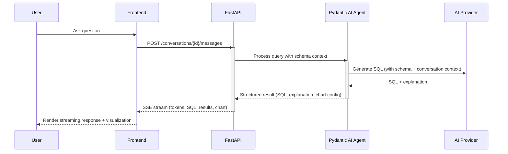

**Error Handling**:
- Retry policy: Exponential backoff (1s, 2s, 4s) for transient errors (5xx, 429)
- Provider fallback: If the selected provider fails, do not auto-fallback to another provider — surface the error to the user
- Rate limiting: Respect provider rate limits; queue requests if needed

### 7.6 Technical Constraints

| Constraint | Impact | Mitigation |
|------------|--------|------------|
| DuckDB is single-process | Cannot share DuckDB instance across multiple backend processes | Use session affinity in k8s, or separate DuckDB process with IPC |
| AI provider latency | LLM inference adds 2-10s to each query cycle | Stream responses to give immediate feedback; cache common query patterns |
| File storage on local disk | Limits horizontal scaling without shared storage | Use configurable storage backend; document NFS/S3 options for cloud deployment |
| Cross-source joins require app-layer orchestration | Adds complexity and latency for multi-source queries | Execute sub-queries in parallel, use DuckDB temp tables for efficient joining |

## 8. Scope Definition

### 8.1 In Scope
- File upload and querying (CSV, Excel, Parquet, JSON)
- Database connections (PostgreSQL, MySQL)
- Natural language querying with agentic AI
- AI-generated visualizations with Plotly
- Virtual data layer with hybrid cross-source querying
- Full-featured SQL editor
- Dashboard for managing datasets, connections, and conversations
- Multi-model AI provider support
- Streaming chat interface
- Quick-start onboarding wizard
- Dark/light theme support
- Responsive design (desktop, tablet, mobile)
- Docker + Kubernetes deployment
- Health probes and graceful shutdown

### 8.2 Out of Scope
- **Multi-user / authentication**: MVP is single-user; auth deferred to post-MVP
- **Real-time data streaming**: No Kafka/streaming source support
- **ETL / data pipelines**: No data transformation or scheduled jobs
- **Data cleaning / preparation**: Data is queried as-is
- **Collaborative features**: No shared dashboards, comments, or multi-user sessions
- **Embedded analytics**: No iframe or widget embedding
- **Mobile native apps**: Web-only (responsive), no iOS/Android apps
- **Data export**: No bulk export functionality beyond chart PNG/SVG export

### 8.3 Future Considerations
- Multi-user support with role-based access control
- Additional database connectors (SQLite, BigQuery, Snowflake, etc.)
- Scheduled queries and automated reports
- Data transformation / prep layer
- Collaborative dashboards
- Plugin system for custom data sources and visualizations
- Self-hosted model support (Ollama, vLLM)
- Embeddable chart widgets

## 9. Implementation Plan

### 9.1 Phase 1: Foundation

**Completion Criteria**: Project scaffolding complete, file upload working end-to-end, basic API operational, PostgreSQL schema deployed, DuckDB querying functional.

| Deliverable | Description | Technical Tasks | Dependencies |
|-------------|-------------|-----------------|--------------|
| Project Scaffolding | Initialize Python backend and React frontend | FastAPI project setup, Vite + React init, Docker Compose for dev, PostgreSQL container, project structure | None |
| Database Schema | PostgreSQL schema for all entities | SQLAlchemy models, Alembic migrations, seed data | Scaffolding |
| File Upload Pipeline | Chunked upload with streaming into DuckDB | Upload endpoint, chunked transfer, DuckDB registration, schema detection, async processing | Scaffolding, Database Schema |
| Data Preview API | Spreadsheet-style data preview | Preview endpoint with pagination, sorting, filtering | File Upload Pipeline |
| Basic Frontend Shell | IDE-style layout with sidebar navigation | React layout components, sidebar, theme toggle, routing | Scaffolding |
| Settings Foundation | Provider and connection configuration | Settings API endpoints, encrypted storage, settings UI | Database Schema |

**Checkpoint Gate**:
- [ ] File upload → DuckDB registration → query → results works end-to-end
- [ ] PostgreSQL schema deployed with all entity tables
- [ ] Docker Compose starts all services (frontend, backend, PostgreSQL)
- [ ] Basic frontend layout renders with sidebar navigation

---

### 9.2 Phase 2: AI Agent + Chat

**Completion Criteria**: Users can ask natural language questions and receive streaming AI responses with generated SQL, results, and explanations.

| Deliverable | Description | Technical Tasks | Dependencies |
|-------------|-------------|-----------------|--------------|
| AI Agent Setup | Pydantic AI agent with multi-provider support | Agent definition, provider abstraction, model configuration, schema context injection | Phase 1: Settings Foundation |
| NL→SQL Generation | Natural language to SQL query generation | Prompt engineering, schema-aware query generation, SQL validation | AI Agent Setup |
| SSE Streaming | Server-Sent Events for streaming AI responses | FastAPI SSE endpoint, frontend SSE consumer, token-by-token rendering | Phase 1: Scaffolding |
| Chat Interface | Hybrid chat UI with streaming | Chat panel component, message rendering, Streamdown integration, Tambo AI components | SSE Streaming |
| Results Panel | Stacked card display for query results | Result card component, data table, smooth transitions | Chat Interface |
| Self-Correcting Loop | Agentic retry on query failure | Error detection, SQL correction, retry with backoff, max retry limit (default 3) | NL→SQL Generation |
| Conversation Persistence | Save and restore chat history | Conversation CRUD API, message storage, conversation list UI | Phase 1: Database Schema |

**Checkpoint Gate**:
- [ ] User can ask a natural language question and receive a correct SQL query result
- [ ] AI responses stream in real-time with typing animation
- [ ] Self-correcting loop successfully fixes at least 70% of initial query failures
- [ ] Conversations persist across page reloads

---

### 9.3 Phase 3: Virtual Data Layer + Connections

**Completion Criteria**: Users can connect to external databases and query across multiple data sources seamlessly.

| Deliverable | Description | Technical Tasks | Dependencies |
|-------------|-------------|-----------------|--------------|
| Connection Management | Add, edit, test, delete database connections | Connection CRUD API, SQLAlchemy dialect setup, connection pooling, encrypted credential storage | Phase 1: Database Schema |
| Schema Introspection | Automatic schema discovery from connected databases | SQLAlchemy inspector, schema metadata extraction, schema refresh | Connection Management |
| Live Query Proxy | Execute queries against connected databases | Query routing, read-only enforcement, timeout handling, EXPLAIN plan review | Connection Management |
| Cross-Source Querying | Join results from DuckDB + live databases | Parallel query execution, DuckDB temp table loading, cross-source join orchestration | Live Query Proxy, Phase 1: File Upload Pipeline |
| Unified Schema Registry | Single schema view across all sources | Schema API endpoint, AI context builder, source-agnostic table/column lookup | Schema Introspection, Phase 1: File Upload Pipeline |
| Connection UI | Frontend for managing connections | Connection form, test button, status indicators, schema browser | Connection Management |

**Checkpoint Gate**:
- [ ] PostgreSQL and MySQL connections can be added, tested, and queried
- [ ] Cross-source queries (file + database) return correct results
- [ ] Schema registry accurately reflects all sources
- [ ] AI agent correctly routes queries to the appropriate data source

---

### 9.4 Phase 4: Visualizations, Dashboard + Polish

**Completion Criteria**: AI generates interactive visualizations, SQL editor is fully functional, dashboard provides complete data management, onboarding guides new users.

| Deliverable | Description | Technical Tasks | Dependencies |
|-------------|-------------|-----------------|--------------|
| AI Visualizations | Automatic chart generation from query results | Chart type heuristics, Plotly config generation, react-plotly.js integration, chart transitions | Phase 2: AI Agent |
| SQL Editor | Full IDE-style SQL editor | CodeMirror/Monaco integration, schema-aware autocomplete, multi-tab, query history, saved queries, EXPLAIN viewer, keyboard shortcuts | Phase 3: Unified Schema Registry |
| Dashboard Views | Dataset, connection, and conversation management | Dashboard layout, dataset list/detail, connection status, conversation history, saved visualization gallery | Phase 3: Connection UI |
| Onboarding Wizard | Quick-start guide for first-time users | Step-by-step wizard component, contextual guidance, dismiss/re-trigger | Phase 1: Basic Frontend Shell |
| Responsive Layout | Mobile and tablet layout adaptation | Responsive breakpoints, collapsed sidebar, stacked panels, mobile navigation | Phase 1: Basic Frontend Shell |
| Theme Polish | Dark/light theme with friendly/modern aesthetic | Tailwind theme configuration, shadcn/ui customization, rounded corners, subtle gradients, consistent spacing | Phase 1: Basic Frontend Shell |
| Health Probes | Kubernetes liveness and readiness endpoints | /health and /ready endpoints, PostgreSQL check, DuckDB check, graceful shutdown handler | Phase 1: Scaffolding |
| Chart Export | PNG/SVG export for visualizations | Plotly export integration, download button on chart cards | AI Visualizations |

**Checkpoint Gate**:
- [ ] AI correctly selects chart type for common data shapes (time series, categorical, distribution)
- [ ] SQL editor autocompletes table and column names from schema registry
- [ ] Dashboard displays all datasets, connections, and conversations
- [ ] Onboarding wizard completes without errors
- [ ] App renders correctly on desktop, tablet, and mobile viewports
- [ ] Dark and light themes pass WCAG AA contrast requirements
- [ ] Health probes return correct status in Docker/k8s environment

## 10. Testing Strategy

### 10.1 Test Levels

| Level | Scope | Tools | Coverage Target |
|-------|-------|-------|-----------------|
| Unit | Business logic, data models, utilities | pytest | 80% for core modules |
| Integration | API endpoints, database operations, DuckDB queries | pytest + httpx (async client) | All API endpoints |
| AI Agent | Query generation accuracy, self-correction loop | pytest + mock LLM responses | Critical query patterns |
| E2E | Critical user workflows | Playwright (deferred to post-MVP) | Upload → Query → Visualize flow |

### 10.2 Test Scenarios

#### Critical Path: Natural Language Query

| Step | Action | Expected Result |
|------|--------|-----------------|
| 1 | Upload a CSV file | File accepted, schema detected, status = "ready" |
| 2 | Ask "What is the average revenue by product?" | AI generates valid SQL with GROUP BY |
| 3 | Query executes | Correct aggregated results returned |
| 4 | Visualization renders | Bar chart with products on x-axis, avg revenue on y-axis |
| 5 | Follow-up: "Show me only the top 3" | AI modifies query with LIMIT 3 ORDER BY |

#### Critical Path: Cross-Source Query

| Step | Action | Expected Result |
|------|--------|-----------------|
| 1 | Upload CSV with product data | Dataset registered in DuckDB |
| 2 | Connect to PostgreSQL with order data | Connection established, schema introspected |
| 3 | Ask "Join product catalog with orders by product_id" | AI generates cross-source query, results joined correctly |

#### Critical Path: Self-Correcting Loop

| Step | Action | Expected Result |
|------|--------|-----------------|
| 1 | Ask question that generates invalid SQL | Initial query fails |
| 2 | Agent analyzes error | Error message parsed, correction strategy determined |
| 3 | Agent retries with corrected SQL | Query succeeds on retry |
| 4 | If max retries exceeded | User sees error with attempted queries and suggestion to rephrase |

### 10.3 Performance Test Plan

- **File upload**: Upload files of 10MB, 100MB, 500MB, 1GB — verify chunked upload completes and DuckDB registration succeeds
- **Query latency**: Measure end-to-end time for simple queries (< 1M rows) — target < 5s
- **Streaming**: Verify SSE stream starts within 2s of query submission
- **Concurrent queries**: Verify DuckDB handles multiple simultaneous queries without deadlock

## 11. Deployment & Operations

### 11.1 Deployment Strategy

**Development**: Docker Compose with hot-reload for both frontend and backend

```yaml
services:
  backend:
    build: ./backend
    ports: ["8000:8000"]
    volumes: ["./backend:/app"]
    environment:
      - DATABASE_URL=postgresql://...
      - DATAX_ENCRYPTION_KEY=...
  frontend:
    build: ./frontend
    ports: ["5173:5173"]
    volumes: ["./frontend:/app"]
  postgres:
    image: postgres:16
    ports: ["5432:5432"]
```

**Production (Self-Hosted)**: Docker Compose or Kubernetes

- Rolling update strategy for zero-downtime deploys
- Graceful shutdown: drain SSE connections (30s timeout), finish active queries
- Rollback plan: Previous Docker image tag; database rollback via Alembic downgrade

### 11.2 Kubernetes Manifests

Provide production-ready manifests for:
- Backend Deployment + Service
- Frontend Deployment + Service (or static file serving via backend)
- PostgreSQL StatefulSet (or external managed database)
- ConfigMap for non-sensitive configuration
- Secret for encryption keys and default provider API keys
- Ingress for routing
- HPA (Horizontal Pod Autoscaler) for backend based on CPU/memory

### 11.3 Environment Variables

| Variable | Required | Description |
|----------|----------|-------------|
| `DATABASE_URL` | Yes | PostgreSQL connection string |
| `DATAX_ENCRYPTION_KEY` | Yes | Fernet master key for encrypting API keys and passwords |
| `DATAX_OPENAI_API_KEY` | No | OpenAI API key (overrides UI-configured key) |
| `DATAX_ANTHROPIC_API_KEY` | No | Anthropic API key (overrides UI-configured key) |
| `DATAX_GEMINI_API_KEY` | No | Google Gemini API key (overrides UI-configured key) |
| `DATAX_STORAGE_PATH` | No | Path for uploaded file storage (default: `./data/uploads`) |
| `DATAX_MAX_QUERY_TIMEOUT` | No | Maximum query execution time in seconds (default: 30) |
| `DATAX_MAX_RETRIES` | No | Maximum agentic retry attempts (default: 3) |

### 11.4 Monitoring & Alerting

| Metric | Threshold | Description |
|--------|-----------|-------------|
| API error rate | > 5% of requests | Backend returning 5xx errors |
| Query execution time | > 30s | Queries exceeding timeout |
| AI provider errors | > 3 consecutive failures | Provider connectivity issues |
| DuckDB memory usage | > 80% of allocated | DuckDB approaching memory limit |
| Upload pipeline failures | Any | File processing errors |

### 11.5 Health Endpoints

- `GET /health` — Liveness probe: returns 200 if the process is running
- `GET /ready` — Readiness probe: returns 200 if PostgreSQL is connected and DuckDB is initialized

## 12. Dependencies

### 12.1 Technical Dependencies

| Dependency | Purpose | Risk if Unavailable |
|------------|---------|---------------------|
| PostgreSQL 16+ | Application state persistence | App cannot start |
| DuckDB | File-based data querying | Cannot query uploaded files |
| At least one AI provider API key | Natural language querying | Core feature unavailable |
| Node.js 20+ / npm or pnpm | Frontend build | Cannot build frontend |
| Python 3.12+ / UV | Backend runtime | Cannot run backend |
| Docker | Containerized deployment | Must run natively |

### 12.2 External Library Dependencies

**Python**:
| Library | Version | Purpose |
|---------|---------|---------|
| FastAPI | Latest | Web framework |
| Pydantic AI | Latest | AI agent framework |
| Pydantic | v2+ | Data validation |
| Pydantic Settings | Latest | Configuration management |
| DuckDB | Latest | Analytical query engine |
| SQLAlchemy | 2.0+ | Database ORM |
| cryptography (Fernet) | Latest | API key encryption |
| Alembic | Latest | Database migrations |
| uvicorn | Latest | ASGI server |
| sse-starlette | Latest | SSE support for FastAPI |

**TypeScript/React**:
| Library | Version | Purpose |
|---------|---------|---------|
| React | 19+ | UI framework |
| Vite | Latest | Build tool |
| Tailwind CSS | 4+ | Utility-first styling |
| shadcn/ui | Latest | Component library |
| Vercel ai-sdk | Latest | AI streaming integration |
| Tambo AI | Latest | Conversational UI components |
| Streamdown | Latest | Streaming markdown renderer |
| Plotly.js / react-plotly.js | Latest | Interactive visualizations |
| TanStack Query | v5+ | Server state management |
| Zustand | Latest | Client state management |
| CodeMirror 6 or Monaco Editor | Latest | SQL editor |

## 13. Risks & Mitigations

| Risk | Impact | Likelihood | Mitigation Strategy |
|------|--------|------------|---------------------|
| AI query accuracy below target | High | Medium | Invest in prompt engineering, schema context optimization, and self-correction loop; build test suite of common query patterns |
| DuckDB single-process limitation blocks scaling | Medium | Low (MVP is single-user) | Design for session affinity; evaluate DuckDB-WASM or separate DuckDB service for future scaling |
| Cross-source join performance for large datasets | High | Medium | Execute sub-queries in parallel; limit result set sizes before joining; add pagination to cross-source results |
| AI provider API costs at scale | Medium | Low (MVP is single-user) | Track token usage; implement caching for repeated queries; support cost-effective providers |
| Tambo AI or Streamdown library maturity | Medium | Medium | Abstract chat UI components behind interfaces; be prepared to swap for alternatives if libraries are unstable |
| File upload memory pressure for very large files | High | Medium | Streaming pipeline prevents full file memory loading; monitor DuckDB memory usage; document resource requirements |

## 14. Open Questions

| # | Question | Resolution |
|---|----------|------------|
| 1 | What should the agentic retry limit be? | Default to 3 retries; make configurable via `DATAX_MAX_RETRIES` environment variable |
| 2 | How central should Tambo AI be to the chat UI? | Evaluate during Phase 2; use for conversational components but abstract behind interfaces for swappability |
| 3 | Should dashboards support saved layouts with multiple visualizations? | Defer to post-MVP; MVP dashboards are management views, not composed visualization layouts |
| 4 | CodeMirror 6 vs Monaco Editor for SQL editor? | Evaluate during Phase 4; CodeMirror 6 is lighter, Monaco is more feature-rich — decision based on bundle size vs feature needs |
| 5 | What storage backend for cloud deployment? | Document S3-compatible storage as recommended option; implement configurable storage interface |

## 15. Appendix

### 15.1 Glossary

| Term | Definition |
|------|------------|
| Virtual Data Layer | An abstraction that unifies multiple data sources (files + databases) under a single queryable interface |
| Agentic AI | An AI system that autonomously plans and executes multi-step tasks (e.g., generating SQL, detecting errors, self-correcting) |
| DuckDB | An in-process analytical database engine optimized for OLAP workloads |
| SSE (Server-Sent Events) | A protocol for one-way server-to-client streaming over HTTP |
| Fernet | A symmetric encryption scheme from the Python `cryptography` library |
| Pydantic AI | A Python framework for building AI agents with structured inputs/outputs and multi-provider support |
| Schema Registry | Internal system that maintains metadata about all tables and columns across all data sources |

### 15.2 References

- [Pydantic AI Documentation](https://ai.pydantic.dev/)
- [FastAPI Documentation](https://fastapi.tiangolo.com/)
- [DuckDB Documentation](https://duckdb.org/docs/)
- [Plotly.js Documentation](https://plotly.com/javascript/)
- [Vercel AI SDK Documentation](https://sdk.vercel.ai/)
- [shadcn/ui Documentation](https://ui.shadcn.com/)
- [Tailwind CSS Documentation](https://tailwindcss.com/docs)
- [TanStack Query Documentation](https://tanstack.com/query/latest)

### 15.3 Agent Recommendations

*The following requirements were suggested based on industry best practices and accepted during the interview:*

1. **Security: API Key Encryption at Rest** — Store all AI provider API keys and database connection passwords encrypted using Fernet symmetric encryption with a server-side master key (`DATAX_ENCRYPTION_KEY`). Rationale: API keys grant access to paid services; plaintext storage risks exploitation if the database is exposed.

2. **Architecture: Model Provider Abstraction Layer** — Leverage Pydantic AI's native multi-provider support to create a unified interface. Adding a new provider requires only configuration, not code changes. Rationale: Prevents provider-specific if/else chains; ensures clean extensibility.

3. **File Handling: Streaming Upload Pipeline** — Implement chunked uploads with progress tracking. Files stream directly into DuckDB registration without loading entirely into memory. Large files process asynchronously with status notifications. Rationale: Without streaming, large files (multi-GB Parquet) would timeout, exhaust memory, or block the event loop.

4. **Operational: Kubernetes Health Probes & Graceful Shutdown** — Include `/health` (liveness) and `/ready` (readiness) endpoints. Implement graceful shutdown that drains SSE connections and finishes active queries before stopping. Rationale: Without probes, k8s routes traffic to unready containers; without graceful shutdown, rolling deploys kill active AI conversations.

### 15.4 Change Log

| Version | Date | Author | Changes |
|---------|------|--------|---------|
| 1.0 | 2026-03-11 | Stephen Sequenzia | Initial version |

---

*Document generated by SDD Tools*
