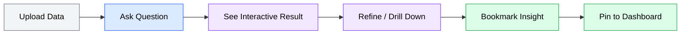
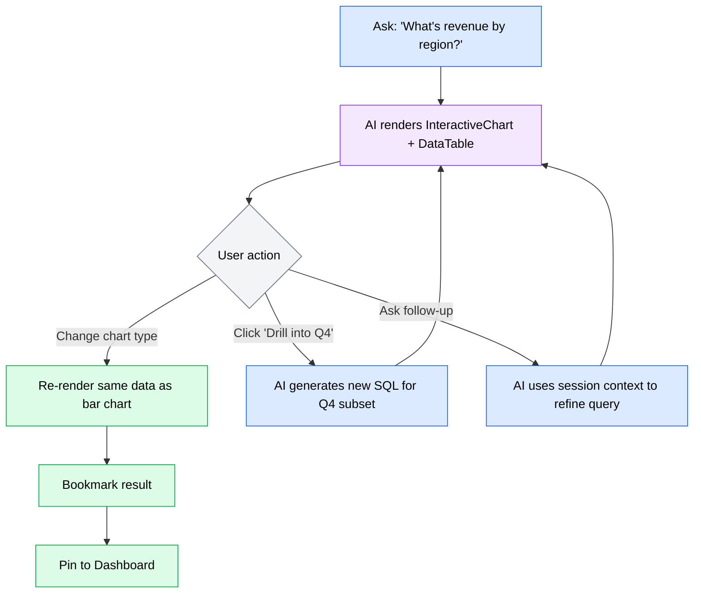
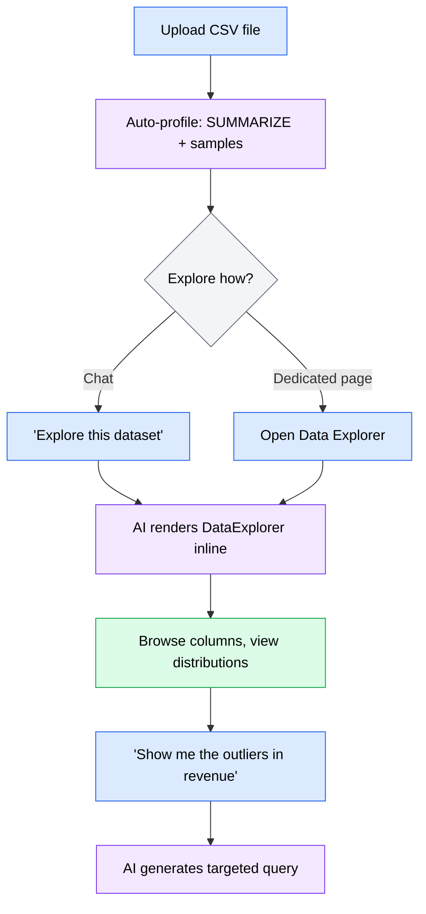
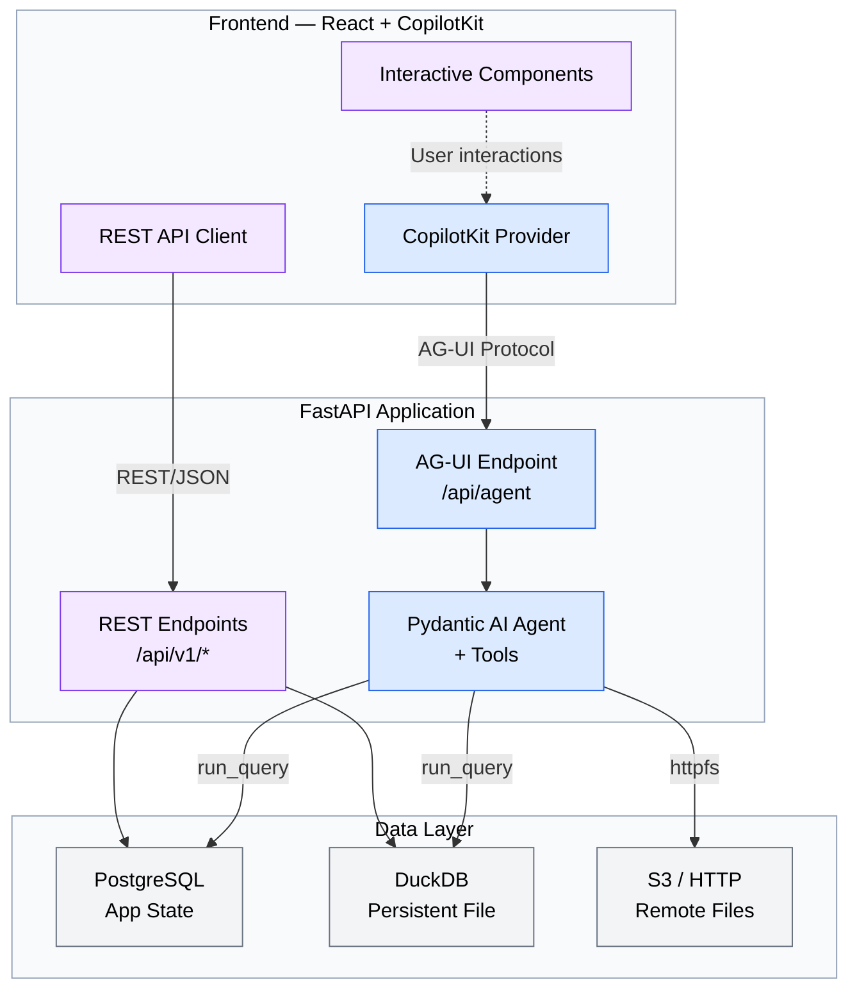
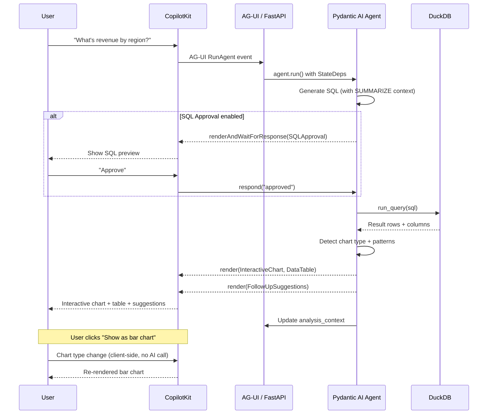
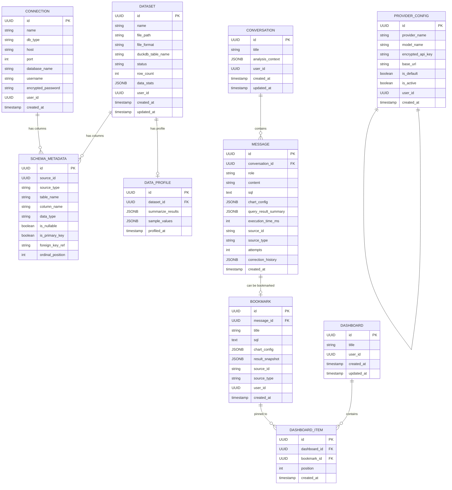

# datax-v2 PRD

**Version**: 1.0
**Author**: Stephen Sequenzia
**Date**: 2026-03-14
**Status**: Draft
**Spec Type**: New feature for existing product
**Spec Depth**: Full technical documentation
**Description**: Complete transformation of DataX from a one-shot Q&A analytics tool into an interactive, AI-collaborative data analysis platform powered by CopilotKit's generative UI via the AG-UI protocol.

---

## 1. Executive Summary

DataX v2 is a fundamental reimagining of how users interact with their data. The current DataX treats data analysis as a search engine — ask a question, get a static answer. v2 transforms it into an interactive analysis platform where AI-rendered components become starting points for exploration, not endpoints. Powered by CopilotKit's generative UI and the AG-UI protocol, the AI becomes a collaborator that renders interactive charts, data tables, and exploration tools that users manipulate directly — with every interaction informing the AI's next move.

## 2. Problem Statement

### 2.1 The Problem

Real data analysis is **iterative, branching, and exploratory**. DataX v1's methodology is fundamentally misaligned with this reality:

- Each question is treated as independent — the AI has no memory of previous queries or results
- Results are static and non-interactive — users cannot drill down, change chart types, filter, or sort without re-asking
- The user is a passive consumer — zero control over chart type, axes, aggregation, colors, or data presentation
- Visualizations are preview thumbnails, not analytical tools — an analyst cannot customize a chart to tell the story they need
- The chat paradigm is linear and append-only, but data analysis is branching and revisitable

### 2.2 Current State

DataX v1 scores **5/10 for analysis capability** and **3/10 for visualization control** against its stated goals. The current flow is:

```
User asks question → AI generates ONE SQL query → Executes → Auto-picks ONE chart → Done
```

Users who want to refine their analysis must re-ask from scratch. The AI receives only column names and types — no sample data, no statistics, no distribution information — leading to suboptimal SQL generation.

### 2.3 Impact Analysis

| Gap | Impact |
|-----|--------|
| No iterative refinement | Users re-type variations of the same question 3-5x to get the result they want |
| No chart customization | Analysts cannot produce presentation-ready visualizations for stakeholders |
| No data context for AI | ~30% of generated SQL queries fail on first attempt due to poor data understanding |
| No cumulative analysis | Each session starts from zero — no way to build on previous findings |
| SQL Editor disconnected | Power users context-switch between chat and SQL Editor, losing analytical flow |

### 2.4 Business Value

Transforming DataX from an "answer machine" into a true analysis platform:
- Positions DataX as a viable alternative to Tableau/Metabase for interactive exploration while retaining the natural language advantage
- Enables analysts to produce deliverables (dashboards, charts, reports) directly from the tool
- Reduces time-to-insight by enabling iterative refinement within a single conversation
- Creates a defensible product differentiator: AI that composes interactive UI components on demand

## 3. Goals & Success Metrics

### 3.1 Primary Goals

1. **Iterative analysis** — Users can drill down, refine, and build on results without re-asking from scratch
2. **User-controlled visualization** — Users can customize chart type, axes, colors, and export presentation-ready charts
3. **AI as collaborator** — AI proactively suggests next steps, insights, and follow-up queries based on data patterns
4. **Interactive results** — Every result is a starting point for further exploration, not a static endpoint

### 3.2 Success Metrics

| Metric | Current Baseline | Target | Measurement Method |
|--------|------------------|--------|--------------------|
| Analysis capability | 5/10 | 8+/10 | User satisfaction survey |
| Visualization control | 3/10 | 8+/10 | User satisfaction survey |
| First-attempt SQL success | ~70% | 90%+ | Backend logging (attempts == 1) |
| User interactions per session | ~3 questions | 10+ interactions | Session analytics |
| Results refined (not re-asked) | 0% | 60%+ | Follow-up vs. new question ratio |

### 3.3 Non-Goals

- **Multi-user / collaboration** — v2 remains single-user. Collaborative features are future scope.
- **Full dashboard builder** — v2 supports pin-to-dashboard. Drag-and-drop layout editing is future scope.
- **Write operations** — All queries remain read-only. Data modification is not in scope.
- **Mobile-native app** — Responsive web only. No iOS/Android app.
- **Custom AI model training** — Uses third-party AI providers. No fine-tuning or custom models.

## 4. User Research

### 4.1 Target Users

#### Primary Persona: Data Analyst

- **Role/Description**: Business or data analyst who needs to explore datasets, find insights, and present findings to stakeholders
- **Goals**: Quickly understand data patterns, create visualizations for presentations, build cumulative analysis over a session
- **Pain Points**: Current tool forces re-asking instead of refining; cannot customize charts; no way to save and compare insights; AI doesn't understand their data well enough
- **Context**: Uses DataX at a desk, typically working with uploaded CSV/Excel files or connected databases. Sessions last 15-60 minutes.
- **Technical Proficiency**: Comfortable with basic SQL, understands data concepts (aggregation, filtering, joins), not a software developer

#### Secondary Persona: Technical Analyst

- **Role/Description**: Data engineer or technical analyst who prefers writing SQL but values AI assistance for exploration
- **Goals**: Use SQL Editor for precise queries, leverage AI for initial exploration and chart generation, iterate quickly between SQL and natural language
- **Pain Points**: SQL Editor and Chat are disconnected workflows; no way to ask AI about a SQL query in the editor; chart generation requires re-asking in chat

### 4.2 User Journey Map



Upload data triggers an automatic data profile (SUMMARIZE + sample values). User asks a question in natural language. AI generates SQL, executes it, and renders an interactive chart + data table inline. User refines the result (changes chart type, filters data, drills into a segment). User bookmarks the insight and pins it to a dashboard for ongoing reference.

### 4.3 User Workflows

#### Workflow 1: Iterative Analysis



#### Workflow 2: Data Exploration



## 5. Functional Requirements

### 5.1 Feature: CopilotKit / AG-UI Integration

**Priority**: P0 (Critical)
**Complexity**: High

#### User Stories

**US-001**: As a data analyst, I want the AI to render interactive components (charts, tables, data profiles) so that I can manipulate results directly instead of re-asking questions.

**Acceptance Criteria**:
- [ ] AG-UI ASGI app is mounted at `/api/agent` inside the existing FastAPI application via `agent.to_ag_ui()`
- [ ] CopilotKit provider wraps the React application at `runtimeUrl="/api/agent"`
- [ ] Custom SSE pipeline (`messages.py` endpoint + `chat-store.ts` SSE handling) is completely removed
- [ ] All conversational interactions flow through the AG-UI protocol
- [ ] Pydantic AI agent retains all existing capabilities: multi-provider support, self-correction loop, error classification, schema context injection
- [ ] Agent has a full toolkit of tools: `run_query`, `get_schema`, `summarize_table`, `search_bookmarks`, `render_chart`, `render_table`, `render_data_profile`, `suggest_followups`, `create_bookmark`
- [ ] CopilotKit auto-discovers frontend tools registered via `useCopilotAction`
- [ ] State management uses `StateDeps` for conversation context and graduated summarization

**Technical Notes**:
- `agent.to_ag_ui()` creates an ASGI app — mount it as a sub-application in FastAPI
- The existing `NLQueryService` orchestration logic (SQL generation → execution → chart config) moves into agent tools
- Custom events (`CustomEvent`) are used for progress reporting (SQL generation → execution → chart building)
- The `create_agent()` factory and provider resolution logic are preserved

**Edge Cases**:
| Scenario | Input | Expected Behavior |
|----------|-------|-------------------|
| AI provider unavailable | AG-UI connection attempt with no provider configured | Return error event; frontend shows "Configure AI provider in Settings" |
| Agent tool fails | `run_query` tool raises exception | Agent receives error, attempts self-correction (up to 3 retries) |
| Client disconnects mid-stream | Browser tab closed during AG-UI streaming | Server detects disconnect, cancels agent execution gracefully |
| Concurrent conversations | Multiple browser tabs open | Each tab has its own AG-UI session; no shared state |

**Error Handling**:
| Error Condition | User Message | System Action |
|-----------------|--------------|---------------|
| No AI provider configured | "Configure an AI provider in Settings to start chatting" | Show settings link, disable chat input |
| AG-UI connection failed | "Connection to AI assistant lost. Retrying..." | Exponential backoff retry (3 attempts) |
| Agent timeout | "The AI is taking too long to respond. Please try again." | Cancel agent execution, log timeout |

---

### 5.2 Feature: Interactive Charts with Full Editor

**Priority**: P0 (Critical)
**Complexity**: High

#### User Stories

**US-002**: As a data analyst, I want to customize AI-generated charts (type, axes, colors, labels, scales) so that I can create presentation-ready visualizations without re-asking the AI.

**Acceptance Criteria**:
- [ ] AI renders an `InteractiveChart` component via `useCopilotAction` with full Plotly configuration
- [ ] Chart type selector: switch between all supported types (line, bar, pie, scatter, kpi, heatmap, box plot, area, histogram, dual-axis, treemap, waterfall, funnel, violin, candlestick, Sankey)
- [ ] Axis assignment: dropdown to swap X/Y columns or select different columns
- [ ] Color customization: palette selector or individual series color picker
- [ ] Label editing: title, axis labels, legend labels
- [ ] Scale control: toggle between linear/logarithmic for numeric axes
- [ ] Annotations: add reference lines (horizontal/vertical) and text annotations
- [ ] Series toggle: show/hide individual data series
- [ ] Multi-chart layouts: arrange 2+ charts side by side for comparison
- [ ] Chart modifications do NOT trigger a new AI call — they re-render the same data with new Plotly config
- [ ] Export: PNG and SVG with current customizations applied

**Technical Notes**:
- The `ChartEditor` component wraps `react-plotly.js` with a configuration panel
- Chart type switching maps to Plotly trace type changes — data stays the same, trace config changes
- Multi-chart is implemented as a flex/grid container of independent `InteractiveChart` instances
- The full Plotly suite requires Plotly.js with all trace types bundled (not the minimal bundle)

**Edge Cases**:
| Scenario | Input | Expected Behavior |
|----------|-------|-------------------|
| Incompatible chart type | Switch pie chart (requires labels/values) to scatter (requires x/y) | Show warning, auto-map closest columns, or disable incompatible types |
| Large dataset + heatmap | 10k+ rows rendered as heatmap | Use Plotly's WebGL renderer for performance |
| Dual-axis with mismatched scales | Revenue ($M) vs. Count (#) on same chart | Auto-detect scale difference, default to dual Y-axes |

---

### 5.3 Feature: Interactive Data Tables

**Priority**: P1 (High)
**Complexity**: Medium

#### User Stories

**US-003**: As a data analyst, I want to sort, filter, search, and paginate query results so that I can explore data without re-asking the AI.

**Acceptance Criteria**:
- [ ] AI renders a `DataTable` component via `useCopilotAction`
- [ ] Column sorting: click header to sort ascending/descending
- [ ] Type-aware filtering: numeric range filters, date pickers, text search, categorical dropdowns
- [ ] Full-text search across all visible columns
- [ ] Hide/show columns via column picker dropdown
- [ ] Column reordering via drag-and-drop
- [ ] Virtual scrolling for smooth rendering of large result sets
- [ ] Server-side pagination beyond 1000-row limit with page size selector
- [ ] Inline row count and filter status indicators

**Technical Notes**:
- Use TanStack Table for the table engine (already in the React ecosystem)
- Server-side pagination requires a new backend endpoint: `POST /api/v1/queries/paginate` that re-executes the SQL with `LIMIT/OFFSET`
- Virtual scrolling uses `@tanstack/react-virtual` for windowed rendering

---

### 5.4 Feature: Context-Aware Follow-ups

**Priority**: P0 (Critical)
**Complexity**: High

#### User Stories

**US-004**: As a data analyst, I want the AI to remember what I've asked and what the results were so that I can refine my analysis iteratively within a conversation.

**Acceptance Criteria**:
- [ ] AI receives the last 3 queries + their SQL in every turn
- [ ] AI receives a summary of the most recent result: column names, row count, column statistics (min/max/avg), value ranges
- [ ] AI maintains a session memory (`analysis_context` JSONB on Conversation) that grows as the conversation progresses
- [ ] Token budget management: context summarization triggers when accumulated context exceeds ~60% of model's context window
- [ ] Older turns get progressively compressed: full SQL → SQL signature + result summary → just result summary
- [ ] "Show me just the top 5" modifies the previous SQL with `LIMIT 5`, not generating from scratch
- [ ] AI can reference earlier findings: "Earlier you asked about Q4 revenue ($2.3M) — want me to break that down by region?"

**Technical Notes**:
- `StateDeps` from Pydantic AI AG-UI carries the `analysis_context` state between turns
- The `analysis_context` is a structured JSON object with sections for `recent_queries`, `result_summaries`, and `session_insights`
- Context compression uses a lightweight summarization prompt when token budget is exceeded
- Token counting uses the model's tokenizer (via `tiktoken` for OpenAI, approximation for others)

---

### 5.5 Feature: AI Proactive Suggestions

**Priority**: P1 (High)
**Complexity**: Medium

#### User Stories

**US-005**: As a data analyst, I want the AI to suggest relevant follow-up queries when it detects interesting patterns so that I can discover insights I wouldn't have thought to ask about.

**Acceptance Criteria**:
- [ ] AI renders a `FollowUpSuggestions` component with 2-3 clickable suggestion chips below results
- [ ] Suggestions are contextual — only shown when the AI detects interesting patterns (outliers, trends, skewed distributions, unexpected nulls)
- [ ] Clicking a suggestion chip sends it as a new message to the AI
- [ ] Suggestions are NOT shown for simple lookups, clarification responses, or error states
- [ ] AI explains why it's suggesting each follow-up (e.g., "3 outliers detected in this data")

**Technical Notes**:
- Pattern detection is part of the agent's response generation — not a separate service
- The agent's system prompt includes instructions to identify and suggest follow-ups for: statistical outliers (>2 std dev), time-series trends, skewed distributions (>80% in one category), unexpected null concentrations

---

### 5.6 Feature: SQL Approval Flow

**Priority**: P1 (High)
**Complexity**: Medium

#### User Stories

**US-006**: As a data analyst, I want the option to preview and approve generated SQL before it executes so that I can verify the query matches my intent.

**Acceptance Criteria**:
- [ ] Settings toggle: "Preview SQL before execution" (default: off)
- [ ] When enabled, AI renders an `SQLApproval` component via `renderAndWaitForResponse`
- [ ] SQL is displayed with syntax highlighting (CodeMirror or Prism)
- [ ] User can: Approve (execute as-is), Edit (modify SQL then execute), Reject (ask AI to try a different approach)
- [ ] If user edits SQL, the modified version is what gets executed
- [ ] Agent waits for user response before proceeding

**Technical Notes**:
- Uses CopilotKit's `renderAndWaitForResponse` pattern
- The agent receives the user's response ("approved", "modified: <new SQL>", "rejected") and acts accordingly
- SQL highlighting can use the existing CodeMirror integration from the SQL Editor

---

### 5.7 Feature: DuckDB Intelligence Layer

**Priority**: P0 (Critical)
**Complexity**: Medium

#### User Stories

**US-007**: As a data analyst, I want the AI to understand my data deeply (statistics, distributions, sample values) so that it generates accurate SQL queries on the first attempt.

**Acceptance Criteria**:
- [ ] On file upload, run DuckDB `SUMMARIZE table_name` and store results in `data_stats` JSONB column on Dataset
- [ ] Extract and store 5 sample values per column alongside SUMMARIZE stats
- [ ] Include SUMMARIZE results + sample values in the AI system prompt for every query
- [ ] Switch DuckDB from `:memory:` to persistent file-backed database
- [ ] Registered tables survive application restarts without re-registration from PostgreSQL metadata
- [ ] Enable `httpfs` extension: users can provide S3 URIs or HTTP URLs to Parquet/CSV files
- [ ] S3 authentication via environment variables (`AWS_ACCESS_KEY_ID`, `AWS_SECRET_ACCESS_KEY`, `AWS_DEFAULT_REGION`) or IAM roles only
- [ ] Remote files are queried directly — no local download required

**Technical Notes**:
- `SUMMARIZE` output includes: column_name, column_type, min, max, approx_unique, avg, std, q25, q50, q75, count, null_percentage
- Sample values are extracted via `SELECT DISTINCT column_name FROM table LIMIT 5` for each column
- The persistent DuckDB file lives at a configurable path (default: `data/datax.duckdb`)
- httpfs requires `INSTALL httpfs; LOAD httpfs;` at DuckDB initialization
- For S3 authentication: `SET s3_access_key_id='...'; SET s3_secret_access_key='...';` from env vars

**Edge Cases**:
| Scenario | Input | Expected Behavior |
|----------|-------|-------------------|
| SUMMARIZE on 500+ column table | Wide table exceeds WIDE_TABLE_THRESHOLD | Run SUMMARIZE but truncate to first 100 columns in AI prompt |
| S3 credentials not configured | User provides s3:// URI without env vars set | Clear error: "S3 credentials not configured. Set AWS_ACCESS_KEY_ID and AWS_SECRET_ACCESS_KEY environment variables." |
| Remote file unavailable | HTTP URL returns 404 | DuckDB error caught and surfaced: "Remote file not found at URL" |
| Large remote Parquet file | 10GB Parquet on S3 | DuckDB handles via predicate pushdown + column pruning; add LIMIT warning for broad queries |

---

### 5.8 Feature: Data Explorer

**Priority**: P2 (Medium)
**Complexity**: High

#### User Stories

**US-008**: As a data analyst, I want to visually browse a dataset's columns, distributions, and values so that I can understand my data before asking questions.

**Acceptance Criteria**:
- [ ] **Inline mode**: User says "explore this dataset" in chat → AI renders `DataExplorer` component inline
- [ ] **Dedicated page**: `/explore` route with full-screen data browsing
- [ ] Column browser: list all columns with type, null percentage, distinct count
- [ ] Column detail: click a column to see its distribution histogram, top values, min/max/avg
- [ ] Quick filters: click a value to filter the dataset by that value
- [ ] Column search: search across column names
- [ ] Powered by DuckDB SUMMARIZE data + additional DuckDB queries for distributions

---

### 5.9 Feature: Bookmarks

**Priority**: P2 (Medium)
**Complexity**: Medium

#### User Stories

**US-009**: As a data analyst, I want to save specific insights (SQL + chart + data snapshot) so that I can revisit and compare findings.

**Acceptance Criteria**:
- [ ] Pin button on every InteractiveChart and DataTable component
- [ ] Bookmark stores: SQL query, chart configuration (type + customizations), result snapshot (first 100 rows), source info, creation timestamp, user-provided title
- [ ] Bookmarks appear in the sidebar alongside conversations
- [ ] Click a bookmark to re-execute the saved SQL and re-render the chart with saved customizations
- [ ] Bookmarks can be added to any dashboard
- [ ] Delete individual bookmarks
- [ ] AI can create bookmarks via the `create_bookmark` tool when user says "save this"

---

### 5.10 Feature: Dashboards

**Priority**: P3 (Low)
**Complexity**: Medium

#### User Stories

**US-010**: As a data analyst, I want to arrange pinned charts and results into a dashboard view so that I can monitor key metrics at a glance.

**Acceptance Criteria**:
- [ ] Create/rename/delete dashboards
- [ ] Pin any bookmark to a dashboard
- [ ] Dashboard displays pinned items in a responsive grid layout
- [ ] Auto-refresh: re-execute each bookmark's SQL on dashboard load to show current data
- [ ] Remove items from dashboard without deleting the bookmark
- [ ] Dashboard accessible from sidebar navigation

---

### 5.11 Feature: SQL Editor Integration

**Priority**: P2 (Medium)
**Complexity**: Low

#### User Stories

**US-011**: As a technical analyst, I want bidirectional integration between the SQL Editor and Chat so that I can switch between manual SQL and AI assistance without losing context.

**Acceptance Criteria**:
- [ ] "Open in SQL Editor" button on every SQL block in chat — opens a new SQL Editor tab with the query pre-loaded
- [ ] "Ask AI about this query" button in SQL Editor — sends the current query to chat with context: "Explain this query: [SQL]"
- [ ] SQL Editor results can be bookmarked using the same bookmark system
- [ ] SQL Editor remains a separate page (not merged into chat)

---

### 5.12 Feature: Error & Progress UX

**Priority**: P1 (High)
**Complexity**: Medium

#### User Stories

**US-012**: As a data analyst, I want to see what the AI is doing while it works and understand what went wrong if it fails so that I trust the tool and can help it recover.

**Acceptance Criteria**:
- [ ] AI renders a `QueryProgress` component via `useCoAgentStateRender` showing current step: "Generating SQL..." → "Executing query..." → "Building visualization..."
- [ ] Default summary mode: show spinner during retries, details only on final failure
- [ ] Optional verbose mode (Settings toggle): show each retry step in real-time — "Error: column not found. Retrying (1/3)... Corrected SQL..."
- [ ] On success in verbose mode: show the correction chain that led to success
- [ ] Progress state emitted via `CustomEvent` from the Pydantic AI agent

---

### 5.13 Feature: Generative UI Component Design System

**Priority**: P1 (High)
**Complexity**: Medium

#### User Stories

**US-013**: As a user, I want all AI-rendered components to look and behave consistently so that the experience feels cohesive, not fragmented.

**Acceptance Criteria**:
- [ ] **Skeleton states**: Every CopilotKit component shows a meaningful skeleton during AG-UI streaming (shimmer placeholders matching the component's layout, not just a spinner)
- [ ] **Error boundaries**: Each component is wrapped in a React error boundary — a failed chart doesn't crash the chat
- [ ] **Consistent action toolbar**: All components share a common toolbar pattern with contextual actions (pin/bookmark, expand to fullscreen, export, close)
- [ ] **Theme awareness**: All components respect light/dark mode via the existing theme context
- [ ] **Responsive behavior**: All components adapt to three layout modes (mobile < 768px, tablet 768-1279px, desktop 1280px+) via `useBreakpoint()`

---

### 5.14 Feature: Graceful Degradation

**Priority**: P1 (High)
**Complexity**: Low

#### User Stories

**US-014**: As a user, I want to still use DataX's non-AI features when the AI provider is unavailable so that an AI outage doesn't block all work.

**Acceptance Criteria**:
- [ ] If AG-UI connection fails: show banner "AI assistant is unavailable. You can still browse data, view bookmarks, and use saved queries."
- [ ] Data Explorer, SQL Editor, Dashboards, and Bookmarks function independently of the AI
- [ ] Chart rendering uses Plotly components directly (no AI mediation needed for re-rendering saved charts)
- [ ] Failed AI requests use exponential backoff retry (3 attempts, 1s/2s/4s delays)
- [ ] Banner dismissible; auto-clears when AI connectivity is restored

## 6. Non-Functional Requirements

### 6.1 Performance Requirements

| Metric | Requirement | Measurement Method |
|--------|-------------|-------------------|
| First token latency | Qualitative: "feels responsive" | Manual UX testing |
| Full result rendering | Qualitative: no perceptible lag for simple queries | Manual UX testing |
| Chart re-render (type switch) | < 200ms (no AI call, client-side only) | Browser DevTools |
| Table virtual scroll | 60fps smooth scrolling with 10k+ rows | Browser DevTools |
| Data profile generation | < 5s for datasets up to 1M rows | Backend logging |
| DuckDB query execution | Maintain current performance (< 1s for typical queries) | Backend logging |

### 6.2 Security Requirements

#### Data Protection
- AI provider API keys encrypted at rest using Fernet (existing pattern)
- S3 credentials sourced from environment variables only — never stored in database
- All queries remain read-only — enforced by the `is_read_only_sql()` check
- httpfs remote file access uses HTTPS for HTTP URLs
- Database connection passwords remain Fernet-encrypted

#### API Security
- AG-UI endpoint follows same CORS policy as existing REST endpoints
- No authentication required (single-user MVP), but `user_id` fields are present for future multi-user support

### 6.3 Accessibility Requirements

- All interactive components are keyboard-navigable
- Chart components include `aria-label` with chart title and type description
- Data tables support screen reader row/column announcement
- Color choices in charts maintain WCAG AA contrast ratios
- Focus management: CopilotKit-rendered components receive focus when they appear

## 7. Technical Architecture

### 7.1 System Overview



### 7.2 Data Flow — Conversational Query



### 7.3 Tech Stack

| Layer | Technology | Justification |
|-------|------------|---------------|
| Frontend Framework | React 19 + Vite 7 | Existing stack |
| Generative UI | CopilotKit (`@copilotkit/react-core`) | AG-UI protocol, `useCopilotAction`, `renderAndWaitForResponse` |
| UI Components | shadcn/ui + Tailwind CSS 4 | Existing stack |
| Charts | react-plotly.js (full bundle) | Full Plotly suite (16 chart types) |
| Tables | TanStack Table + TanStack Virtual | Virtual scrolling, sort/filter/pagination |
| SQL Editing | CodeMirror 6 | Existing stack |
| Streaming Markdown | Streamdown | Existing stack |
| Backend Framework | FastAPI (Python) | Existing stack |
| AI Agent | Pydantic AI + `pydantic-ai-slim[ag-ui]` | Native AG-UI support via `agent.to_ag_ui()` |
| Analytical Engine | DuckDB (persistent file) | Upgraded from `:memory:` |
| App Database | PostgreSQL | Existing stack, fresh schema |
| ORM | SQLAlchemy | Existing stack |
| Encryption | Fernet | Existing stack for API keys |

### 7.4 Data Models

#### Fresh Database Schema



#### Key Schema Changes from v1

| Change | Rationale |
|--------|-----------|
| `Message.metadata_` JSONB → structured columns (`sql`, `chart_config`, `query_result_summary`, `execution_time_ms`, etc.) | Enables indexed queries on specific metadata fields; bookmarks reference structured columns |
| New `analysis_context` JSONB on Conversation | Stores graduated session memory for context-aware follow-ups |
| New `data_stats` JSONB on Dataset | Stores SUMMARIZE results + sample values for AI prompt injection |
| New `Bookmark` table | Saveable insights with SQL + chart config + result snapshot |
| New `Dashboard` + `DashboardItem` tables | Pin-to-dashboard with ordered grid layout |
| New `DataProfile` table | Cached data profiling results computed on upload |

### 7.5 API Specifications

#### AG-UI Endpoint

**Mount**: AG-UI ASGI app mounted at `/api/agent` inside FastAPI

```python
from pydantic_ai import Agent
from fastapi import FastAPI

app = FastAPI()
agent = Agent('openai:gpt-4o', instructions=SYSTEM_PROMPT, deps_type=StateDeps[AnalysisState])
agui_app = agent.to_ag_ui(deps=StateDeps(AnalysisState()))
app.mount("/api/agent", agui_app)
```

The AG-UI protocol handles all conversational interactions. CopilotKit communicates via AG-UI events (RunAgent, ToolCall, StateSnapshot, Custom).

#### REST Endpoints (Existing — Preserved)

| Method | Path | Purpose |
|--------|------|---------|
| `POST` | `/api/v1/datasets/upload` | Upload file |
| `GET` | `/api/v1/datasets` | List datasets |
| `GET` | `/api/v1/datasets/{id}` | Get dataset detail |
| `DELETE` | `/api/v1/datasets/{id}` | Delete dataset |
| `GET` | `/api/v1/datasets/{id}/preview` | Preview dataset rows |
| `POST/GET/PUT/DELETE` | `/api/v1/connections/*` | Connection CRUD |
| `POST` | `/api/v1/connections/test` | Test connection |
| `GET` | `/api/v1/schema/{source_type}/{source_id}` | Get schema |
| `POST` | `/api/v1/queries/execute` | Execute SQL |
| `POST` | `/api/v1/queries/explain` | Explain SQL |
| `POST/GET/DELETE` | `/api/v1/queries/saved/*` | Saved query CRUD |
| `POST/GET/PUT/DELETE` | `/api/v1/providers/*` | Provider config CRUD |
| `GET/POST/PUT/DELETE` | `/api/v1/conversations/*` | Conversation CRUD |

#### REST Endpoints (New)

##### `GET /api/v1/bookmarks`

**Purpose**: List all bookmarks

**Response**: `200 OK`
```json
{
  "bookmarks": [
    {
      "id": "uuid",
      "title": "Q4 Revenue by Region",
      "sql": "SELECT region, SUM(revenue) ...",
      "chart_config": { "type": "bar", ... },
      "source_type": "dataset",
      "created_at": "2026-03-14T10:00:00Z"
    }
  ]
}
```

##### `POST /api/v1/bookmarks`

**Purpose**: Create a bookmark from a message

**Request**:
```json
{
  "message_id": "uuid",
  "title": "Q4 Revenue by Region"
}
```

**Response**: `201 Created`

##### `DELETE /api/v1/bookmarks/{id}`

**Purpose**: Delete a bookmark

**Response**: `204 No Content`

##### `GET /api/v1/dashboards`

**Purpose**: List all dashboards

##### `POST /api/v1/dashboards`

**Purpose**: Create a dashboard

**Request**:
```json
{
  "title": "Executive Summary"
}
```

##### `PUT /api/v1/dashboards/{id}`

**Purpose**: Update dashboard title

##### `DELETE /api/v1/dashboards/{id}`

**Purpose**: Delete dashboard and its items

##### `POST /api/v1/dashboards/{id}/items`

**Purpose**: Pin a bookmark to a dashboard

**Request**:
```json
{
  "bookmark_id": "uuid",
  "position": 0
}
```

##### `DELETE /api/v1/dashboards/{id}/items/{item_id}`

**Purpose**: Remove an item from a dashboard

##### `GET /api/v1/datasets/{id}/profile`

**Purpose**: Get data profile for a dataset

**Response**: `200 OK`
```json
{
  "dataset_id": "uuid",
  "summarize_results": {
    "columns": [
      {
        "column_name": "revenue",
        "column_type": "DOUBLE",
        "min": 100.0,
        "max": 99500.0,
        "avg": 12340.5,
        "std": 8750.2,
        "approx_unique": 4523,
        "null_percentage": 2.1,
        "q25": 5000.0,
        "q50": 10000.0,
        "q75": 18000.0
      }
    ]
  },
  "sample_values": {
    "revenue": [100.0, 5432.0, 12000.0, 25000.0, 99500.0],
    "region": ["North", "South", "East", "West", "Central"]
  },
  "profiled_at": "2026-03-14T10:00:00Z"
}
```

##### `POST /api/v1/queries/paginate`

**Purpose**: Re-execute a SQL query with pagination

**Request**:
```json
{
  "sql": "SELECT * FROM ds_sales_2024",
  "source_id": "uuid",
  "source_type": "dataset",
  "offset": 1000,
  "limit": 100,
  "sort_by": "revenue",
  "sort_order": "desc"
}
```

### 7.6 CopilotKit Component Registry

All generative UI components registered via `useCopilotAction`:

| Component | Action Name | Type | Description |
|-----------|-------------|------|-------------|
| `InteractiveChart` | `showChart` | `render` | Renders Plotly chart with full editor (type, axes, colors, scales) |
| `DataTable` | `showTable` | `render` | Renders sortable/filterable/paginated data table |
| `SQLApproval` | `confirmQuery` | `renderAndWaitForResponse` | Shows generated SQL for approval/edit/rejection |
| `DataExplorer` | `exploreDataset` | `render` | Renders column browser with distributions and quick filters |
| `DataProfile` | `showProfile` | `render` | Renders SUMMARIZE statistics and sample values |
| `FollowUpSuggestions` | `suggestFollowups` | `render` | Renders clickable suggestion chips |
| `QueryProgress` | (state render) | `useCoAgentStateRender` | Shows real-time agent progress (generating → executing → charting) |
| `BookmarkCard` | `showBookmark` | `render` | Renders a saved bookmark with chart + SQL preview |
| `FilterBuilder` | `showFilters` | `render` | Renders filter controls for refining data |
| `ChartEditor` | `editChart` | `render` | Full chart configuration panel (part of InteractiveChart) |

### 7.7 Codebase Context

#### Integration Points

| File/Module | Purpose | How v2 Integrates |
|------------|---------|-------------------|
| `apps/backend/src/app/api/v1/messages.py` | Current SSE streaming endpoint | **Removed** — replaced by AG-UI endpoint |
| `apps/backend/src/app/services/agent_service.py` | Agent factory + provider resolution | **Preserved** — `create_agent()` still used, wrapped in `to_ag_ui()` |
| `apps/backend/src/app/services/nl_query_service.py` | NL-to-SQL pipeline + self-correction | **Refactored** — logic moves into agent tools |
| `apps/backend/src/app/services/duckdb_manager.py` | DuckDB in-memory management | **Enhanced** — persistent DB, SUMMARIZE, httpfs |
| `apps/backend/src/app/services/schema_context.py` | Schema text formatting for AI | **Enhanced** — includes SUMMARIZE stats + sample values |
| `apps/backend/src/app/services/chart_heuristics.py` | Chart type recommendation | **Preserved** — AI uses heuristics as a starting point, user can override |
| `apps/backend/src/app/services/chart_config.py` | Plotly config generation | **Enhanced** — supports all 16 chart types |
| `apps/frontend/src/stores/chat-store.ts` | Zustand store + SSE handling | **Removed** — CopilotKit manages message state |
| `apps/frontend/src/lib/api.ts` | REST client + `sendMessageSSE` | **Simplified** — remove `sendMessageSSE`, keep REST functions |
| `apps/frontend/src/components/charts/chart-renderer.tsx` | Static Plotly renderer | **Replaced** — by `InteractiveChart` CopilotKit component |
| `apps/frontend/src/components/chat/` | Chat UI components | **Refactored** — integrate with CopilotKit message rendering |

#### Patterns to Follow

- **App factory pattern**: `create_app(settings=None)` in `main.py` — all new services attached to `app.state`
- **Dependencies module**: New dependencies (`get_bookmark_service`, etc.) added to `dependencies.py`
- **Service layer**: Business logic in `services/` — new services for bookmarks, dashboards, data profiling
- **JSONB compatibility**: Use `JSON().with_variant(JSONB, "postgresql")` for SQLite test compatibility
- **Boolean defaults**: Use `sa_true()`/`sa_false()` for cross-database `server_default`

### 7.8 Technical Constraints

| Constraint | Impact | Mitigation |
|------------|--------|------------|
| DuckDB is per-process, single-writer | Cannot horizontally scale DuckDB queries | Acceptable for single-user MVP; future: shared storage or query routing |
| Plotly.js full bundle is ~3.5MB | Increases frontend bundle size | Code-split Plotly; lazy-load chart types on first use |
| AG-UI protocol adds network overhead vs. direct SSE | Potential latency increase | Mount ASGI app in-process (zero network hop); benchmark during Phase 1 |
| CopilotKit API is evolving (v1 → v2) | Potential breaking changes | Target stable `useCopilotAction` API (v1); monitor v2 migration guides |
| Token budget for full conversational context | Long sessions may exceed context window | Graduated summarization compresses older turns; token budget monitoring |

## 8. Scope Definition

### 8.1 In Scope

- Complete CopilotKit/AG-UI integration replacing custom SSE pipeline
- Full Plotly chart suite (16 types) with interactive chart editor
- Interactive data tables with sort/filter/search/pagination
- Full conversational context with graduated summarization
- DuckDB intelligence layer (SUMMARIZE, persistent DB, httpfs)
- Data Explorer (inline + dedicated page)
- Bookmarks with sidebar integration
- Pin-to-dashboard with auto-refresh grid
- SQL Editor bidirectional integration with chat
- Configurable SQL approval flow
- AI proactive suggestions for follow-ups
- Error/progress UX with configurable verbosity
- Graceful degradation when AI is unavailable
- Component design system for generative UI
- Token budget management
- Fresh database schema (no migration from v1)

### 8.2 Out of Scope

- **Multi-user support**: User accounts, authentication, authorization, tenant isolation
- **Full dashboard builder**: Drag-and-drop layout, resize cards, markdown annotations
- **Write operations**: INSERT, UPDATE, DELETE against user data
- **Mobile native app**: iOS/Android applications
- **Custom AI models**: Fine-tuning, custom model training
- **Real-time collaboration**: Shared dashboards, concurrent editing
- **Data transformation**: ETL pipelines, data cleaning, column transformations
- **Materialized views**: AI-suggested materialized views in DuckDB
- **S3 credential management via UI**: Only environment variable authentication

### 8.3 Future Considerations

- Multi-user support with RBAC and tenant isolation
- Full drag-and-drop dashboard builder
- Materialized views for frequently-queried aggregations
- Data transformation pipeline (cleaning, joining, reshaping)
- CopilotKit v2 API migration (`useComponent`, `useAgent`)
- Bidirectional component state sync (Tambo-style `withInteractable` pattern via tool calls)

## 9. Implementation Plan

### 9.1 Phase 1: Foundation

**Completion Criteria**: AG-UI endpoint is live, CopilotKit provider renders in the frontend, DuckDB runs persistently with SUMMARIZE support, fresh database schema is in place.

| Deliverable | Description | Technical Tasks | Dependencies |
|-------------|-------------|-----------------|--------------|
| AG-UI endpoint | Mount `agent.to_ag_ui()` at `/api/agent` | Install `pydantic-ai-slim[ag-ui]`, create ASGI app, mount in FastAPI | Pydantic AI AG-UI package |
| CopilotKit provider | Wrap React app in `<CopilotKit>` | Install `@copilotkit/react-core`, configure runtimeUrl, verify connection | CopilotKit npm package |
| Fresh database schema | Design and create all tables | Write SQLAlchemy models, create Alembic migration, seed script | PostgreSQL |
| Persistent DuckDB | Switch from `:memory:` to file-backed | Modify `DuckDBManager.__init__()`, configure file path, test restart survival | None |
| SUMMARIZE integration | Profile datasets on upload | Add `summarize_table()` method to DuckDBManager, store results in `data_stats`, inject into AI prompt | Persistent DuckDB |
| Agent tool architecture | Define agent tools for run_query, get_schema, summarize_table | Refactor `NLQueryService` logic into Pydantic AI tool functions | AG-UI endpoint |

**Checkpoint Gate**:
- [ ] AG-UI endpoint responds to CopilotKit handshake
- [ ] Agent can execute a simple query via tool and return results
- [ ] DuckDB persists across application restarts
- [ ] SUMMARIZE data appears in AI system prompt

---

### 9.2 Phase 2: Core Generative Components

**Completion Criteria**: Users can ask questions and receive interactive charts + data tables rendered by CopilotKit. SQL approval flow works. Progress is visible.

| Deliverable | Description | Technical Tasks | Dependencies |
|-------------|-------------|-----------------|--------------|
| InteractiveChart | Chart with type switching and basic editor | Implement `useCopilotAction("showChart")`, integrate full Plotly suite, build chart type selector + axis dropdowns | Phase 1 |
| DataTable | Sortable/filterable/paginated table | Implement `useCopilotAction("showTable")`, integrate TanStack Table/Virtual, build server-side pagination endpoint | Phase 1 |
| SQLApproval | Preview SQL before execution | Implement `renderAndWaitForResponse("confirmQuery")`, add settings toggle | Phase 1 |
| QueryProgress | Real-time agent progress | Implement `useCoAgentStateRender`, emit `CustomEvent` from agent tools | Phase 1 |
| Component design system | Shared component contract | Build skeleton states, error boundaries, action toolbar, theme integration | Phase 1 |
| Remove SSE pipeline | Delete old streaming code | Remove `messages.py` endpoint, `sendMessageSSE()`, `chat-store.ts` SSE handling, `StreamingMetadata` | InteractiveChart + DataTable working |

**Checkpoint Gate**:
- [ ] End-to-end flow: ask question → see interactive chart + table
- [ ] Chart type switching works client-side without AI call
- [ ] SQL approval flow works when enabled
- [ ] Old SSE code is fully removed

---

### 9.3 Phase 3: Intelligence & Interactivity

**Completion Criteria**: Full chart editor with all customizations. Context-aware follow-ups work. AI suggests follow-ups. Data profiling is complete.

| Deliverable | Description | Technical Tasks | Dependencies |
|-------------|-------------|-----------------|--------------|
| Full ChartEditor | Colors, labels, scales, annotations, series toggle, multi-chart | Extend InteractiveChart with configuration panel, implement multi-chart grid | Phase 2 |
| Conversational context | Full session memory with graduated summarization | Implement `StateDeps[AnalysisState]`, build context compression, token budget tracking | Phase 2 |
| AI proactive suggestions | Follow-up chips on pattern detection | Implement `useCopilotAction("suggestFollowups")`, add pattern detection to agent system prompt | Conversational context |
| Data profiling | Auto-profile on upload + profile viewer | Build DataProfile component, compute on upload, render via `useCopilotAction("showProfile")` | SUMMARIZE (Phase 1) |
| Error UX | Configurable verbose/summary modes | Implement settings toggle, build verbose progress view, wire `CustomEvent` for retry chain | QueryProgress (Phase 2) |

**Checkpoint Gate**:
- [ ] Chart editor supports all customization options
- [ ] Follow-up queries use context from previous turns
- [ ] AI suggests follow-ups when patterns are detected
- [ ] Data profiles are generated on upload

---

### 9.4 Phase 4: Exploration & Persistence

**Completion Criteria**: Data Explorer, Bookmarks, Dashboards, SQL Editor integration, and httpfs remote data all functional.

| Deliverable | Description | Technical Tasks | Dependencies |
|-------------|-------------|-----------------|--------------|
| Data Explorer | Inline + dedicated page | Build DataExplorer component, `/explore` route, column browser, distribution views | Data profiling (Phase 3) |
| Bookmarks | Save/manage/re-execute insights | Build Bookmark model + REST endpoints, sidebar UI, pin button on components, `create_bookmark` agent tool | Phase 2 components |
| Dashboards | Pin-to-dashboard grid | Build Dashboard/DashboardItem models + REST endpoints, dashboard page, auto-refresh | Bookmarks |
| SQL Editor integration | Bidirectional chat ↔ editor | Add "Open in SQL Editor" to chat SQL blocks, "Ask AI" to SQL Editor toolbar | Phase 2 |
| httpfs remote data | S3 + HTTP URL support | Enable httpfs extension, add URL input to data source UI, configure S3 from env vars | Persistent DuckDB (Phase 1) |
| Graceful degradation | Non-AI features work offline | Add connectivity monitoring, fallback banner, ensure Explorer/Editor/Dashboard work without AI | All phases |

**Checkpoint Gate**:
- [ ] Data Explorer renders column distributions and quick filters
- [ ] Bookmarks can be created, listed, and re-executed
- [ ] Dashboard shows pinned bookmarks with auto-refresh
- [ ] SQL Editor has bidirectional links to chat
- [ ] Remote Parquet files queryable via S3 URI

## 10. Testing Strategy

### 10.1 Test Levels

| Level | Scope | Tools | Coverage Target |
|-------|-------|-------|-----------------|
| Unit (backend) | Services, tools, models | pytest | 80% |
| Unit (frontend) | CopilotKit components, stores, hooks | vitest + jsdom | 80% |
| Integration (backend) | AG-UI endpoint, REST endpoints, DuckDB | pytest + httpx + AsyncClient | Critical paths |
| Integration (frontend) | CopilotKit action rendering, AG-UI communication | vitest + MSW (Mock Service Worker) | Critical paths |
| E2E | Full user workflows (ask → chart → customize → bookmark → dashboard) | Playwright | Top 5 workflows |

### 10.2 Test Scenarios

#### Critical Path 1: Conversational Query

| Step | Action | Expected Result |
|------|--------|-----------------|
| 1 | Send message via CopilotKit | AG-UI RunAgent event dispatched |
| 2 | Agent generates SQL | SQL sent to `run_query` tool |
| 3 | Query executes against DuckDB | Results returned with columns + rows |
| 4 | Agent renders InteractiveChart | Chart component appears in chat with correct data |
| 5 | User switches chart type | Chart re-renders without new AI call |

#### Critical Path 2: Context-Aware Follow-up

| Step | Action | Expected Result |
|------|--------|-----------------|
| 1 | Ask "What's revenue by region?" | Chart shows revenue by region |
| 2 | Ask "Show me just the top 3" | AI modifies previous SQL with `ORDER BY ... LIMIT 3` |
| 3 | Ask "Compare that to last year" | AI uses session context to generate a comparison query |

#### Critical Path 3: Bookmark to Dashboard

| Step | Action | Expected Result |
|------|--------|-----------------|
| 1 | Pin a chart result | Bookmark created with SQL + chart config |
| 2 | Open bookmarks sidebar | Bookmark appears in list |
| 3 | Pin bookmark to dashboard | Dashboard item created |
| 4 | Open dashboard | Chart renders with current data (auto-refresh) |

### 10.3 Backend Testing Notes

- AG-UI endpoint tested via `httpx.AsyncClient` with `ASGITransport` (same pattern as existing tests)
- DuckDB tests use a temporary file-backed database (not `:memory:`) to test persistence
- Agent tool tests mock the AI model response but execute real DuckDB queries
- Use `sqlite://` DATABASE_URL for PostgreSQL model tests (existing pattern)

## 11. Deployment & Operations

### 11.1 Deployment Strategy

- **Strategy**: Replace v1 entirely (clean cut). No parallel running.
- **Database**: Fresh schema — no migration from v1 data.
- **DuckDB**: New persistent file created on first startup.
- **Rollback plan**: Git revert to v1 codebase. v1 database is separate (not destroyed).

### 11.2 Configuration

| Setting | Environment Variable | Default | Description |
|---------|---------------------|---------|-------------|
| DuckDB path | `DATAX_DUCKDB_PATH` | `data/datax.duckdb` | Persistent DuckDB file location |
| httpfs enabled | `DATAX_HTTPFS_ENABLED` | `true` | Enable S3/HTTP remote file access |
| SQL approval default | `DATAX_SQL_APPROVAL` | `false` | Default SQL approval toggle |
| Verbose errors | `DATAX_VERBOSE_ERRORS` | `false` | Default error verbosity |
| Max retries | `DATAX_MAX_RETRIES` | `3` | Self-correction retry limit |
| Query timeout | `DATAX_MAX_QUERY_TIMEOUT` | `30` | Query execution timeout (seconds) |

### 11.3 Monitoring

| Metric | Description | Alert Threshold |
|--------|-------------|-----------------|
| AG-UI request latency | Time from RunAgent to first component render | P99 > 10s |
| SQL generation success rate | First-attempt success vs. retry needed | < 80% success |
| Token usage per conversation | Cumulative tokens used in a session | > 100k tokens/session |
| DuckDB query latency | Query execution time | P99 > 5s |
| AI provider errors | Failed AI API calls | > 5% error rate |

## 12. Dependencies

### 12.1 Technical Dependencies

| Dependency | Version | Status | Risk if Unavailable |
|------------|---------|--------|---------------------|
| `pydantic-ai-slim[ag-ui]` | Latest | Available | Blocks AG-UI integration |
| `@copilotkit/react-core` | Latest stable | Available | Blocks generative UI |
| DuckDB `httpfs` extension | Built-in | Available | Blocks remote data feature only |
| TanStack Table | v8+ | Available | Blocks interactive tables |
| TanStack Virtual | v3+ | Available | Blocks virtual scrolling |
| Plotly.js (full bundle) | Latest | Available | Required for expanded chart types |

### 12.2 External Service Dependencies

| Service | Dependency | Fallback |
|---------|------------|----------|
| AI Provider (OpenAI/Anthropic/Gemini) | Required for conversational features | Graceful degradation — non-AI features work |
| AWS S3 | Required for remote S3 data only | Users upload files locally instead |

## 13. Risks & Mitigations

| Risk | Impact | Likelihood | Mitigation Strategy |
|------|--------|------------|---------------------|
| CopilotKit API breaking changes | High | Medium | Pin to stable v1 API. Monitor changelogs. Maintain abstraction layer between CopilotKit hooks and DataX components. |
| Pydantic AI AGUIAdapter bugs | High | Medium | `to_ag_ui()` is new. Contribute bug reports upstream. Maintain fallback option to wrap agent manually with raw AG-UI events. |
| Scope creep | Medium | High | Full P0-P4 committed. Mitigate via phase-by-phase execution with clear completion criteria. No scope additions without explicit trade-offs. |
| Plotly.js bundle size | Medium | Low | Code-split Plotly. Lazy-load uncommon chart types (Sankey, candlestick, violin). Measure bundle impact in Phase 2. |
| Token cost escalation | Medium | Medium | Token budget management with graduated compression. Monitor cumulative tokens per session. Surface usage in UI. |
| Performance regression from AG-UI overhead | Medium | Low | AG-UI mounted in-process (no network hop). Benchmark in Phase 1 against current SSE latency. |
| DuckDB persistent file corruption | Low | Low | DuckDB has WAL recovery. Implement health check on startup. Fallback: recreate from registered file paths. |

## 14. Open Questions

| # | Question | Status | Resolution |
|---|----------|--------|------------|
| — | All questions resolved during interview | Resolved | — |

## 15. Appendix

### 15.1 Glossary

| Term | Definition |
|------|------------|
| AG-UI | Agent-User Interface protocol — an industry-standard protocol for AI agent ↔ frontend communication, co-created by CopilotKit |
| CopilotKit | Open-source framework for building AI-assisted applications with generative UI |
| Generative UI | Pattern where the AI dynamically selects and renders interactive React components at runtime |
| SUMMARIZE | DuckDB command that returns column-level statistics (min, max, avg, std, null count, distinct count) for a table |
| httpfs | DuckDB extension enabling direct queries against files on S3 or HTTP URLs |
| StateDeps | Pydantic AI dependency type that enables state management across AG-UI turns |
| renderAndWaitForResponse | CopilotKit pattern where the agent renders a UI component and waits for user interaction before continuing |

### 15.2 References

- [CopilotKit Documentation](https://docs.copilotkit.ai)
- [AG-UI Protocol Specification](https://github.com/ag-ui-protocol)
- [Pydantic AI AG-UI Integration](https://ai.pydantic.dev/ag-ui/)
- [DuckDB SUMMARIZE Documentation](https://duckdb.org/docs/sql/statements/summarize)
- [DuckDB httpfs Extension](https://duckdb.org/docs/extensions/httpfs)
- [Plotly.js Chart Types](https://plotly.com/javascript/)
- [TanStack Table Documentation](https://tanstack.com/table)
- DataX Deep Analysis: `internal/reports/datax-deep-analysis.md`

### 15.3 Change Log

| Version | Date | Author | Changes |
|---------|------|--------|---------|
| 1.0 | 2026-03-14 | Stephen Sequenzia | Initial version |

---

*Document generated by SDD Tools*
